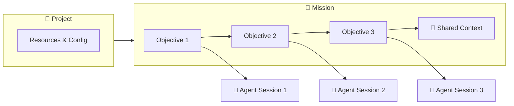
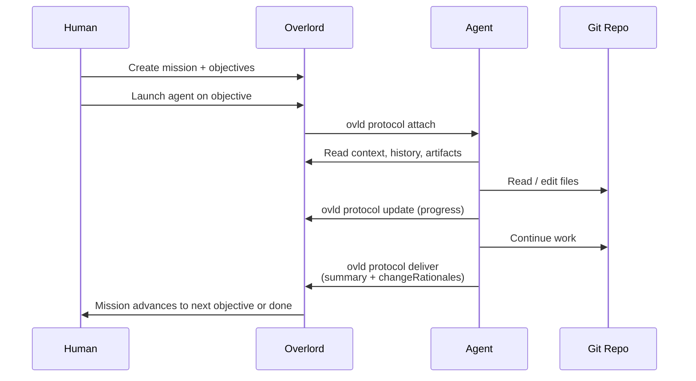

# Overlord

Open-source management layer for AI coding agents. Overlord persists work as
**missions** with structured **objectives**, routes execution to the right
**device**, and records **change rationales** so every agent session builds on
the last.

To sign up for a hosted account, visit [Overlord | AI Agent Management](https://www.ovld.ai/)

## Table of Contents

- [For Users](#for-users)
  - [What it is](#what-it-is)
  - [Getting Started](#getting-started)
  - [Configuration (`overlord.toml`)](#overlordtoml)
  - [Core Concepts](#core-concepts)
  - [Workflow](#workflow)
  - [Surfaces and Interfaces](#surfaces-and-interfaces)
- [For Developers](#for-developers)
  - [Development setup](#development-setup)
  - [How to build on top of Overlord](#how-to-build-on-top-of-overlord)
  - [Operations](#operations)
  - [Testing](#testing)
  - [Planned / Deferred](#planned--deferred)

## For Users

### What it is

Overlord is a project management layer for AI coding agents (Claude Code, Codex, Cursor, OpenCode, Antigravity, and others). Instead of treating each agent session as a one-shot, throwaway interaction, Overlord persists work as **missions** with structured **objectives**, accumulates **shared context** as work progresses, and routes execution to the right **device** for the job — your laptop, a remote workstation, or a cloud runner.

The result is a Kanban-style workflow where humans plan and agents execute, with every session producing artifacts, change rationales, and history that the next session inherits.


#### What Problem Does This Solve?

| Challenge                                                    | Overlord Solution                                            |
|--------------------------------------------------------------|--------------------------------------------------------------|
| Users lose track of context between prompts                  | Structured Kanban workflow lets you thoroughly plan prompts and prompt sequences |
| Agent sessions lose context between runs                     | Missions persist objectives, history, attachments, and shared state in the backend |
| Hard to track what an agent actually changed and why         | Agents record `changeRationales` per file as part of the deliver step |
| Plans, missions, and code drift apart                         | One mission holds many ordered objectives sharing the same context and artifacts |
| Agent lock-in: hard to switch between different agents between each turn | Assign any agent you want to each objective.                 |

### Using the production-ready app

You can use Overlord locally on MacOS for free by following these steps:
1. [Download the Desktop App](https://github.com/cooperativ-labs/OpenOverlord/releases)
2. Download the CLI: `npm install -g overlord-cli`.
3. Open the desktop app and create an account with an email and password
4. Create a project and link a repository
5. Run `ovld setup` in your terminal to configure and log into the CLI
6. run `ovld runner start` to make sure the CLI automatically picks up queued work.

Now, you can create "missions" in the desktop app, select your preferred agent, and click "Run". In a few moments you will see the agent open in your terminal and begin working. Agents launched by Overlord use your existing Claude, Codex, Cursor, or PI provider configuration.

### Getting Started

New to Overlord? Follow the [Getting Started guide](developer-instructions/getting-started.md) —
ten minutes from a fresh `ovld` install to your first delivered mission.

#### Setting up a custom instance

Forked Overlord and standing up your own instance? Start with
[Setting Up a Custom Overlord Instance](developer-instructions/custom-instance-setup.md) — the
ordered list of questions (which database, which schema groups, what goes in
`overlord.toml`) to answer before you configure anything. It doubles as the
interview script for an agent asked to set Overlord up for you.

### overlord.toml

Per-instance configuration (gitignored, like `.env.local`). Generate with
`ovld init` or copy `overlord.toml.example`. It sets the instance name,
`backend_mode` / `backend_url`, optional SQL Studio settings, and default
agent/model options.

**Backend URL precedence** (highest first): explicit shell export of
`OVERLORD_BACKEND_URL` (or `OVERLORD_BACKEND_URL_DEV` in dev) → `overlord.toml`
→ `.env.local` / `.env.prod` default → hardcoded fallback. Dev and production
use separate env vars (`OVERLORD_BACKEND_URL_DEV` vs `OVERLORD_BACKEND_URL`) so
`yarn dev` and Desktop can run side by side.

In-repo development uses `.env.local` and `yarn ovld:dev`; an installed
`overlord-cli` package never reads the dev channel. See
[Getting Started](developer-instructions/getting-started.md) and
[Custom Instance Setup](developer-instructions/custom-instance-setup.md) for full detail.

### Core Concepts

**Key relationship:** one **objective** maps to one **agent session**. A **mission** is home to one or more objectives plus their shared context. Missions live inside a **project**, and a project is mapped to a **git repository** (and optionally a working device).



#### Project 📁

The top-level container. A project is mapped to a git repository and a local working directory. Projects route missions to the correct codebase and define which devices and resources are available for execution.

#### Mission 🎫

A unit of work, identified like `1:1204` (`<workspace>:<sequence>`). A mission represents a feature, bug, or goal that may take one or many steps to complete. Missions hold the shared state that every objective beneath them can read and contribute to: history, attachments, artifacts, acceptance criteria, and recorded change rationales.

#### Objective 🎯

A single step inside a mission — one objective equals one agent prompt. Objectives have a lifecycle (`draft → submitted → executing → delivered`) and execute sequentially. If a feature needs planning, implementation, and docs, that is three objectives on one mission, not three missions.

#### Agent Session 🤖

The live attachment between an agent (Claude Code, Codex, Cursor, etc.) and an objective. A session is created when an agent calls `ovld protocol attach`, persists updates while the work runs, and closes when the agent calls `deliver`. Sessions carry a `sessionKey` that authenticates subsequent protocol calls.

#### Shared Context 📚

Everything attached to the mission that survives across objectives: `write-context` entries, uploaded attachments, recorded artifacts, prior session history, and change rationales. The next agent session inherits all of it.

#### Change Rationale 📝

A structured record per modified file describing **what** changed, **why**, and the **impact**. Agents emit these during `deliver`, producing an audit trail that lives alongside the diff and survives long after the session ends.

### Workflow



### Surfaces and Interfaces

| Surface | Role |
| --- | --- |
| **CLI** (`ovld`) | Primary product surface: management, `ovld protocol`, runner, config |
| **Web app** | Control center bundled with the backend (local or hosted) |
| **Desktop** | Optional Electron shell supervising the local backend |
| **Connectors** | Agent harness plugins (Claude, Codex, Cursor, PI) — see [connectors/](connectors/README.md) |
| **Database** | SQLite (local) or Postgres (cloud) behind the backend — see [database/](database/README.md) |

All surfaces share one contract: [`CONTRACT.md`](CONTRACT.md) (version `0`).

## For Developers

### Development setup

This repo is a single [Yarn 4](https://yarnpkg.com) workspace: the `auth`,
`automations`, `database`, `cli`, `webapp`, and optional `desktop` packages
alongside the root. One install at the root bootstraps everything — there are
no per-package installs to remember. Yarn is pinned via `packageManager` in
`package.json` and a committed binary at `.yarn/releases/` (see `yarnPath` in
`.yarnrc.yml`). After cloning, run `yarn install` from the repo root — `yarn`
delegates to that binary automatically.

To upgrade Yarn: `yarn set version <version> --yarn-path`, then commit
`package.json`, `.yarnrc.yml`, the new `.yarn/releases/*.cjs`, and remove the
old release file. Docker and Vercel read `yarnPath` from `.yarnrc.yml`; no
Dockerfile edits are needed on bump.

```bash
yarn setup   # install, build, start the local DB, and regenerate DB types
yarn dev     # run the webapp (API server + Vite)
yarn check   # lint + typecheck + test — the "am I done?" command
```

Production/package defaults live in `.env.prod` (read by bundled production and
`yarn desktop:package:prod`). Development settings belong in `.env.local` (copy
`.env.local.example`) — source `yarn dev`, `db:*`, and `yarn ovld:dev` read
that file only.

### Development vs production instances

| | **Production / Desktop** | **In-repo development** |
| --- | --- | --- |
| Config | `.env.prod` + `overlord.toml` | `.env.local` |
| Data dir | `~/.ovld` | `database/.local/dev-home` (gitignored) |
| API port | `4310` | `4320` |
| Vite port | — | `5173` |
| CLI target | `OVERLORD_BACKEND_URL=http://127.0.0.1:4310` | `OVERLORD_BACKEND_URL_DEV=http://127.0.0.1:4320` |

With `.env.local` in place, `yarn dev` and the global Desktop app can run
simultaneously without sharing a database or port. `yarn test` uses throwaway
temp homes so tests never touch either instance.

```bash
cp .env.local.example .env.local
yarn db:start    # init the dev database once
yarn dev         # API :4320 + Vite :5173
yarn ovld:dev protocol help   # in-repo CLI → dev instance
```

Common tasks (every command is run from the repo root):

| Command | What it does |
| --- | --- |
| `yarn build:prod` | Build all workspaces (database, auth, automations, core, CLI, webapp) |
| `yarn test` / `yarn test:watch` | Run all tests / watch the root suite |
| `yarn typecheck` | Typecheck all workspaces |
| `yarn db:start` | Launch the local SQLite database |
| `yarn db:reset` | Wipe local state and relaunch the database |
| `yarn db:codegen` | Regenerate `packages/core/types/db.ts` from the local schema |
| `yarn pack:cli:prod` | Produce the publishable `overlord-cli` tarball |

To work inside a single package, use `yarn workspace <name> <script>`
(e.g. `yarn workspace @overlord/webapp dev`). Because the tree is synced across
macOS and Linux (Syncthing), re-run `yarn install` after switching machines so
native dependencies used by the local backend/Desktop build are rebuilt for the
current host. The published npm CLI does not include native database
dependencies.

### How to build on top of Overlord

#### Principles
* **CLI-first**: The CLI is the primary interface for users and agents. The web app is a secondary interface.
* **Contract-first**: The contract is the primary source of truth for how modules interact.
* **Modular**: The system is organized as independent modules connected via the contract. Each module is self-contained and includes its own tests and documentation to help agents and users understand how to use the system.
* **Extensible**: The system is designed to be extensible and can be extended with new modules.

#### Modules

Overlord is organized as **independent modules connected via the contract**.
Each module owns its code, tests, and documentation; this README is the table of
contents. The normative spec for how modules interact is
[`CONTRACT.md`](CONTRACT.md) — read it before any change that crosses a module
boundary.

**Documentation map →** [`developer-instructions/README.md`](developer-instructions/README.md) is the front door to
every documentation surface (user guides, the
[architecture series in reading order](docs/src/content/docs/docs-for-agents/architecture.mdx), module specs,
planning, and security audits), and records where each kind of doc lives.

| Module | Purpose | Contract component(s) |
| --- | --- | --- |
| [packages/core/](packages/core/) | Shared protocol/service core: service functions, repository helpers, and generated database types (the `@overlord/core` workspace package) | `protocol` / service layer |
| [database/](database/README.md) | SQLite/Postgres persistence, migrations, and schema extension system used behind local/cloud backends | `database`, `extension` |
| [cli/](cli/README.md) | The client-only `ovld` command surface: config, backend API client, agent protocol forwarding, and local runner/launcher | `cli`, `protocol`, `runner` |
| [auth/](auth/README.md) | Mix-and-match authentication (tokens) and RBAC authorization (the `@overlord/auth` workspace package — runtime in `auth/src/`) | `auth` |
| [webapp/](webapp/README.md) | Web control center + REST/realtime API | `rest` |
| [mcp/](mcp/README.md) | Optional hosted MCP server surface for cloud agents | `mcp` |
| [connectors/](connectors/README.md) | Agent harness connectors: core, plugins, adapters, hooks | `connector` |
| [automations/](automations/README.md) | Optional AI automations (Gemini summarization, objective titles) (the `@overlord/automations` workspace package — runtime in `automations/src/`) | `automations` |
| [desktop/](desktop/README.md) | Optional Electron desktop shell wrapping the webapp (the `@overlord/desktop` workspace package) — **not built by default** | `desktop` |
| [contract/](contract/README.md) | The connecting spec — machine-readable counterparts to `CONTRACT.md` | _(spec)_ |

> Behavior specs live under `<module>/docs/`. Planning notes are in
> [`planning/feature-plans/`](planning/feature-plans/). **Convention:** colocate
> new code and tests inside the owning module.

### Operations

If you run a customized OpenOverlord distribution and need to keep adopting
changes from upstream, use the contract-first workflow in
[Adopting Upstream Changes in Customized Instances](developer-instructions/upstream-adoption.md).

### Testing

The master test strategy is [`TEST_PLAN.md`](TEST_PLAN.md): a five-layer test pyramid whose centerpiece is a cross-module **contract conformance suite** that proves every module adheres to [`CONTRACT.md`](CONTRACT.md). Per-module test plans are colocated under each module's `docs/testing.md` (database, cli, auth, connectors, webapp), following the same code-and-tests colocation convention as the rest of the repo.

### Planned / Deferred

* OAuth consent/token management for hosted [MCP](mcp/README.md) connections is
  still phased; the initial MCP endpoint and metadata are implemented behind
  `OVERLORD_MCP_ENABLED=true`.
