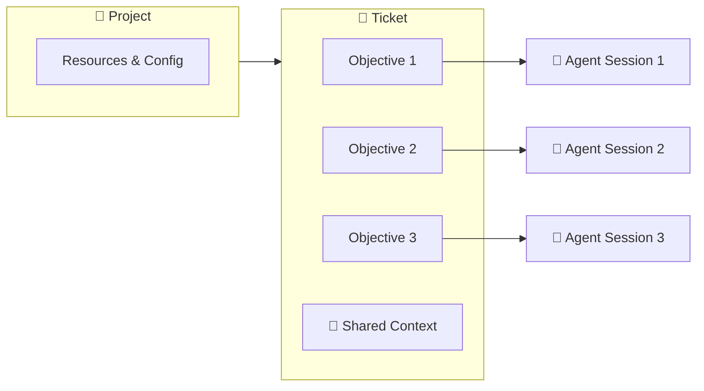
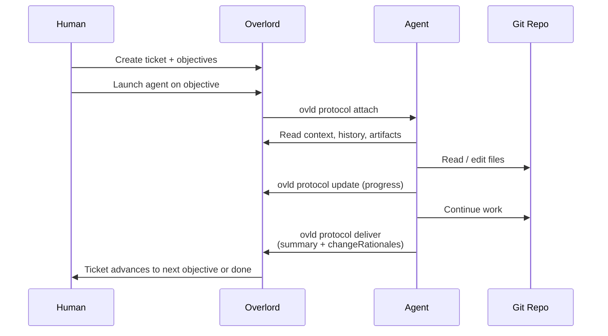

# Open Overlord

This is a project to create a open source version of the Overlord project.

## Table of Contents

- [For Users](#for-users)
  - [What it is](#what-it-is)
  - [Getting Started](#getting-started)
  - [Configuration (`overlord.toml`)](#overlordtoml)
  - [Core Concepts](#core-concepts)
  - [Workflow](#workflow)
  - [Surfaces and Interfaces](#surfaces-and-interfaces)
- [For Developers](#for-developers)
  - [Development setup](#development-setup)
  - [How to build on top of Overlord](#how-to-build-on-top-of-overlord)
  - [Operations](#operations)
  - [Testing](#testing)
  - [Planned / Deferred](#planned--deferred)

## For Users

### What it is

Overlord is a coordination layer for AI coding agents (Claude Code, Codex, Cursor, OpenCode, Antigravity, and others). Instead of treating each agent session as a one-shot, throwaway interaction, Overlord persists work as **tickets** with structured **objectives**, accumulates **shared context** as work progresses, and routes execution to the right **device** for the job — your laptop, a remote workstation, or a cloud runner.

The result is a Kanban-style workflow where humans plan and agents execute, with every session producing artifacts, change rationales, and history that the next session inherits.

#### What Problem Does This Solve?

| Challenge                                                    | Overlord Solution                                            |
|--------------------------------------------------------------|--------------------------------------------------------------|
| Users lose track of context between prompts                  | Structured Kanban workflow lets you thoroughly plan prompts and prompt sequences |
| Agent sessions lose context between runs                     | Tickets persist objectives, history, attachments, and shared state in Postgres |
| Hard to track what an agent actually changed and why         | Agents record `changeRationales` per file as part of the deliver step |
| Agent lock-in: hard to switch between different agents between each turn | Assign any agent you want to each objective.                 |
| Plans, tickets, and code drift apart                         | One ticket holds many ordered objectives sharing the same context and artifacts |

### Getting Started

New to Overlord? Follow the [Getting Started guide](docs/getting-started.md) —
ten minutes from a fresh `ovld` install to your first delivered ticket.

#### Setting up a custom instance

Forked Overlord and standing up your own instance? Start with
[Setting Up a Custom Overlord Instance](docs/custom-instance-setup.md) — the
ordered list of questions (which database, which schema groups, what goes in
`overlord.toml`) to answer before you configure anything. It doubles as the
interview script for an agent asked to set Overlord up for you.

### overlord.toml

The `overlord.toml` file configures an Open Overlord instance. It is a
**per-instance / per-deployment** file that is **not committed** (gitignored,
like `.env.local`/`.env.prod`) — generate it for a deployment with `ovld init`
or copy `overlord.toml.example`. Local development needs none: it runs off
`.env.local` plus code defaults. It is discovered from the current directory
upward, with a global fallback under `~/.ovld/`, and configures:
* The instance/organization name
* The CLI backend target (`backend_mode`, `backend_url`)
* The host and port the web app will run on
* Optional legacy database settings consumed by local/backend packages
* Optional SQL Studio launch settings for local backend database inspection
* The default agent/model options (for the run button in the web app)
* An optional `[agent_catalog]` section to customize which agents and models are offered
* Default terminal configuration (should include popular terminals commented out)

Each `ovld`/server process resolves these values independently — there is no
single shared connection. Development and production read **separate** backend
env vars so the two never collide: development uses `OVERLORD_BACKEND_URL_DEV`
(`.env.local`, e.g. a dev backend on `:4320`) and production uses
`OVERLORD_BACKEND_URL` (`.env.prod`, e.g. `:4310`). Backend-URL precedence,
highest first: an explicit shell export of the channel variable (e.g.
`OVERLORD_BACKEND_URL=http://host.docker.internal:4310` inside Docker, or
`OVERLORD_BACKEND_URL_DEV` in dev) > the per-instance `overlord.toml` `backend_url`
(e.g. what `ovld config set` writes) > the env-file default (`.env.local` /
`.env.prod`) > a hardcoded fallback. A `.env.local` value is just the default when
you have no `overlord.toml`; running `ovld config set` writes the toml and takes
effect. Since `overlord.toml` is per-instance and uncommitted, dev and prod no
longer share one config file to fight over.

`OVERLORD_BACKEND_URL_DEV` is strictly a development variable — it is read only
by the in-repo source build and the dev/test tooling that runs it (`yarn dev`,
the test harness). An installed/published `ovld` (under `node_modules`) runs as
production: it never auto-loads `.env.local` or reads `OVERLORD_BACKEND_URL_DEV`,
even when invoked inside a dev checkout. For dev work against the source build,
use `yarn ovld:dev` rather than a globally installed `ovld`.

### Core Concepts

**Key relationship:** one **objective** maps to one **agent session**. A **ticket** is home to one or more objectives plus their shared context. Tickets live inside a **project**, and a project is mapped to a **git repository** (and optionally a working device).



#### Project 📁

The top-level container. A project is mapped to a git repository and a local working directory. Projects route tickets to the correct codebase and define which devices and resources are available for execution.

#### Ticket 🎫

A unit of work, identified like `1:1204` (`<workspace>:<sequence>`). A ticket represents a feature, bug, or goal that may take one or many steps to complete. Tickets hold the shared state that every objective beneath them can read and contribute to: history, attachments, artifacts, acceptance criteria, and recorded change rationales.

#### Objective 🎯

A single step inside a ticket — one objective equals one agent prompt. Objectives have a lifecycle (`draft → submitted → executing → delivered`) and execute sequentially. If a feature needs planning, implementation, and docs, that is three objectives on one ticket, not three tickets.

#### Agent Session 🤖

The live attachment between an agent (Claude Code, Codex, Cursor, etc.) and an objective. A session is created when an agent calls `ovld protocol attach`, persists updates while the work runs, and closes when the agent calls `deliver`. Sessions carry a `sessionKey` that authenticates subsequent protocol calls.

#### Shared Context 📚

Everything attached to the ticket that survives across objectives: `write-context` entries, uploaded attachments, recorded artifacts, prior session history, and change rationales. The next agent session inherits all of it.

#### Change Rationale 📝

A structured record per modified file describing **what** changed, **why**, and the **impact**. Agents emit these during `deliver`, producing an audit trail that lives alongside the diff and survives long after the session ends.

### Workflow



### Surfaces and Interfaces

#### Agent Connectors

**Connector Core**: There is a connector core that expresses the primary instructions in Markdown. Users should be able to create plugins that extend the core. 

**Connector Plugins**: Connector plugins are used to extend the connector core. Users can customize them to match the needs of their harnesses. We include plugins for popular desktop apps like Claude, Codex, and Cursor.

**Plugin Adapters**: Plugin adapters package Connector Plugins into harnesses via each harness's native plugin/connector manager. We include adapters for popular desktop apps like Claude, Codex, and Cursor.

**Prompt Wrappers:** Prompt wrappers are instructions and key data that wrap the users's prompt during submission to the LLM. We include wrappers for popular LLMs like Claude, Codex, and Cursor.

These need to be well-documented and cleanly organized so that users and agents can easily create new connectors by referencing their chosen connectors' documentation. 

#### Database And Backends

Overlord stores projects, tickets, objectives, events, and other data behind a
backend service. Local mode uses a backend running on the user's machine
(Desktop today, and possibly a future db-only local backend) that owns SQLite
and migrations. Cloud mode uses a hosted backend that owns Postgres. The
published `open-overlord` CLI is a client of one of those backends; it does not
open SQLite directly or ship `better-sqlite3`.

The first-pass portable schema proposal is documented in the [database module's schema contract](database/docs/09-database-schema-contract.md) (see the [database module](database/README.md)). The schema should be generated from one machine-readable source for SQLite/Postgres DDL, docs, and adapter conformance tests. Users should be able to extend/customize the schema through component-scoped migrations, namespaced metadata, and documented extension points:
**Authentication:** Users should be able to attach their own authentication mechanisms to Overlord, so the schema should facilitate this and documentation should be provided for how to do so.
**Role-Based Access Control:** We want users to be able to define roles and permissions. 

#### CLI

Open Overlord should be CLI-first from the beginning. Any functionality available in the web app should be available in the CLI. The CLI talks to the configured backend URL (`backend_url` in `overlord.toml`) for stateful operations while keeping local connector setup and runner/agent launching on the user's machine. Major components include:

**Management**
* Projects: Users should be able to create, delete, and manage projects.
* Tickets: Users should be able to create, delete, and manage tickets.
* Objectives: Users should be able to create, delete, and manage objectives.
* Events: Users should be able to create, delete, and manage events.
* Users: Users should be able to create, delete, and manage users.
* Roles: Users should be able to create, delete, and manage roles.
* Permissions: Users should be able to create, delete, and manage permissions.

**Configuration:**
* Linking projects to directories
* Setting up agent connectors
* updating agent connectors 

**Runner:** The runner is the action core of the system: it maintains a queue of objectives that need to be executed. It launches agents in the user's chosen terminal, in the directory associated with the project.

**Protocol:** The protocol (`ovld protocol`) is the interface between Overlord and agents. Agents use it to: 
* Conduct any management tasks (including account creation and management)
* Update the status of tickets and objectives


#### Web App

The web app runs as part of a backend process at the configured host/port. From
a source checkout, `yarn dev` or `ovld serve` can start the local web/API
backend; in packaged local mode, Desktop supervises that backend. The current
local default is `http://127.0.0.1:4310`, which is also the CLI's default
`backend_url`.

## For Developers

### Development setup

This repo is a single [Yarn 4](https://yarnpkg.com) workspace: the `auth`,
`automations`, `database`, `cli`, `webapp`, and optional `desktop` packages
alongside the root. One install at the root bootstraps everything — there are
no per-package installs to remember. Yarn 4 is provided via `packageManager`;
run `corepack enable` once if `yarn --version` does not report `4.x`.

```bash
yarn setup   # install, build, start the local DB, and regenerate DB types
yarn dev     # run the webapp (API server + Vite)
yarn check   # lint + typecheck + test — the "am I done?" command
```

Production/package defaults live in `.env.prod` (read by bundled production and
`yarn desktop:package:prod`). Development settings belong in `.env.local` (copy
`.env.local.example`) — source `yarn dev`, `db:*`, and `yarn ovld:dev` read
that file only.

### Development vs production instances

| | **Production / Desktop** | **In-repo development** |
| --- | --- | --- |
| Config | `.env.prod` + `overlord.toml` | `.env.local` |
| Data dir | `~/.ovld` | `database/.local/dev-home` (gitignored) |
| API port | `4310` | `4320` |
| Vite port | — | `5173` |
| CLI target | `OVERLORD_BACKEND_URL=http://127.0.0.1:4310` | `OVERLORD_BACKEND_URL_DEV=http://127.0.0.1:4320` |

With `.env.local` in place, `yarn dev` and the global Desktop app can run
simultaneously without sharing a database or port. `yarn test` uses throwaway
temp homes so tests never touch either instance.

```bash
cp .env.local.example .env.local
yarn db:start    # init the dev database once
yarn dev         # API :4320 + Vite :5173
yarn ovld:dev protocol help   # in-repo CLI → dev instance
```

Common tasks (every command is run from the repo root):

| Command | What it does |
| --- | --- |
| `yarn build:prod` | Build all workspaces (database, auth, automations, root, CLI, webapp) |
| `yarn test` / `yarn test:watch` | Run all tests / watch the root suite |
| `yarn typecheck` | Typecheck all workspaces |
| `yarn db:start` | Launch the local SQLite database |
| `yarn db:reset` | Wipe local state and relaunch the database |
| `yarn db:codegen` | Regenerate `src/types/db.ts` from the local schema |
| `yarn pack:cli:prod` | Produce the publishable `open-overlord` tarball |

To work inside a single package, use `yarn workspace <name> <script>`
(e.g. `yarn workspace @overlord/webapp dev`). Because the tree is synced across
macOS and Linux (Syncthing), re-run `yarn install` after switching machines so
native dependencies used by the local backend/Desktop build are rebuilt for the
current host. The published npm CLI does not include native database
dependencies.

### How to build on top of Overlord

#### Principles
* **CLI-first**: The CLI is the primary interface for users and agents. The web app is a secondary interface.
* **Contract-first**: The contract is the primary source of truth for how modules interact.
* **Modular**: The system is organized as independent modules connected via the contract. Each module is self-contained and includes its own tests and documentation to help agents and users understand how to use the system.
* **Extensible**: The system is designed to be extensible and can be extended with new modules.

#### Modules

Overlord is organized as **independent modules connected via the contract**.
Each module owns its code, tests, and documentation; this README is the table of
contents. The normative spec for how modules interact is
[`CONTRACT.md`](CONTRACT.md) — read it before any change that crosses a module
boundary.

| Module | Purpose | Contract component(s) |
| --- | --- | --- |
| [database/](database/README.md) | SQLite/Postgres persistence, migrations, and schema extension system used behind local/cloud backends | `database`, `extension` |
| [cli/](cli/README.md) | The client-only `ovld` command surface: config, backend API client, agent protocol forwarding, and local runner/launcher | `cli`, `protocol`, `runner` |
| [auth/](auth/README.md) | Mix-and-match authentication (tokens) and RBAC authorization (the `@overlord/auth` workspace package — runtime in `auth/src/`) | `auth` |
| [webapp/](webapp/README.md) | Deferred web control center + REST/realtime API | `rest` |
| [mcp/](mcp/README.md) | Planned MCP server surface (Phase 5, not yet implemented) | _(future)_ |
| [connectors/](connectors/README.md) | Agent harness connectors: core, plugins, adapters, hooks | `connector` |
| [automations/](automations/README.md) | Optional AI automations (Gemini summarization, objective titles) (the `@overlord/automations` workspace package — runtime in `automations/src/`) | `automations` |
| [desktop/](desktop/README.md) | Optional Electron desktop shell wrapping the webapp (the `@overlord/desktop` workspace package) — **not built by default** | `desktop` |
| [contract/](contract/README.md) | The connecting spec — machine-readable counterparts to `CONTRACT.md` | _(spec)_ |

> The contract defines nine fine-grained components; the seven modules above are
> friendlier developer-facing groupings, and each module's README maps to the
> contract component(s) it contains. Behavior specs are colocated with their
> owning module under `<module>/docs/`; each module README links to its relevant
> plans, and [planning/feature-plans/](planning/feature-plans/README.md) is now a
> redirect index pointing at those module homes. **Convention:** colocate new code and tests inside
> the owning module (as `auth/src/rbac/authorizer.ts` + `authorizer.test.ts` and
> `database/sqlite/migrations/` already do).

### Operations

If you run a customized OpenOverlord distribution and need to keep adopting
changes from upstream, use the contract-first workflow in
[Adopting Upstream Changes in Customized Instances](docs/upstream-adoption.md).

### Testing

The master test strategy is [`TEST_PLAN.md`](TEST_PLAN.md): a five-layer test pyramid whose centerpiece is a cross-module **contract conformance suite** that proves every module adheres to [`CONTRACT.md`](CONTRACT.md). Per-module test plans are colocated under each module's `docs/testing.md` (database, cli, auth, connectors, webapp), following the same code-and-tests colocation convention as the rest of the repo.

### Planned / Deferred

* **MCP** — a Model Context Protocol server surface is planned but not yet implemented (Phase 5). The module slot is reserved at [mcp/](mcp/README.md), and it will be added to the contract before any implementation lands.
