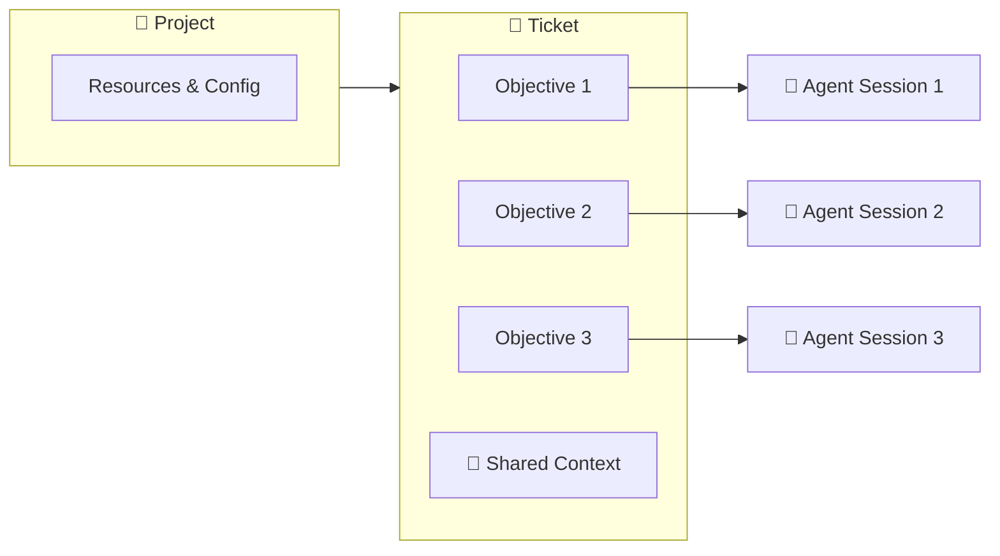
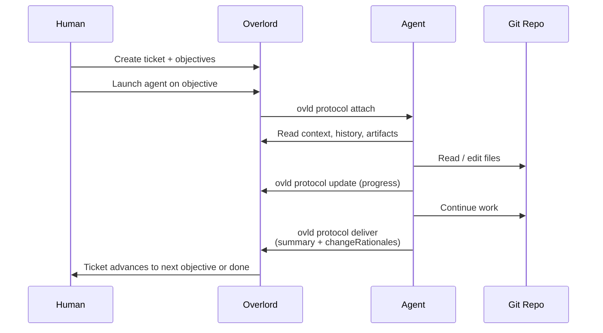

# Open Overlord

This is a project to create a open source version of the Overlord project.

## Overview

Overlord is a coordination layer for AI coding agents (Claude Code, Codex, Cursor, OpenCode, Antigravity, and others). Instead of treating each agent session as a one-shot, throwaway interaction, Overlord persists work as **tickets** with structured **objectives**, accumulates **shared context** as work progresses, and routes execution to the right **device** for the job — your laptop, a remote workstation, or a cloud runner.

The result is a Kanban-style workflow where humans plan and agents execute, with every session producing artifacts, change rationales, and history that the next session inherits.

## Surfaces and Interfaces

### Agent Connectors

**Connector Core**: There is a connector core that expresses the primary instructions in Markdown. Users should be able to create plugins that extend the core. 

**Connector Plugins**: Connector plugins are used to extend the connector core. Users can customize them to match the needs of their harnesses. We include plugins for popular desktop apps like Claude, Codex, and Cursor.

**Plugin Adapters**: Plugin adapters package Connector Plugins into harnesses via each harness's native plugin/connector manager. We include adapters for popular desktop apps like Claude, Codex, and Cursor.

**Prompt Wrappers:** Prompt wrappers are instructions and key data that wrap the users's prompt during submission to the LLM. We include wrappers for popular LLMs like Claude, Codex, and Cursor.

These need to be well-documented and cleanly organized so that users and agents can easily create new connectors by referencing their chosen connectors' documentation. 

### Database

The package includes a SQLite database that is used to store projects, tickets, objectives, events, and other data. Data architecture will be discussed below, but users should be able to extend/customize the schema: 
**Authentication:** Users should be able to attach their own authentication mechanisms to OpenOverlord, so the schema should facilitate this and documentation should be provided for how to do so.
**Role-Based Access Control:** We want users to be able to define roles and permissions. 

### CLI

Open Overlord should be CLI-first from the beginning. Any functionality available in the web app should be available in the CLI. Major components include: 

**Management**
* Projects: Users should be able to create, delete, and manage projects.
* Tickets: Users should be able to create, delete, and manage tickets.
* Objectives: Users should be able to create, delete, and manage objectives.
* Events: Users should be able to create, delete, and manage events.
* Users: Users should be able to create, delete, and manage users.
* Roles: Users should be able to create, delete, and manage roles.
* Permissions: Users should be able to create, delete, and manage permissions.

**Configuration:**
* Linking projects to directories
* Setting up agent connectors
* updating agent connectors 

**Runner:** The runner is the action core of the system: it maintains a queue of objectives that need to be executed. It launches agents in the user's chosen terminal, in the directory associated with the project.

**Protocol:** The protocol (`ovld protocol`) is the interface between Overlord and agents. Agents use it to: 
* Conduct any management tasks (including account creation and management)
* Update the status of tickets and objectives

### Web App

Users will use `ovld serve` to start the web app on at their chosen port. Default is `http://localhost:8010`.

### overlord.toml

The `overlord.toml` file is used to configure the Open Overlord system. It is a TOML file that is located in the root of the project. It is used to configure the project, including:
* The instance/organization name
* The the database location
* The port the web app will run on
* The default agent/model options (for the run button in the web app)
* Default terminal configuration (should include popular terminals commented out)

## Core Concepts

**Key relationship:** one **objective** maps to one **agent session**. A **ticket** is home to one or more objectives plus their shared context. Tickets live inside a **project**, and a project is mapped to a **git repository** (and optionally a working device).

### Project 📁

The top-level container. A project is mapped to a git repository and a local working directory. Projects route tickets to the correct codebase and define which devices and resources are available for execution.

### Ticket 🎫

A unit of work, identified like `1:1204` (`<org>:<sequence>`). A ticket represents a feature, bug, or goal that may take one or many steps to complete. Tickets hold the shared state that every objective beneath them can read and contribute to: history, attachments, artifacts, acceptance criteria, and recorded change rationales.

### Objective 🎯

A single step inside a ticket — one objective equals one agent prompt. Objectives have a lifecycle (`draft → submitted → executing → delivered`) and execute sequentially. If a feature needs planning, implementation, and docs, that is three objectives on one ticket, not three tickets.

### Agent Session 🤖

The live attachment between an agent (Claude Code, Codex, Cursor, etc.) and an objective. A session is created when an agent calls `ovld protocol attach`, persists updates while the work runs, and closes when the agent calls `deliver`. Sessions carry a `sessionKey` that authenticates subsequent protocol calls.

### Shared Context 📚

Everything attached to the ticket that survives across objectives: `write-context` entries, uploaded attachments, recorded artifacts, prior session history, and change rationales. The next agent session inherits all of it.

### Change Rationale 📝

A structured record per modified file describing **what** changed, **why**, and the **impact**. Agents emit these during `deliver`, producing an audit trail that lives alongside the diff and survives long after the session ends.

## Workflow

## Feature Plans

Detailed requirements for the OpenOverlord port are documented in [docs/feature-plans](docs/feature-plans/README.md). The web app requirements live in a separate [web app feature plan](docs/feature-plans/web-app.md) so the CLI-first implementation can proceed without committing to Next.js or any specific UI stack.

## Out of Scope
* The Feed
* MCP
