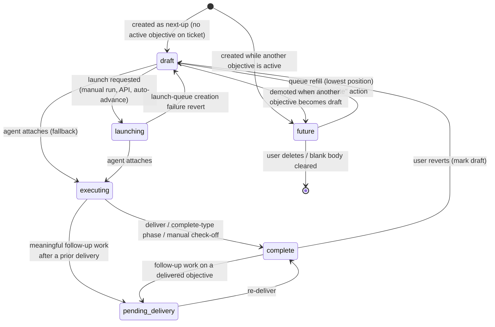

# Objective Manager: Objective Lifecycle Within a Ticket

This document specifies how objectives behave within a ticket: which states exist,
what triggers every state transition, and the invariants the system enforces at all
times. It is written as a portable, implementation-agnostic specification so the
behavior can be replicated on any storage layer or runtime.

It complements, and must stay consistent with:

- [`cli/docs/01-core-domain-and-lifecycle.md`](../../../cli/docs/01-core-domain-and-lifecycle.md) — domain concepts and required states.
- [`cli/docs/03-agent-protocol.md`](../../../cli/docs/03-agent-protocol.md) — the protocol verbs that drive transitions.
- [`cli/docs/04-runner-and-launch-execution.md`](../../../cli/docs/04-runner-and-launch-execution.md) — the execution-request queue and runner.
- [`database/docs/09-database-schema-contract.md`](../../../database/docs/09-database-schema-contract.md) — the `objectives` and `execution_requests` tables.

Per `CONTRACT.md`, the database layer owns the schema and constraints, the protocol
layer owns the transition-triggering verbs, and the CLI/runner owns launch execution.
This document is the cross-cutting behavioral specification those layers implement
together; it does not change any stable interface.

> **Divergence from upstream:** this specification deliberately omits upstream
> Overlord's `submitted` state (see [Section 10](#10-suggested-simplifications-vs-the-upstream-design),
> item 4). Discussion does not change objective state; `launching` covers the entire
> "execution ordered, agent not yet attached" window. The reference specs listed
> above still include `submitted` and the `discuss-objective` transition — adopting
> this simplification requires updating them and the schema contract's state
> vocabulary together.

## Concepts

A **ticket** represents a whole feature or goal. Each ticket owns an ordered queue of
**objectives** — one objective equals one agent prompt/work session. Objectives advance
through a state machine driven by three kinds of triggers:

1. **User actions** — run, reorder, promote, edit, complete, revert.
2. **Agent protocol calls** — `attach`, `update`, `deliver`.
3. **Background automation** — auto-advance after delivery, queue refill, launch settlement.

Two of these automations are connected but distinct, and must never be conflated:

- **Queue refill (`ensureDraftSlot`) is unconditional.** Whenever the "next up"
  objective leaves the editable queue (attaches, is completed, or is demoted to
  `future`), the next `future` objective becomes `draft` — or a blank draft is
  created. This happens regardless of any preference and can be triggered by user
  actions or by automation.
- **Auto-advance is opt-in policy.** A draft launching automatically after a delivery
  happens only when the user enabled `auto_advance` on that objective. Auto-advance
  _requests_ transitions; it never contains refill logic of its own.

---

## 1. State catalog

`objectives.state` has six values:

| State              | Meaning                                                                                                                                                                                                               | Instruction text may be empty? |
| ------------------ | --------------------------------------------------------------------------------------------------------------------------------------------------------------------------------------------------------------------- | ------------------------------ |
| `future`           | Queued behind the current draft; not yet next in line.                                                                                                                                                                | Yes                            |
| `draft`            | The single editable "next up" objective for the ticket.                                                                                                                                                               | Yes                            |
| `launching`        | A launch has been requested (an execution request exists) but no agent has attached yet. Covers the whole pre-attach window. Still a kind of draft: editable and re-queueable, and still the ticket's "next up" slot. | No                             |
| `executing`        | An agent session is attached and actively working the objective.                                                                                                                                                      | No                             |
| `pending_delivery` | Follow-up execution after a prior delivery produced new work that needs a re-delivery.                                                                                                                                | No                             |
| `complete`         | Done. `completed_at` is set.                                                                                                                                                                                          | No                             |

Conceptually there are three groups:

- **Queue states** — `future`, `draft`, and `launching`: the editable "next up" line.
  `launching` straddles the boundary — it has been handed to the launch pipeline, but
  it remains editable and re-queueable and still occupies the next-up slot until an
  agent actually attaches.
- **Active states** — `executing`, `pending_delivery`: an agent has the objective.
- **Terminal state** — `complete`. Re-enterable: a user may revert a completed
  objective to `draft`, and follow-up work may pull it back into the active set as
  `pending_delivery`.

Two derived state sets are used throughout the rules below:

- **Launchable** (an execution request may be created or claimed for the objective):
  `draft`, `launching`.
- **Active for queue-insertion purposes** (used to decide whether a newly added
  objective becomes `draft` or `future`): `draft`, `launching`, `executing`,
  `pending_delivery`.

> Naming note: `objectives.state = 'launching'` and
> `execution_requests.status = 'launching'` are **different fields with different
> lifespans**. The objective state covers the entire request-created → attach window;
> the request status only covers the post-spawn/pre-attach window. See
> [Section 7](#7-companion-state-machine-execution-requests).

---

## 2. State diagram



Discussion is intentionally absent from this diagram: an agent opening or discussing
a ticket without an execution order does **not** change objective state. The draft
stays `draft`. Only an explicit execution order (launch request or attach) moves an
objective forward.

---

## 3. Required invariants

These rules must hold at all times, regardless of which code path writes. Enforce them
**transactionally in the storage layer where the database can express them** (unique
partial indexes, check constraints, triggers); where it cannot, the service layer must
enforce them and the adapter conformance suite must test that enforcement.

1. **At most one `draft` per ticket.**
2. **At most one `executing` _or_ `pending_delivery` objective per ticket.** This
   prevents auto-advance races from leaving two objectives active, and prevents
   follow-up work awaiting redelivery from racing with another active objective.
3. **Unique per-ticket positions.** `position` is an integer, unique per ticket,
   0-based.
4. **Auto-assigned position on insert.** When a caller omits `position`, the system
   assigns `max(position) + 1` for the ticket. Callers doing manual reorders set
   positions explicitly.
5. **Non-empty instruction text in `launching` and beyond.** An objective can never
   enter `launching`, `executing`, `pending_delivery`, or `complete` with blank
   instruction text. (Blank text is allowed only in `future` and `draft`.)
6. **`completed_at` is system-managed.** Entering `complete` stamps
   `completed_at = now()` (if not provided); moving to any non-`complete` state
   clears it.
7. **At most one active agent session per objective.** A new attach must first detach
   any prior active session for the objective.
8. **At most one in-flight execution request per objective.** All launch paths reuse
   or re-queue an existing active request instead of inserting duplicates.
9. **`auto_advance` defaults to `false`.** Auto-advance is explicit opt-in per
   objective.
10. **CAS-guarded transitions.** Every state change is guarded on the expected current
    state (compare-and-swap on `state`), so concurrent triggers degrade to no-ops,
    never to duplicate transitions.

---

## 4. Ordering rules and the position queue

- **Canonical sort order is `position ASC`, tie-broken by `created_at ASC`.** Every
  "pick the next objective" query in the system uses this order.
- **Appending** (protocol `create`, `add-objectives`, UI "add objective"): new rows
  take `max(position) + 1` per insert order. An inserted objective becomes `draft`
  only when the ticket currently has **no existing `draft` objective**. Once a draft
  exists, every additional inserted objective is created as `future`. In a creation
  batch, this means the first objective for a new ticket is `draft` and all remaining
  objectives are `future`.
- **User reorder** (drag-and-drop or equivalent):
  - Only the **`draft` + `future`** set can be reordered. IDs outside that set are
    silently dropped from the request.
  - The reordered queue **recycles the same sorted position pool** the set already
    occupied, so reordering never collides with positions held by
    launching/executing/complete objectives.
  - Persistence must satisfy the unique-position invariant mid-write — for example a
    two-phase write (move affected rows to temporary high positions, then write final
    positions) or a single transaction with deferred constraint checking.
- **Promotion**: promoting a `future` objective to `draft` splices it into the current
  draft's slot in the ordering, demotes any existing `draft` to `future` first
  (preserving invariant #1), then persists positions.
- **Deletion**: only `future` objectives may be deleted outright. Clearing the
  instruction text of a `future` objective through the editor also deletes it.
  Positions are _not_ compacted on delete; uniqueness and relative order are
  sufficient.
- **Editing**: instruction text is only editable in `draft`, `future`, and
  `launching` (a launching objective is still a draft in spirit — editable and
  re-queueable until an agent attaches). Text in `executing`, `pending_delivery`,
  and `complete` is immutable through editing surfaces.

---

## 5. Transition reference

Every transition, its trigger, guard conditions, and side effects.

### 5.1 Creation

| Trigger                                                | Resulting state                                                                    | Notes                                                                                                                                             |
| ------------------------------------------------------ | ---------------------------------------------------------------------------------- | ------------------------------------------------------------------------------------------------------------------------------------------------- |
| Ticket created with objectives (protocol `create`, UI) | First objective `draft`, rest `future`                                             | A create-and-run variant (e.g. `prompt`) additionally requests execution immediately.                                                             |
| `add-objectives` protocol call                         | Each appended objective is `draft` only if no draft exists yet; otherwise `future` | This preserves the one-draft invariant across repeated additions.                                                                                 |
| UI "add objective"                                     | `draft` if the ticket has no draft yet, else `future`                              | No-op if the last editable objective is already an empty draft. New row inherits `assigned_agent` from the most recently set agent on the ticket. |
| Automatic queue refill (5.3 step 5 / 5.4)              | `draft`                                                                            | Promote next `future`, or insert an **empty draft** when no `future` exists.                                                                      |

### 5.2 Discussion — no state change

An agent opening or discussing a ticket without an execution order leaves the
objective in `draft`. There is no discussion state and no session is created.
**Discussion ≠ execution**: only an explicit execution order (a launch request, 5.3,
or an attach, 5.4) moves an objective out of `draft`.

> Upstream Overlord models discussion as a `draft → submitted` transition via a
> `discuss-objective` verb. This specification drops that state; if the verb is kept
> for protocol compatibility, it validates that the draft has non-empty instruction
> text and is otherwise a state no-op. Upstream `submitted` data maps to `draft` here.

### 5.3 `draft` → `launching` — launch requested

**Trigger:** an execution request is created for the objective. Sources
(`requested_source`): a user manually running the objective, the public API/CLI, or
auto-advance after a delivery (see 5.6).

Sequence (all steps guarded so races cannot double-queue):

1. Resolve the target objective: the explicit objective ID, or the
   **lowest-position launchable** (`draft`/`launching`) objective on the ticket.
   Reject if instruction text is empty, the state is not launchable, or the ticket is
   marked human-only.
2. **Dedup:** if an active (`queued`/`claimed`/`launching`) execution request already
   exists for the objective, reuse it — a stale `claimed`/`launching` request is
   CAS-reset to `queued` and a fresh `execution_requested` event is emitted so runners
   wake up. No new request, no objective-state change beyond what already happened.
3. If the objective is `draft`, update it to `launching` (CAS-guarded on
   `state = 'draft'`). Auto-advance also stamps `auto_advanced_at`. (A `launching`
   objective stays `launching`.)
4. Insert the execution request with `status = 'queued'` and an idempotency key
   (`auto_advance:<objective_id>` for auto-advance; unique otherwise). A uniqueness
   violation on insert is resolved by reusing the request that won the race.
5. Emit an `execution_requested` ticket event (this is what wakes runners).

**No queue refill here.** The launching objective is still the ticket's editable
"next up" slot (it can be edited and re-queued until attach), so `draft → launching`
does not trigger `ensureDraftSlot`. The refill happens at attach (5.4).

**Failure revert:** if the request cannot be created (insert error, unresolvable
race), revert the objective `launching` → `draft` (CAS-guarded on
`state = 'launching'`) and clear `auto_advanced_at`. This is the only automated
backward transition out of `launching`.

### 5.4 `launching`/`draft` → `executing` — agent attaches

**Trigger:** an agent calls `attach` (or an attach-equivalent verb such as
`connect`/`spawn` that shares the same transition logic).

1. **Selection order:** prefer the lowest-position objective in `launching`, then
   `draft` (each in canonical order). The first non-empty match is the launch
   objective.
2. **Re-attach idempotency:** when no launchable objective exists but the ticket
   already has an `executing` or `pending_delivery` objective, attach returns that
   objective **without changing state**. This lets an agent that lost its session key
   recover by re-attaching.
3. Guard: an assigned agent must resolve from the objective (or attach metadata);
   attach fails otherwise.
4. Update the objective: `state = 'executing'`, stamp the agent and model
   identifiers, clear `completed_at`.
5. **Queue refill (`ensureDraftSlot`)** — the objective has now left the editable
   queue, so restore the next-up slot (Section 6): promote the lowest-position
   `future` to `draft` (clearing its `completed_at`), or if no `future` and no
   `draft` exists, insert a new **empty `draft`** inheriting the executing
   objective's `assigned_agent`.
6. **Session bookkeeping:** detach any prior active session for the objective
   (invariant #7), then create the new agent session.
7. **Execution request settlement:** mark the matching request `launched` (prefer a
   request ID threaded through attach metadata; fall back to the objective's active
   request). **Attach is the source of truth for a successful launch.** Settlement
   failures never fail attach; manual launches with no request are a no-op.
8. **Ticket status:** move the ticket to the project's `execute`-type status. If the
   previous status was `review`/`complete`-type, also emit a reopened event.
9. Fire-and-forget secondary automation: generate an objective title (see the
   `summarize-objective-title` automation in
   [`01-automations-overview.md`](../../../automations/docs/01-automations-overview.md)).

### 5.5 `executing` (and others) → `complete` — delivery

**Trigger:** the agent calls `deliver`. After persisting the delivery event,
artifacts, and change rationales:

1. Update the session's objective to `complete` with `completed_at = now()`,
   CAS-guarded on `state IN ('executing','pending_delivery','launching','draft')` —
   deliver completes the objective from any active state, but never resurrects an
   already-complete row.
2. Mark the agent session completed/detached **before** auto-advance runs, so
   launchers see no active session when the next `execution_requested` event arrives.
3. Run the **auto-advance decision** (5.6).
4. If auto-advance did **not** queue anything: move the ticket to the project's
   `review`-type status, placed at the **top** of that board column, and emit a
   `status_change` event.

Other paths to `complete`:

- **Agent marks the ticket complete:** a protocol `update` with a phase that maps to a
  `complete`-type status marks all `executing`/`pending_delivery` objectives on the
  ticket `complete`.
- **Manual check-off (user):** sets any non-complete objective to `complete`. If it
  was still in the queue (`draft`/`launching`), run the queue refill
  (`ensureDraftSlot`, Section 6). Any active execution requests for the objective are
  cancelled. Idempotent for already-complete objectives.

### 5.6 Auto-advance decision (runs inside deliver)

After completing the delivered objective, inspect the **lowest-position `draft`** on
the ticket:

```text
next_draft = lowest-position draft with non-empty instruction text
if none                     → no advance → ticket goes to review
elif ticket is human-only   → no advance
elif draft.auto_advance     → (requires assigned agent)
                              draft → launching, insert queued execution request,
                              emit execution_requested  → runner launches next agent
else (auto_advance = false) → emit blocking awaiting_approval event
                              (summary = objective.approval_reason or a default),
                              flag the ticket as awaiting a response,
                              notify the user; objective STAYS draft
```

Notes:

- Auto-advance is **policy, not structure**: it only chooses whether the next draft
  _launches_ automatically. The queue-refill guarantee (Section 6) is unconditional
  and applies whether or not auto-advance is enabled.
- An **empty** draft (the auto-created refill slot) never auto-advances — the queue
  simply ends and the ticket moves to review.
- The awaiting-approval branch counts as "advanced" for ticket-status purposes: the
  ticket does **not** move to review while an approval is pending.
- **Approval gating:** an agent can pre-gate a queued objective (set
  `auto_advance = false` plus an `approval_reason`). A user approves by setting
  `auto_advance = true`, which clears `approval_reason` and the ticket's waiting flag;
  the objective then launches on the next trigger (manual run, or auto-advance after
  the next delivery). Toggling `auto_advance` is only allowed while the objective is
  in `draft`/`future`/`launching`; enabling it clears `approval_reason`.

### 5.7 → `pending_delivery` — follow-up work after a delivery

**Trigger:** after an objective has at least one delivery, a subsequent protocol
`update` or rationale-recording call carrying a **meaningful follow-up work signal**
transitions it to `pending_delivery`. Meaningful signals:

- any change rationales,
- a commit ID or diff stat in the snapshot,
- explicit follow-up intent of `pending_delivery`,
- non-empty artifacts/deliverables in the payload,
- an `update` event with execution intent (follow-up intent of `execution`, or an
  `execute` phase).

A bare "begin follow-up work" announcement is **not** itself a work signal — it merely
declares intent. The transition is CAS-guarded on
`state IN ('executing','launching','draft','complete')` — note this is the one
transition that can pull a `complete` objective back into the active set. Because of
invariant #2, a ticket can hold only one `executing`-or-`pending_delivery` objective,
so pending redelivery blocks a second active objective.

`pending_delivery` resolves only via a new `deliver` (→ `complete`, per 5.5). A
delivery-status check reports redelivery as needed while an objective sits in this
state, prompting agents to re-deliver.

### 5.8 Manual user overrides

| Action          | Transition                                                                   | Preserved invariants                                                                                    |
| --------------- | ---------------------------------------------------------------------------- | ------------------------------------------------------------------------------------------------------- |
| Mark draft      | any state → `draft`; `completed_at` cleared                                  | All _other_ drafts on the ticket are demoted to `future` first, so the one-draft invariant never trips. |
| Promote future  | `future` → `draft` (existing draft demoted to `future`); positions respliced | One draft per ticket; ordering. Idempotent if already draft; rejects non-`future` states.               |
| Reorder         | no state change; positions recycled within the draft+future set              | Position uniqueness via constraint-safe write.                                                          |
| Delete future   | `future` row removed                                                         | Only `future` may be deleted.                                                                           |
| Manual complete | see 5.5                                                                      | Queue refill + execution-request cancellation.                                                          |

---

## 6. The "always a next slot" guarantee (`ensureDraftSlot`)

**Whenever the "next up" objective leaves the editable queue, the system immediately
restores a `draft` slot** so the user/agent always has a next objective to type into.
This guarantee is **unconditional** — it holds regardless of the `auto_advance`
preference and fires identically whether the transition came from a user action or
from automation.

`ensureDraftSlot` runs when the next-up objective:

- **attaches** (`→ executing`, 5.4 step 5),
- **is marked complete** while still queued (manual check-off, 5.5),
- **is demoted to `future`** — satisfied inherently, because demotion only happens
  when another objective is simultaneously made `draft` (promotion or mark-draft),
  so the slot is already filled and the refill is a no-op,
- or when an agent files follow-up work via protocol `create` with a session.

`draft → launching` does **not** trigger a refill: a launching objective is still a
kind of draft — editable and re-queueable — and remains the ticket's next-up slot
until an agent attaches.

Refill order: promote the lowest-position `future`; otherwise insert an empty `draft`
inheriting the previous objective's `assigned_agent` (agent selection persists down
the queue; it only changes by explicit user/agent action). Combined with invariant #1,
the steady-state shape of a ticket's queue is:

```text
[complete*] [one executing|pending_delivery?] [one next-up: draft|launching] [future*]
            └──────── at most one ─────────┘  └──── at most one draft ─────┘
```

(A `draft` and a `launching` objective may briefly coexist — e.g. a user promotes a
`future` while another objective is launching. Attach selection prefers `launching`
over `draft`, so the launch is unaffected.)

---

## 7. Companion state machine: execution requests

Launch automation is mediated by a durable queue (see
[`cli/docs/04-runner-and-launch-execution.md`](../../../cli/docs/04-runner-and-launch-execution.md)
and the `execution_requests` table in the schema contract). The happy path is
`queued` → `claimed` → `launching` → `launched`; terminal failure states (`failed`,
`cleared`, `cancelled`, `expired`) are reachable from any active status.

| Transition                                  | Trigger                                                                                                                                                                                                                                                                                                                                                          |
| ------------------------------------------- | ---------------------------------------------------------------------------------------------------------------------------------------------------------------------------------------------------------------------------------------------------------------------------------------------------------------------------------------------------------------- |
| → `queued`                                  | Launch requested (5.3). At most one active request per objective (invariant #8); duplicates are reused/re-queued.                                                                                                                                                                                                                                                |
| `queued` → `claimed`                        | A runner polls for work. Compare-and-swap guarded on `status = 'queued'` with a claim lease (`claim_expires_at`), so concurrent polls cannot double-claim. Claim is refused/deferred when the target doesn't match, the working directory can't be resolved (request stays queued with a recorded error), or agent config lookup fails (stays queued for retry). |
| `claimed` → `launching`                     | Runner reports a successful child spawn. The spawn started; no agent has attached yet. The lease stays in place.                                                                                                                                                                                                                                                 |
| `claimed`/`launching`/`queued` → `launched` | The agent **attaches** (5.4 step 7). Attach is the source of truth for launch success; the lease is cleared.                                                                                                                                                                                                                                                     |
| active → `failed`                           | (a) the runner reports a launch error; (b) a `claimed`/`launching` request's lease expires before attach — the next poll fails it and notifies the user with a retryable alert instead of silently relaunching.                                                                                                                                                  |
| active → `cleared`                          | The user clears the queue.                                                                                                                                                                                                                                                                                                                                       |
| active → `cancelled`                        | A poll finds the objective is no longer launchable (e.g. it was completed or reverted manually) and cancels the request.                                                                                                                                                                                                                                         |
| active → `expired`                          | Housekeeping expires stale requests past a retention boundary.                                                                                                                                                                                                                                                                                                   |

Mapping to objective state: the objective sits in `launching` for the entire
`queued → launched` window. A failed request does **not** automatically revert the
objective out of `launching` (except the immediate creation-failure revert in 5.3);
`launching` remains a _launchable_ state precisely so a retry creates/reuses a request
without state gymnastics.

---

## 8. Ticket status coupling

Objective transitions drive the ticket's board status. Status names are configurable
per project, but status _types_ are stable (`draft`, `execute`, `review`, `complete`,
`blocked`, `cancelled` — see
[`cli/docs/01-core-domain-and-lifecycle.md`](../../../cli/docs/01-core-domain-and-lifecycle.md));
transitions resolve the project's preferred status name per type.

| Objective event                                                 | Ticket effect                                                                                  |
| --------------------------------------------------------------- | ---------------------------------------------------------------------------------------------- |
| Agent attaches (→ `executing`)                                  | Ticket → `execute`-type status. If it was in `review`/`complete`, a reopened event is emitted. |
| Deliver with nothing auto-advanced                              | Ticket → `review`-type status, top of the review column, marked unread.                        |
| Deliver with auto-advance queued                                | Ticket **stays** in execute; the next objective launches.                                      |
| Deliver gated on approval                                       | Ticket stays put; flagged as awaiting a response, blocking `awaiting_approval` event.          |
| Agent `update` with a phase mapping to a `complete`-type status | All `executing`/`pending_delivery` objectives → `complete`.                                    |

---

## 9. Secondary automation on transitions

- **`completed_at`** — system-managed (invariant #6); manual writes are tolerated but
  unnecessary.
- **Titles** — generated fire-and-forget when an objective starts executing (and on
  manual complete) via the `summarize-objective-title` automation: plain truncation at
  or below the threshold, AI summarization above it, subject to the user's AI-title
  preference. Falls back to local derivation when the provider is unavailable.
- **`assigned_agent` inheritance** — every auto-created draft (refill or UI add)
  copies the most recent `assigned_agent` so the chosen agent/model persists down the
  queue; it only changes via explicit user/agent action.
- **`auto_advanced_at`** — stamped when auto-advance moves a draft to `launching`;
  cleared on revert.
- **Events** — every meaningful transition writes a ticket event
  (`execution_requested`, `awaiting_approval`, `status_change`, alerts, system notes),
  which power the activity feed, notifications, and runner wake-ups. Objective state
  changes must be auditable from event history.

---

## 10. Suggested simplifications (vs. the upstream design)

These preserve the observable behavior above while reducing incidental complexity.
Where one conflicts with an existing reference spec, treat it as a proposal requiring
a contract review, not as license to diverge silently.

1. **One canonical refill routine, separate from auto-advance.** Upstream scatters
   refill/promote logic across attach, manual complete, and follow-up creation.
   Implement a single `ensureDraftSlot(ticket)` service routine (promote lowest
   `future`, else insert empty draft with inherited agent) and call it as a
   postcondition of exactly the transitions in Section 6: attach, queued manual
   complete, and demotion (a structural no-op). The name matters — this is the
   unconditional structural guarantee, not the opt-in auto-advance policy, and
   neither flow should ever contain the other's logic.
2. **State transitions through one chokepoint.** Route every objective state write
   through a single transition function that applies the CAS guard, the
   `completed_at` rule, and event emission. Ad-hoc `UPDATE`s are how invariants rot.
3. **Avoid the `launching`/`launching` naming collision in code.** The schema fixes
   both names, but service code and logs should qualify them (`objective.launching`
   vs. `request.launching`) or alias the request status (e.g. "spawning") in internal
   naming, since the two windows differ and confusing them causes real bugs.
4. **No `submitted` state.** _(Adopted in this specification.)_ Upstream uses
   `submitted` to mark a draft "surfaced to an agent for discussion", but it behaves
   identically to `draft` for launch resolution and to `launching` for readers.
   This spec drops it: discussion does not change state, and `launching` is the only
   state between `draft` and `executing`. When interoperating with upstream data,
   map `submitted` to `draft`. The reference specs and schema contract still list
   `submitted`; removing it there is a coordinated contract change.
5. **Database-agnostic invariant enforcement.** Upstream leans on Postgres partial
   unique indexes and triggers. This project supports multiple adapters, so the
   portable contract is: enforce in the database where expressible, otherwise enforce
   in the service layer inside the same transaction, and cover both with the adapter
   conformance suite.
6. **Idempotency keys over heuristics.** Every automated request creation
   (auto-advance especially) carries a deterministic idempotency key
   (`auto_advance:<objective_id>`), making dedup a uniqueness property rather than a
   query-then-insert race.

---

## 11. Re-implementation checklist

To replicate this system, enforce — transactionally, not just in application code:

1. Per ticket: ≤1 `draft`; ≤1 objective in (`executing` | `pending_delivery`); unique
   integer positions.
2. States beyond `draft`/`future` require non-empty instruction text.
3. Per objective: ≤1 active agent session; ≤1 in-flight execution request.
4. Canonical ordering everywhere: `position ASC, created_at ASC`; user reorders
   confined to the `draft`+`future` set, recycling that set's position pool.
5. State changes are CAS-guarded on the expected current state so concurrent triggers
   degrade to no-ops, never to duplicate transitions.
6. Discussion ≠ execution: discussing a ticket leaves the draft in `draft`; only an
   explicit execution order changes state (`→ launching` or `→ executing`).
7. Refill the `draft` slot (promote next `future`, else create an empty draft
   inheriting the agent assignment) exactly when the next-up objective attaches, is
   completed while queued, or is demoted — never on `draft → launching`, since a
   launching objective is still the editable next-up slot. This refill is
   unconditional, independent of `auto_advance`.
8. Auto-advance only on explicit opt-in (`auto_advance = true`), only with non-empty
   text and an assigned agent, never on human-only tickets; otherwise emit an
   approval gate instead of launching.
9. Delivery completes the objective _before_ deciding what runs next; if nothing
   advances, surface the ticket for review.
10. Post-delivery work on a delivered objective re-opens it as `pending_delivery`,
    which blocks other active objectives until re-delivered.
