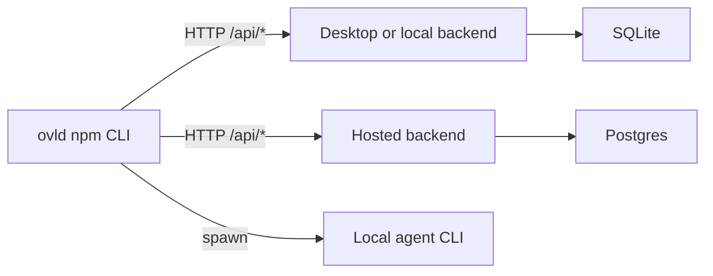

# CLI Module

The `ovld` command-line surface — Overlord's primary, CLI-first product.
This module is the home for everything a user or agent invokes as `ovld …`.

## Contract Components

This module is the developer-facing home for three components defined in
[`CONTRACT.md`](../CONTRACT.md):

| Component      | Stable id  | What it owns                                                                                                                                                                        |
| -------------- | ---------- | ----------------------------------------------------------------------------------------------------------------------------------------------------------------------------------- |
| CLI Layer      | `cli`      | Management command names/shapes, project linking & discovery, config file locations (`overlord.toml`, `.overlord/project.json`), human-readable output conventions                  |
| Protocol Layer | `protocol` | `ovld protocol` subcommands and flags, session lifecycle (`attach → (update\|heartbeat)* → (ask\|deliver)`), context-assembly format, delivery payload + change-rationale recording |
| Runner Layer   | `runner`   | `execution_requests` queue claiming and launch, working-directory resolution, `ovld runner` commands, execution-target selection                                                    |

These stay distinct components in the contract (separate interaction surfaces
and ownership). They are grouped into one developer module because they are all
the `ovld` command surface and tend to be worked on together.

## Documentation

Requirements and behavior specs are colocated in this module's
[`docs/`](docs/) folder (see the root [README](../README.md#modules) for the
colocation convention):

- [01 — Core Domain and Lifecycle](docs/01-core-domain-and-lifecycle.md): projects, tickets, objectives, sessions, events, statuses, state transitions.
- [02 — CLI-First Product Surface](docs/02-cli-first-product-surface.md): management commands, configuration, project linking, output contracts.
- [03 — Agent Protocol](docs/03-agent-protocol.md): `ovld protocol` lifecycle, context assembly, updates, delivery, attachments.
- [04 — Runner and Launch Execution](docs/04-runner-and-launch-execution.md): execution requests, local runner, launch command generation, auto-advance.
- [05 — Review, Artifacts, and Change Tracking](docs/05-review-artifacts-and-change-tracking.md): delivery review records, artifacts, rationale coverage, local diff support.
- [Test Plan](docs/testing.md): test plan for the `cli`, `protocol`, and `runner` components — management commands, protocol lifecycle/attach-shape/validation conformance, runner queue atomicity, and surface smoke tests. Part of the root [TEST_PLAN.md](../TEST_PLAN.md).

## Setup

The CLI is **client-only**. Management commands, protocol sessions, and runner
queue operations all reach persistence through the backend URL you configure — only
`help` and `version` work without one. First-time setup is about **pointing
`ovld` at a backend** and verifying it is reachable.

### How the published CLI works

The npm package ships command parsing, config/auth onboarding, connector setup,
an HTTP backend client, and the local runner/agent launcher. It does **not** ship
SQLite, `better-sqlite3`, migrations, or the service-layer database runtime.



Local mode means `ovld` talks to a backend already running on your machine,
normally Desktop or a future db-only local backend. Cloud mode means `ovld`
talks to a hosted Overlord backend. In both modes, the backend owns persistence
and migrations; the CLI is a client of that backend.

### Point the CLI at a backend

Configuration lives in `overlord.toml` (discovered from the current directory
upward, or in `~/.ovld/overlord.toml` for a global install).

| Mode | Config key | How to set it |
| ---- | ---------- | ------------- |
| **Local backend** | `backend_url` | `ovld config set local [url]` — defaults to `http://127.0.0.1:4310` |
| **Hosted backend** | `backend_url` | `ovld config set cloud <url>` |

`ovld config set` without arguments opens the interactive backend selector.
`ovld config list` shows the resolved target; `ovld doctor` checks that the
backend is reachable.

Environment overrides (useful in scripts and CI):

- `OVLD_HOME` — relocate the global `~/.ovld` directory
- `OVERLORD_USER_TOKEN` / `USER_TOKEN` — bearer token sent to hosted backends when set

The local backend/Desktop package owns SQLite and migrations. The published npm
CLI only stores the backend URL and sends HTTP requests.

### What requires the backend

These commands work without a backend: `ovld help`, `ovld version`,
`ovld config ...`, and connector setup/inspection commands that only touch local
files. Commands that read or mutate Overlord state — projects, tickets,
protocol calls, runner queue operations, and launch context assembly — call the
configured backend URL.

`ovld runner` is still local in the important sense: it claims work through the
backend API, then spawns the selected agent process on your machine in the
resolved project directory. The queue state remains in the backend.

### First run

After installing the published package:

```bash
ovld auth login
```

Login verifies that a backend is configured. If none is set yet, it walks through
`ovld config` first — local setup offers `http://127.0.0.1:4310` as the default
backend URL; cloud setup accepts a hosted backend URL.

Then confirm the connection and continue with projects, tickets, and agents:

```bash
ovld doctor
ovld config list
```

See [Getting Started](../docs/getting-started.md) for the full walkthrough from
install through first delivered ticket.

## Code & Tests

The packaged CLI lives in this module as a self-contained Yarn sub-project:

```bash
yarn build:cli            # compile TypeScript to cli/dist/
yarn test:cli             # unit + subprocess smoke tests
yarn pack:cli             # produce an installable tarball
node cli/bin/ovld.mjs version
```

Layout:

```
cli/
  bin/ovld.mjs            # published bin entry (imports compiled dist/)
  src/                    # TypeScript implementation
  dist/                   # build output (gitignored)
  test/                   # colocated tests, including cli/test/e2e/
  package.json            # bin map, build scripts, pack metadata
```

The CLI ships command parsing, config/auth onboarding, connector setup, backend
client calls, and local runner/agent launch logic. Run `yarn build` before using
the compiled CLI (`node cli/bin/ovld.mjs …`).

## Interaction Boundaries

Per the contract, the CLI/protocol/runner surfaces reach persistence only
through the configured **REST/backend API** — never direct table writes.
See the Interaction Surfaces section of [`CONTRACT.md`](../CONTRACT.md) before
making any cross-module change.
