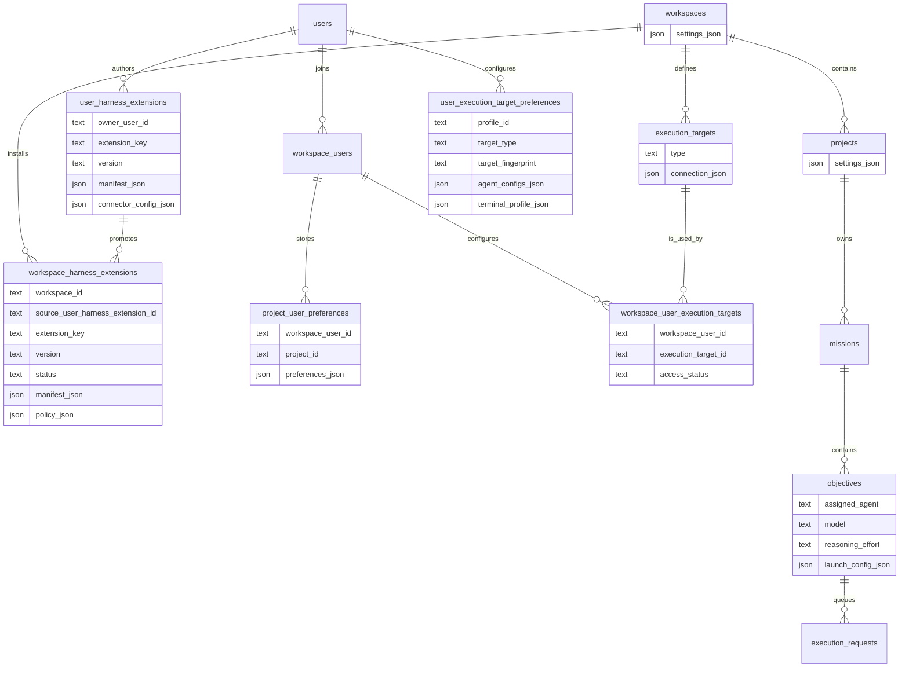
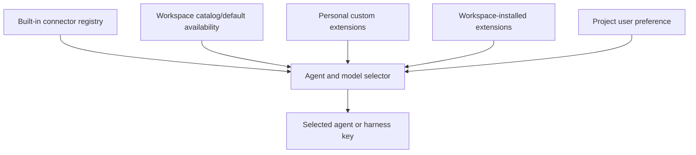
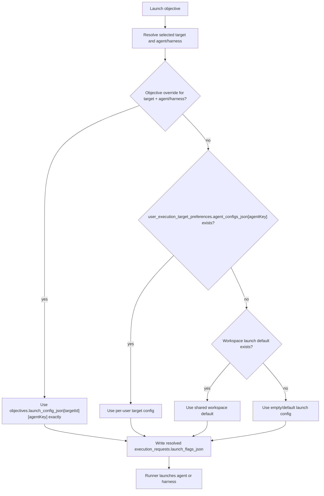
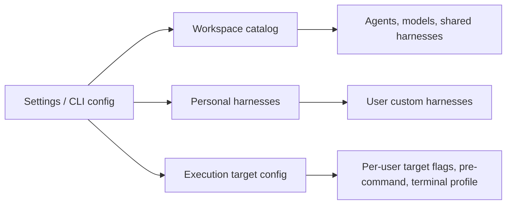

# Agent And Harness Configuration Architecture

## Decision

Overlord should split agent and harness configuration by ownership boundary. The
configuration model should not use one user-level or project-level blob as the canonical source
for every launch decision.

The project-specific model is:

1. Built-in connector metadata defines which agent keys Overlord knows how to launch.
2. Workspace configuration defines which agents, models, and shared harnesses are available in the
   workspace by default.
3. Users may create personal custom harness extensions, then install or publish them into one or
   more workspace catalogs.
4. User-specific launch mechanics live on `user_execution_target_preferences`, because launch
   wrappers, flags, terminal choices, and local shell assumptions are specific to one user and one
   stable target fingerprint, and should follow that user across workspace memberships.
5. Per-objective launch changes live on `objectives.launch_config_json`, keyed by execution
   target and agent or harness key.

This means `agent_flags_json` should be treated as a temporary name. The durable contract should
rename it to `agent_configs_json` where it stores more than raw flags, and the canonical reusable
per-user launch mechanics should move to `user_execution_target_preferences.agent_configs_json`.

## Current Overlord Shape

The current schema already has most of the right boundaries:

| Existing surface | Current role | Architecture direction |
| --- | --- | --- |
| `workspaces.settings_json` | Workspace settings | Store the workspace default agent/model/harness catalog here for the CLI-first MVP. |
| `projects.settings_json` | Project settings | Keep for project behavior only. Do not store model availability or defaults here. |
| `project_user_preferences.preferences_json` | Per-user project preferences | Store recently selected agent/model/reasoning and UI preferences here. |
| Future `user_harness_extensions` | User-authored extension definitions | Personal draft/private harnesses reusable across workspaces. |
| Future `workspace_harness_extensions` | Workspace-installed extension entries | Shared workspace catalog entries, normally created from a user extension version. |
| `execution_targets` | Target identity and connection metadata | Keep as target identity. Do not make it the canonical home for user launch wrappers. |
| `workspace_user_execution_targets` | Workspace-user access to targets | Keep as the workspace access bridge, not the reusable preference home. |
| `user_execution_target_preferences` | User target preferences | Make this the canonical home for reusable per-user/per-target launch mechanics. |
| `objectives.assigned_agent`, `model`, `reasoning_effort` | Objective selection | Keep as the objective's selected agent/model fields. |
| `objectives.launch_config_json` | Per-objective launch override | Keep, but make the JSON shape target-keyed and agent-keyed. |
| `execution_requests.launch_flags_json` | Queued launch snapshot | Keep as the resolved launch snapshot used by a runner claim. |

The important change is semantic: `execution_targets` can describe the target and non-secret
connection metadata, `workspace_user_execution_targets` owns access, and
`user_execution_target_preferences` owns the user's local launch behavior for that stable target
fingerprint.

## Ownership Boundaries

| Concern | Owner | Overlord storage | Notes |
| --- | --- | --- | --- |
| Built-in agent connector capabilities | Overlord | Connector registry or static config | Examples: `codex`, `claude`, `cursor`. |
| Agents and models available by default | Workspace | `workspaces.settings_json`, future `workspace_agent_catalog` | Model config is workspace-level, not project-level. |
| Personal custom harness extensions | User | `user_harness_extensions` | User-owned source of truth for draft/private custom connectors. |
| Workspace custom harness extensions | Workspace admin/member with permission | `workspace_harness_extensions` | Workspace-installed catalog entries, optionally copied from a personal extension version. |
| Last/default selected agent/model/reasoning | Workspace user, scoped to project | `project_user_preferences.preferences_json` | Preference only. Not launch mechanics. |
| Local flags, pre-command, terminal profile | Profile + stable target fingerprint | `user_execution_target_preferences.agent_configs_json` and `terminal_profile_json` | The same user target can be reused across workspace memberships. |
| Target identity and connection metadata | Workspace/project admin or local setup | `execution_targets.connection_json` | No raw credentials and no user-specific shell wrappers. |
| Per-objective launch override | Objective + execution target + agent/harness | `objectives.launch_config_json` | Explicit one-objective override. |
| Queued launch snapshot | Request service/runner | `execution_requests.launch_flags_json` | Snapshot after resolution, not a preference source. |

## Data Model Diagram



## Catalog Resolution

The agent/model selector should be built from shared options plus personal additions:



The sources answer different questions:

- Built-in connector metadata answers: "What can Overlord launch without custom templates?"
- Workspace catalog answers: "What agents, models, and shared harnesses are available by default?"
- Personal custom extensions answer: "What draft/private harnesses has this user built?"
- Workspace-installed extensions answer: "What custom harnesses are approved for this workspace?"
- User preferences answer: "What does this user usually select in this project?"

None of these sources should be the canonical source for local pre-commands, shell wrappers, or
target-specific flags.

## Launch Configuration Resolution

Launch mechanics should resolve from the most specific source first:



Important behavior:

- A present objective override is authoritative.
- Empty override values mean "run with no pre-command or flags" for that objective.
- A null `objectives.launch_config_json` means inherit at request/claim time.
- A non-null `objectives.launch_config_json` means the objective intentionally overrides inherited
  launch mechanics.
- `execution_requests.launch_flags_json` should be a resolved snapshot for that queued request, not
  a fallback preference source.

## Proposed JSON Shapes

### Extension Storage

Custom harnesses should be stored as extension definitions, not as project preferences.

The storage split should be:

| Layer | Storage | Purpose |
| --- | --- | --- |
| Packaged harnesses | Code-level registry bundled with Overlord | Immutable definitions for built-in agents such as `codex`, `claude`, and `pi`. |
| Personal extension definitions | `user_harness_extensions` plus local bundle files or hosted blobs | User-authored draft/private custom connectors. |
| Workspace extension catalog | `workspace_harness_extensions` | Workspace-approved installed extensions available to members. |
| Local connector installation state | `connector_installations` | Doctor/setup state for files installed into a specific local agent runtime. |

For local-only MVP storage, extension bundle files can live under
`~/.ovld/extensions/<extension-key>/<version>/`, with the database storing manifest, checksums,
capabilities, command template metadata, and source path. For hosted/synced workspaces, the same
manifest should point at managed blob storage rather than raw local paths.

Promoting a personal extension into a workspace should create a workspace record that snapshots the
selected version. The workspace should not depend on the author's mutable draft state. Later edits
to the personal extension create a new version and require an explicit workspace update.

### `user_harness_extensions`

```json
{
  "extensionKey": "my-local-review-agent",
  "version": "0.1.0",
  "visibility": "private",
  "manifest": {
    "label": "My Local Review Agent",
    "description": "Personal harness for local review workflows.",
    "entrypoint": "connector.yaml",
    "files": [
      {
        "path": "connector.yaml",
        "sha256": "..."
      }
    ]
  },
  "connectorConfig": {
    "command": "my-review-agent",
    "args": ["--mode", "review"],
    "capabilities": {
      "supportsModelFlag": true,
      "supportsContextFile": true,
      "supportsPermissionHook": false
    }
  }
}
```

### `workspace_harness_extensions`

```json
{
  "extensionKey": "my-local-review-agent",
  "version": "0.1.0",
  "status": "enabled",
  "sourceUserHarnessExtensionId": "user-extension-id",
  "manifest": {
    "label": "My Local Review Agent",
    "entrypoint": "connector.yaml"
  },
  "policy": {
    "availableByDefault": false,
    "allowedWorkspaceUserIds": []
  }
}
```

### `workspaces.settings_json`

```json
{
  "agentCatalog": {
    "agents": {
      "codex": {
        "availableByDefault": true,
        "models": ["gpt-5-codex", "gpt-5"],
        "defaultModel": "gpt-5-codex",
        "defaultReasoningEffort": "medium"
      },
      "claude": {
        "availableByDefault": true,
        "models": ["claude-sonnet-4-5"],
        "defaultModel": "claude-sonnet-4-5"
      }
    },
    "harnesses": {
      "workspace-custom-harness": {
        "availableByDefault": true,
        "label": "Workspace Custom Harness",
        "command": "workspace-agent",
        "capabilities": {
          "supportsModelFlag": true,
          "supportsContextFile": true
        }
      }
    }
  }
}
```

This is the workspace default catalog for the CLI-first MVP. Projects may reference workspace
agents or harnesses through objective selection and user preferences, but they must not define
model availability or shared model defaults.

### `user_execution_target_preferences.agent_configs_json`

```json
{
  "codex": {
    "flags": ["--model", "gpt-5-codex"],
    "preCommand": "direnv exec .",
    "env": {
      "CODEX_HOME": "~/.codex"
    }
  },
  "claude": {
    "flags": ["--append-system-prompt-file"],
    "preCommand": ""
  },
  "custom-local-harness": {
    "command": "my-agent",
    "args": ["--profile", "local"],
    "preCommand": "agent-pod"
  }
}
```

### `objectives.launch_config_json`

```json
{
  "execution-target-id-a": {
    "codex": {
      "flags": [],
      "preCommand": ""
    }
  },
  "execution-target-id-b": {
    "custom-local-harness": {
      "flags": ["--debug"],
      "preCommand": "direnv exec ."
    }
  }
}
```

The objective override is keyed by both execution target and agent or harness key so changing the
target, agent, or harness does not accidentally reuse a stale override from a different launch
context.

### `project_user_preferences.preferences_json`

```json
{
  "launchPreference": {
    "selectedAgent": "codex",
    "selectedModel": "gpt-5-codex",
    "selectedReasoningEffort": "medium",
    "selectedExecutionTargetId": "execution-target-id-a"
  }
}
```

Project user preferences can remember selections, but they must not own custom harness definitions.

## UI And CLI Implications

Settings and commands should keep catalog choices separate from launch mechanics:



Recommended boundaries:

- `ovld agent-setup <agent>` installs connector files and updates connector status, not per-objective
  launch overrides.
- `ovld workspace config` or equivalent manages workspace default agent, model, and shared harness
  availability.
- `ovld project config` must not manage model availability or model defaults.
- `ovld extension create` or `ovld harness create` creates a personal `user_harness_extensions`
  record and local bundle.
- `ovld workspace extension add <extension>` installs a selected personal extension version into
  `workspace_harness_extensions`.
- `ovld target config` manages `user_execution_target_preferences.agent_configs_json` and
  `terminal_profile_json`.
- Manual run UI/CLI shows inherited launch config from the selected execution target and saves
  edits as objective overrides only when the user explicitly changes the launch config for that
  objective.

The launch surface should always show the inherited source target. Otherwise a user with multiple
local or SSH targets cannot tell which flags and pre-command will apply.

## Migration Direction

Recommended implementation sequence:

1. Rename `agent_flags_json` to `agent_configs_json` in contract language where values include
   flags, pre-command, command templates, environment hints, or connector-specific launch settings.
2. Make `user_execution_target_preferences.agent_configs_json` the canonical place for reusable
   per-user and per-target launch mechanics.
3. Remove launch-mechanics storage from `execution_targets` and
   `workspace_user_execution_targets`; both should stay focused on identity and access.
4. Remove `projects.default_agent`, `default_model`, and `default_reasoning_effort`; model
   availability and shared defaults belong to the workspace catalog.
5. Store last selected agent/model/reasoning/target in
   `project_user_preferences.preferences_json.launchPreference`.
6. Shape `objectives.launch_config_json` as a target-keyed and agent-keyed override map.
7. Resolve launch configuration before writing or claiming an `execution_requests` row, and store
   the resolved snapshot in `execution_requests.launch_flags_json`.
8. Add `user_harness_extensions` and `workspace_harness_extensions` before supporting custom
   connector authoring and workspace promotion. Do not hide authored extension definitions inside
   `project_user_preferences`.

## Non-Goals

- Do not store raw credentials, API keys, or session secrets in any config JSON.
- Do not store local launch wrappers on `execution_targets` as the canonical source; target
  identity and reusable user preferences have different owners.
- Do not make projects responsible for model availability, shared model defaults, local
  pre-commands, or per-target flags.
- Do not let an objective override apply across agents or harnesses on the same target.
- Do not require a hosted web app to configure the local MVP; the same model should work from the
  CLI and later web surfaces.
