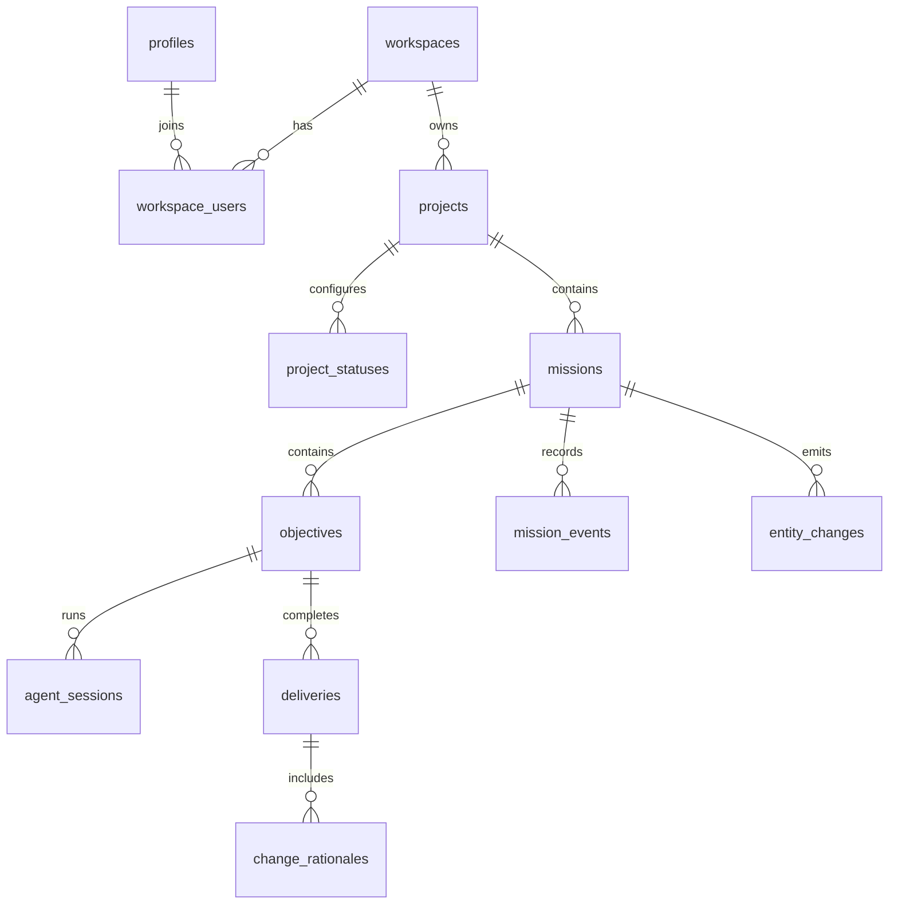

# Database Schema Contract

Contract Version: `1`

## Goal

Define the first-pass persistence contract for Overlord so local CLI, REST APIs, future web UI, runners, workers, and optional sync clients all operate on the same durable model.

This document is a schema contract, not a one-database implementation. PostgreSQL should be the authoritative database for shared deployments, SQLite should remain available for local development, and the logical schema must stay portable enough for both adapters.

## Recommendation: PostgreSQL For Shared Deployments, SQLite For Local Development

Overlord should use PostgreSQL as the authoritative database for shared
organization, hosted, private-network, or remote-runner deployments. SQLite
remains useful as the default local development and single-workstation database.

Reasons to keep SQLite for local development:

- The first product surface is local and CLI-first.
- SQLite has no separate service to install, configure, secure, or back up before `ovld init`.
- The local runner can poll a local SQLite database reliably when WAL mode and short transactions are used.
- Attachments and local repository metadata already have a local filesystem boundary.
- A single-user local instance does not need Postgres operational complexity.

Reasons to use PostgreSQL for shared deployments:

- Hosted REST APIs, edge functions, and remote workers need a network-addressable database.
- Postgres has stronger concurrent writer behavior for shared instances.
- `LISTEN/NOTIFY`, logical replication, and mature JSON/indexing are useful for realtime UI and sync.
- Managed Postgres is a common deployment target for open-source web apps.

This choice does not change the logical schema. It does affect implementation details:

- SQLite stores logical JSON as text, optionally validated with JSON functions. Postgres should use `jsonb`.
- SQLite uses `INTEGER` booleans and text timestamps. Postgres can use native `boolean` and `timestamptz`.
- SQLite has one writer at a time. Postgres can support higher concurrency.
- Realtime should not depend on Postgres-only triggers or notifications. The canonical realtime source should be an application-written change feed, with Postgres notifications as an optimization.
- Edge functions should use the REST/service layer or a Postgres adapter. They should not assume access to a user's local SQLite file.

## Contract Principles

- Clients should use application services or REST APIs, not direct table writes.
- The database schema is a durable implementation contract for adapters, migrations, tests, and extension authors.
- Domain state transitions live in services. Database constraints enforce shape, ownership, uniqueness, and referential integrity.
- Every persisted domain record should have a stable text ID that can survive export/import and client sync.
- All mutable domain tables should include `created_at`, `updated_at`, `deleted_at`, and `revision`.
- Deletes should normally be soft deletes so REST clients, realtime subscribers, and local sync clients can observe tombstones.
- Append-only history should be preferred for audit records, mission events, deliveries, and sync changes.
- The schema should avoid native database enums in the contract. Use stable text values plus adapter checks or application validation.
- Full repository contents, raw token secrets, and raw session secrets must not be persisted.
- Soft delete state is represented by `deleted_at`, not by duplicating terminal `deleted` or `removed` status values.
- Mutable row updates must use `revision` as an optimistic concurrency token.

## Conventions And Glossary

- `active` means `deleted_at IS NULL`.
- `TimestampUTC` values are UTC and fixed-width. SQLite must store them as ISO-8601 text in `YYYY-MM-DDTHH:MM:SS.SSSZ` form. Do not mix text timestamps with epoch integers in the same database.
- Public JSON/API fields use camelCase. Physical database columns use snake_case. A `*_json` column drops the suffix in public JSON names, for example `metadata_json` becomes `metadata`.
- Stable IDs should be UUIDv7 or ULID strings. Integer primary keys are not part of the portable contract.
- `revision` starts at `1` for inserted mutable rows and increments by exactly one for each service-layer mutation.
- `metadata_json` and `settings_json` are extension space, but extension keys must be namespaced. Use reverse-DNS or package-style keys such as `com.example.plugin`, with a nested `schemaVersion` where the extension stores structured data.
- Tables without `created_at`, `updated_at`, `deleted_at`, and `revision` are intentional operational or append-only tables. Current exemptions are `mission_sequences`, `mission_events`, `shared_context_tags`, `entity_changes`, `sync_cursors`, `outbox_messages`, `search_documents`, `audit_log`, `schema_migrations`, and `webhook_delivery_attempts`.
- Columns named `position` (and the mission board ordering column `board_position`) must use a reorder strategy that does not violate active uniqueness mid-transaction. Services should use gap-based integer positions by default, for example `100`, `200`, `300`; compacting positions is a maintenance operation. `board_position` is not uniqueness-constrained, so services may renumber a whole board column densely on each reorder.

## Logical Types

Adapters should map these logical types to their database-native equivalents.

| Logical type | SQLite | Postgres | Notes |
| --- | --- | --- | --- |
| `Id` | `TEXT` | `text` or `uuid` | Prefer UUIDv7 or ULID string. Do not require integer IDs. |
| `DisplayId` | `TEXT` | `text` | Human IDs such as `1:1204`. |
| `TimestampUTC` | `TEXT` ISO-8601 UTC | `timestamptz` | SQLite stores fixed-width `YYYY-MM-DDTHH:MM:SS.SSSZ`; services normalize to UTC. |
| `Json` | `TEXT` containing JSON | `jsonb` | Empty object default should be `{}`. |
| `Bool` | `INTEGER` 0/1 | `boolean` | Use service-layer normalization. |
| `SecretHash` | `TEXT` | `text` | Hash only. Never raw token/session secrets. |
| `Path` | `TEXT` | `text` | Store normalized display path, not file contents. |
| `ChangeSeq` | `INTEGER` | `bigint` | Monotonic change-feed cursor. |
| `BigCount` | `INTEGER` | `bigint` | File sizes, feed cursors, and counters that can exceed 32-bit integer range. |

The public contract should use canonical JSON field names even when physical columns are snake_case.

## Adapter Requirements

Any supported database adapter must provide:

- ACID transactions.
- Foreign key enforcement.
- Unique constraints.
- Indexed lookups by ID, workspace/project/mission, status, and updated time.
- Atomic compare-and-set updates for queue claiming and state transitions.
- A way to allocate monotonic mission sequence numbers.
- A way to append `entity_changes` in the same transaction as domain mutations.
- Commit-safe change-feed visibility for any multi-writer adapter.
- Migration tracking.

Adapters may add optimized indexes, generated columns, full-text indexes, triggers, or notification mechanisms as long as they preserve the logical contract.

In index notes, "active" means `deleted_at IS NULL`. SQLite and Postgres adapters must use partial unique indexes for "one active X" rules. Service-layer transaction checks may supplement those indexes, but must not replace them for invariants both supported adapters can enforce.

Adapter conformance tests must cover required tables, columns, indexes, foreign keys, active unique constraints, optimistic concurrency, soft delete visibility, queue claiming, and change-feed behavior.

### Ambient Transactions

The async `DatabaseClient`'s `transaction(async tx => ...)` is ambient: while the callback is running, any query issued through the *root* `DatabaseClient` (the instance `transaction()` was called on, not just the `tx` parameter) from within that same async context automatically joins the open transaction, on both adapters. This is implemented with a per-root-instance `AsyncLocalStorage`, never a module-level one, so unrelated `DatabaseClient` instances (e.g. separate adapters under test in the same process) never cross-contaminate each other's ambient transaction. A transaction/session-scoped client (the `tx` argument, or any SAVEPOINT-nested client) never consults the ambient store itself — it always operates directly on its own connection.

This closes a bug class where a helper queried through the root client from inside a transaction callback: on SQLite, `SqliteClient.transaction()` holds a process-wide mutex, so a root-client call inside the callback queued on that mutex forever and froze the process; on Postgres, the same mistake silently ran the query on a different pooled connection outside the transaction (non-atomic writes, reads that missed uncommitted state). Ambient join makes both adapters do the correct thing without requiring every call site to thread `tx` through by hand — though passing `tx` explicitly remains correct and preferred for readability.

A query or nested `transaction()` call issued outside the callback's async context (e.g. concurrent work started before/after the `transaction()` call, not awaited from inside it) does **not** join — it runs against the root client normally: serialized after the transaction commits on SQLite (mutex), or genuinely concurrently on a separate connection on Postgres.

Once a transaction-scoped client's `transaction()` callback has resolved (committed or rolled back), any further query issued through that specific captured client throws `TransactionClosedError` — this is a safety net for fire-and-forget/detached async work spawned inside a callback that outlives it (e.g. an unawaited realtime-poll trigger), so a stale connection reference fails loudly instead of silently reusing a released/committed connection.

Postgres foreign keys on workspace-scoped tables, including composite foreign
keys whose child columns include `workspace_id`, must be `DEFERRABLE INITIALLY
IMMEDIATE`. Migrations may temporarily defer them inside a transaction when moving
an entire workspace graph, such as the organization hierarchy UUID rekey.
Constraints still validate at commit.

Adapters should express conditional requirements with CHECK constraints where possible, including:

- `shared_context_entries`: `value_text` is required when `value_kind = 'string'`; `value_json` is required when `value_kind = 'json'`.
- `execution_targets`: `device_id` is required when `type = 'local'`.
- `artifacts`: at least one of `content_text`, `content_json`, or `external_url` is required.
- `role_assignments`: `resource_type` and `resource_id` are non-null, using empty string sentinels for instance scope.

## Concurrency And Consistency

Services must own state transitions and run them in ACID transactions. Direct table writes by clients or extensions are outside the supported contract.

### Optimistic Concurrency

Every mutable table with `revision` must update through compare-and-set semantics:

```sql
UPDATE table_name
SET ..., revision = revision + 1, updated_at = ?
WHERE id = ? AND revision = ? AND deleted_at IS NULL
```

A zero-row update is a conflict and should surface as a `409` or equivalent domain error. The domain mutation, `revision` bump, related `mission_events`, `entity_changes`, and `outbox_messages` must be committed atomically.

### Tenant And Denormalized Column Invariants

Denormalized ownership columns such as `workspace_id`, `project_id`, `mission_id`, and cached `status_type` are part of the contract, not advisory metadata. Services and adapters must prevent cross-tenant rows.

Preferred enforcement is composite foreign keys such as `(workspace_id, project_id)` referencing `projects(workspace_id, id)`, plus similar constraints for mission/objective relationships. Where a database cannot express a denormalized invariant directly, the adapter conformance suite must test service enforcement.

When `missions.status_id` references `project_statuses`, `missions.status_type` must be copied from the referenced row in the same transaction. If a project status type changes, affected missions must be updated and emitted in `entity_changes`.

### Change-Feed Visibility

`entity_changes.seq` is a durable cursor only after the transaction containing the row has committed and the adapter's visibility rule says it is safe to advance past that sequence.

SQLite's single-writer mode can serve `WHERE seq > cursor ORDER BY seq` directly when writes are serialized. Multi-writer adapters such as Postgres must not expose a raw sequence as the only cursor because sequence allocation order can differ from commit visibility. A Postgres adapter must provide one of:

- a transactional outbox/change-feed writer that serializes visible feed rows,
- a safe high-water mark that only advances past the largest contiguous committed `seq`,
- logical-replication or snapshot-horizon semantics that preserve commit-safe consumption.

Sync clients should advance cursors only to the adapter-provided safe high-water mark. If a requested cursor is older than the retained feed window, the API must return a clear full-resync-required response.

### Idempotency Layering

Use `idempotency_keys` to guard request/response replay for protocol, REST, hooks, and worker calls. Per-table idempotency keys such as `mission_events.idempotency_key` or `execution_requests.idempotency_key` guard domain inserts and queue effects.

If the same idempotency scope/key is reused with a different `request_hash`, the operation must fail with a conflict. It must not replay a cached response for a different request body.

## Soft Delete, Foreign Keys, And Tombstones

- `deleted_at` is the single tombstone for soft-deletable rows. Status columns may include operational values such as `active`, `archived`, `disabled`, or `revoked`, but must not duplicate removal with `deleted` or `removed`.
- A `delete` operation in `entity_changes` means a soft-delete tombstone unless a table-specific purge process explicitly says otherwise.
- Services should cascade soft deletes where the child has no useful standalone meaning. Otherwise they should preserve children and filter by active parents in read models.
- Hard deletes are maintenance purges. A purge that removes retained tombstones must either emit a purge outbox/change notification or declare that older sync clients must full-resync.
- Every FK should declare an on-delete policy in the physical migration. Default to `RESTRICT` for durable history and review rows, `SET NULL` for optional actor/session attribution, and service-managed soft cascade for owned mutable children. `RESTRICT` blocks on row existence, not on `deleted_at` — a tombstoned row still blocks the parent's hard delete — so a `RESTRICT` child can only be cleared by a service-managed *hard* purge cascade, never a soft one; reserve `RESTRICT` for children whose parent is normally only ever soft-deleted. Concrete example: `profiles`' `RESTRICT` children (`workspace_users`, `user_tokens`, `user_images`, and `workspace_users`' own `RESTRICT` children `role_assignments`, `workspace_user_execution_targets`, `project_user_preferences`) are hard-purged by `backend/account-deletion.ts` — invoked from the Auth Layer's `deleteUser` `beforeDelete` hook — before the Better Auth `user` row is hard-deleted; that hard delete then cascades `profiles` and `user_execution_target_preferences` (both already `ON DELETE CASCADE`). All of these are exclusively owned by the profile being erased, so none has standalone meaning once the identity is gone; each purge still emits an `entity_changes` row per the purge-notification rule above.
- Attachment bytes are stored outside the database. Soft-deleting an attachment should enqueue an outbox effect such as `attachment.delete_blob` after the tombstone is committed.

## Identity And Tenancy

The local MVP can run as one authenticated local operator in one workspace, created through onboarding. The first human identity is created through the Auth Layer, and the schema should still reserve the future multi-user shape.

### `organizations`

The grouping + identity layer above `workspaces` (`organization → workspace →
project`). Workspaces remain the **sole RBAC layer** — an organization is a
name/logo shell (with room for future billing/plan metadata) that groups one
or more workspaces, not a second permission boundary. An "organization admin"
is a **derived** concept: a profile with an active `ADMIN` role assignment in
*every* constituent (non-deleted) workspace of the organization, maintained by
service-layer invariant (`addOrganizationAdmin`/`removeOrganizationAdmin`), not
a separate RBAC scope type or table.

An organization is created only through onboarding (`POST /api/onboarding`) or
workspace creation under an existing organization; it is deleted implicitly
when its last constituent workspace is deleted (no direct delete endpoint).

| Column | Type | Required | Notes |
| --- | --- | --- | --- |
| `id` | Id | yes | Stable organization ID (UUID). |
| `name` | text | yes |  |
| `settings_json` | Json | yes | Currently just `logoUrl`; reserved for future billing/plan metadata. |
| `created_at` | TimestampUTC | yes |  |
| `updated_at` | TimestampUTC | yes |  |
| `deleted_at` | TimestampUTC | no | Tombstone, set when the last constituent workspace is deleted. |
| `revision` | integer | yes |  |

Indexes: none beyond the primary key — organizations are reached through their constituent workspaces, never searched directly.

### `workspaces`

Represents a tenant and RBAC boundary inside an organization. IDs are opaque
UUIDs (`newId()`), not derived from the name/slug — renaming a workspace is a
plain `UPDATE`, it no longer re-keys `workspace_id` anywhere. Slugs are unique
**per organization**, not instance-wide, and continue to prefix mission display
IDs (`<slug>:<sequence>`); the same slug may exist in two different
organizations.

| Column | Type | Required | Notes |
| --- | --- | --- | --- |
| `id` | Id | yes | Stable workspace ID (UUID). |
| `organization_id` | Id | yes | FK to `organizations`. |
| `slug` | text | yes | Human/config key, unique within the organization. |
| `name` | text | yes | Human-readable name from `overlord.toml` by default. |
| `kind` | text | yes | `local`, `hosted`, or future adapter-defined kind. |
| `settings_json` | Json | yes | Instance defaults, feature flags, and workspace default agent/model/harness catalog for the CLI-first MVP. No longer carries `logoUrl` — the logo moved to the containing organization. |
| `created_at` | TimestampUTC | yes |  |
| `updated_at` | TimestampUTC | yes |  |
| `deleted_at` | TimestampUTC | no | Tombstone. Deleting the last live workspace of an organization also tombstones the organization. |
| `revision` | integer | yes | Increment on mutation. |

Indexes:

- Unique active `(organization_id, slug)`.

### `profiles`

Represents application-facing profile data for Better Auth users. Every interactive
actor must have a Better Auth `user` row first; the corresponding `profiles` row
uses the same `id` as the Better Auth user and is created automatically by the
auth migration bridge. A profile can exist independently of any one workspace.

Email is the account's primary identifier, both for display and for auth. The
auth migration bridge keeps `profiles.email` synchronized with the Better Auth
account email: it copies `user.email` into `profiles.email` when the user row
is inserted, and an `AFTER UPDATE OF email ON "user"` trigger re-copies it
(bumping `updated_at`/`revision`) whenever the account email changes. Because
`email` is bridge-managed it is **not** directly editable through the
application — `PATCH /api/profile` does not accept an `email` field; it is
changed through the Auth surface (`changeEmail`) instead.

The bridge also keeps `handle` synchronized with the account name: it copies
the Better Auth `user.name` into `profiles.handle` when the user row is
inserted, and an `AFTER UPDATE OF name ON "user"` trigger re-copies it whenever
the name changes. `handle` is an optional display value, not the primary
identifier, and like `email` is bridge-managed and **not** directly editable
through `PATCH /api/profile`. `display_name` is seeded from the account name
at sign-up but stays independently editable thereafter.

| Column | Type | Required | Notes |
| --- | --- | --- | --- |
| `id` | Id | yes | Stable profile ID and FK to Better Auth `"user".id`. |
| `kind` | text | yes | `human`, `service`, or adapter-defined. |
| `display_name` | text | yes |  |
| `handle` | text | no | Optional, globally unique, URL/display-safe handle. Mirrors the Better Auth account name via the auth bridge; not directly editable. |
| `email` | text | no | The account's primary identifier. Mirrors the Better Auth account email via the auth bridge; not directly editable. |
| `status` | text | yes | `active`, `disabled`. Removal is represented by `deleted_at`. |
| `metadata_json` | Json | yes | Auth provider metadata, not secrets. |
| `created_at` | TimestampUTC | yes |  |
| `updated_at` | TimestampUTC | yes |  |
| `deleted_at` | TimestampUTC | no | Tombstone. |
| `revision` | integer | yes |  |

Indexes:

- `(status)`.
- Optional unique lowercased `handle` where present.
- Optional unique `(email)` where present.

### `workspace_users`

Represents a profile's membership and effective identity inside a workspace. Workspace-scoped resources such as mission assignments, role assignments, project ownership, and workflow attribution should reference `workspace_users.id`, not the global `profiles.id`.

| Column | Type | Required | Notes |
| --- | --- | --- | --- |
| `id` | Id | yes | Stable workspace membership ID. |
| `workspace_id` | Id | yes | FK to `workspaces`. |
| `profile_id` | Id | yes | FK to `profiles`. |
| `member_key` | text | no | Optional human-readable key such as `<workspace>:<handle>` for URLs and assignee pickers. |
| `status` | text | yes | `active`, `disabled`. Removal is represented by `deleted_at`. |
| `metadata_json` | Json | yes | Workspace membership metadata. |
| `created_at` | TimestampUTC | yes |  |
| `updated_at` | TimestampUTC | yes |  |
| `deleted_at` | TimestampUTC | no | Tombstone. |
| `revision` | integer | yes |  |

Indexes:

- Unique active `(workspace_id, profile_id)`.
- Optional unique active `(workspace_id, member_key)` where present.
- `(workspace_id, status)`.
- `(profile_id, status)`.

### `role_assignments`

Stores durable workspace-user-to-role membership. Role definitions can live in config or a custom provider.

| Column | Type | Required | Notes |
| --- | --- | --- | --- |
| `id` | Id | yes |  |
| `workspace_id` | Id | yes | FK to `workspaces`. |
| `workspace_user_id` | Id | yes | FK to `workspace_users`. |
| `role_key` | text | yes | Examples: `ADMIN`, `MEMBER`. |
| `resource_type` | text | yes | Scope discriminator. Use empty string for instance/workspace-level roles. |
| `resource_id` | Id | yes | Scope ID. Use empty string for instance/workspace-level roles. |
| `assigned_by_workspace_user_id` | Id | no | FK to `workspace_users`. |
| `created_at` | TimestampUTC | yes |  |
| `updated_at` | TimestampUTC | yes |  |
| `deleted_at` | TimestampUTC | no | Revocation tombstone. |
| `revision` | integer | yes |  |

Indexes:

- Unique active assignment on `(workspace_id, workspace_user_id, role_key, resource_type, resource_id)`. `resource_type` and `resource_id` are non-null so this protects instance-level roles on both SQLite and Postgres.
- `(workspace_id, role_key)`.

### `user_tokens`

Stores `USER_TOKEN` metadata and hashes only. A token is owned by `profile_id`
and authenticates that user account across workspaces. Workspace fields on this
table record the issuance/revocation context for audit and backwards
compatibility; they are not the authorization boundary. At request time, the
Auth Layer resolves the token to `profile_id`, validates the requested active
workspace against `workspace_users`, and then applies RBAC for that workspace.

`workspace_id` and `workspace_user_id` are both nullable: a profile with zero
workspace memberships (pre-onboarding) can still mint a token — needed for
headless `ovld org-setup` bootstrap — with both fields `NULL` until the caller
completes onboarding or joins a workspace.

| Column | Type | Required | Notes |
| --- | --- | --- | --- |
| `id` | Id | yes | Token identifier. |
| `workspace_id` | Id | no | Issuance workspace FK to `workspaces`; not the token's authorization scope. `NULL` for a token minted before the profile has any workspace membership. |
| `profile_id` | Id | yes | Profile that owns the token. |
| `workspace_user_id` | Id | no | Issuing workspace membership for audit. Runtime permissions come from the owner's active membership in the requested workspace. `NULL` alongside `workspace_id` for a pre-onboarding token. |
| `label` | text | yes | User supplied. |
| `token_prefix` | text | yes | Non-secret lookup/display prefix. |
| `token_hash` | SecretHash | yes | Hash of raw secret. |
| `hash_algorithm` | text | yes | Example: `argon2id`, `bcrypt`, `hmac-sha256`. |
| `status` | text | yes | `active`, `revoked`, `expired`, `rotated`. |
| `expires_at` | TimestampUTC | no | Optional expiration. |
| `last_used_at` | TimestampUTC | no | Updated after successful auth. |
| `last_used_context_json` | Json | yes | Coarse client metadata only. |
| `revoked_at` | TimestampUTC | no |  |
| `revoked_by_workspace_user_id` | Id | no | FK to `workspace_users`. |
| `predecessor_token_id` | Id | no | FK to `user_tokens` for rotation. |
| `metadata_json` | Json | yes | No raw secret. |
| `created_at` | TimestampUTC | yes |  |
| `updated_at` | TimestampUTC | yes |  |
| `deleted_at` | TimestampUTC | no | Tombstone. |
| `revision` | integer | yes |  |

Indexes:

- Unique `(workspace_id, token_prefix)`.
- `(workspace_id, workspace_user_id, status)`.
- `(profile_id, status)`.
- `(profile_id, token_prefix)` for per-user token management.
- `(token_hash)` for hash-only authentication before workspace authorization.
- `(workspace_id, expires_at)`.

Token rotation stores `predecessor_token_id` only. The successor is derived by querying rows whose predecessor points at the current token, which avoids maintaining two linked-list directions in one transaction.

### Better Auth Implementation Tables

Better Auth (the embedded authentication library) manages its own tables in the same configured adapter database. These tables are **owned by the Auth Layer** and must not be read or written by other components directly.

Schema is managed by Better Auth's configured database adapter. Adapter migration `001_better_auth.sql` creates these tables before the core migration so `profiles.id` can reference Better Auth `"user".id`. Column names follow Better Auth's camelCase conventions (different from Overlord's snake_case domain tables).

| Table | Purpose |
| --- | --- |
| `user` | Better Auth user identity (email, name, emailVerified). Linked to Overlord `profiles` by matching primary key (`profiles.id = user.id`). |
| `session` | Active browser/client sessions issued by Better Auth. |
| `account` | OAuth2 / credential accounts linked to a Better Auth user. |
| `verification` | Email verification and magic-link tokens. |
| `apikey` | USER_TOKEN credentials managed by Better Auth's apiKey plugin. `key` column stores the hashed value; the `start` prefix is the non-secret display prefix. |

These tables are created by each adapter's migration `001_better_auth.sql`. They do not carry Overlord's `workspace_id`, `revision`, or `deleted_at` fields — lifecycle is managed entirely by Better Auth.

### `user_token_scopes`

Token-level restrictions that apply to the token independently of workspace.
The grant patterns are intersected with the owner's workspace-specific RBAC
grants after the requested workspace membership is resolved.

| Column | Type | Required | Notes |
| --- | --- | --- | --- |
| `id` | Id | yes |  |
| `workspace_id` | Id | yes | Issuance workspace FK to `workspaces`; not used to bind the scope to one workspace. |
| `token_id` | Id | yes | FK to `user_tokens`. |
| `permission` | text | yes | Same canonical permission names as RBAC. |
| `resource_type` | text | no | Optional scope. |
| `resource_id` | Id | no | Optional scope. |
| `created_at` | TimestampUTC | yes |  |
| `updated_at` | TimestampUTC | yes |  |
| `deleted_at` | TimestampUTC | no | Tombstone. |
| `revision` | integer | yes |  |

Absence of scope rows means "no token-level restriction" in v1.

## Project Model

### `projects`

| Column | Type | Required | Notes |
| --- | --- | --- | --- |
| `id` | Id | yes | Stable project ID. |
| `workspace_id` | Id | yes | FK to `workspaces`. |
| `slug` | text | yes | Unique within workspace. |
| `name` | text | yes |  |
| `description` | text | no |  |
| `status` | text | yes | `active`, `archived`. Deletion is represented by `deleted_at`. |
| `settings_json` | Json | yes | Project behavior settings. Do not store model availability or shared model defaults here. |
| `created_by_workspace_user_id` | Id | no | FK to `workspace_users`. |
| `created_at` | TimestampUTC | yes |  |
| `updated_at` | TimestampUTC | yes |  |
| `deleted_at` | TimestampUTC | no | Tombstone. |
| `revision` | integer | yes |  |
| `position` | integer | no | 1-based sidebar/board ordering, unique within the workspace among active rows. Nullable only because SQLite's `ALTER TABLE ADD COLUMN` cannot backfill a per-row unique value without a table rebuild (matching this repo's precedent, e.g. `missions.schedule_id`); every non-deleted project has a value in practice, assigned at creation (`MAX(position)+1`). `reorderProjects` may compact the final sequence densely, but must move changed rows out of range first so the unique index is never violated mid-transaction. |

Indexes:

- Unique `(workspace_id, slug)` among active rows (`deleted_at IS NULL`). Soft-deleted projects release their slug for reuse.
- `(workspace_id, status, updated_at)`.
- Unique `(workspace_id, position)` among active rows (`deleted_at IS NULL`).

### `project_statuses`

Configurable mission statuses per project, with stable semantic types.

| Column | Type | Required | Notes |
| --- | --- | --- | --- |
| `id` | Id | yes |  |
| `workspace_id` | Id | yes | FK to `workspaces`. |
| `project_id` | Id | yes | FK to `projects`. |
| `key` | text | yes | Example: `next-up`. |
| `name` | text | yes | Display name. |
| `type` | text | yes | `draft`, `execute`, `review`, `complete`, `blocked`, `cancelled`. |
| `position` | integer | yes | Ordering in board/UI. |
| `is_default` | Bool | yes | One default per project. |
| `is_terminal` | Bool | yes | Complete/cancelled-style statuses. |
| `metadata_json` | Json | yes | UI hints, colors, etc. |
| `created_at` | TimestampUTC | yes |  |
| `updated_at` | TimestampUTC | yes |  |
| `deleted_at` | TimestampUTC | no | Tombstone. |
| `revision` | integer | yes |  |

Indexes:

- Unique `(project_id, key)`.
- Unique one active default status per project.
- Unique one active `execute` type per project, enforced by adapter partial unique index.
- Unique one active `review` type per project, enforced by adapter partial unique index.

### `devices`

Represents a local or remote runner-capable device identity.

| Column | Type | Required | Notes |
| --- | --- | --- | --- |
| `id` | Id | yes |  |
| `workspace_id` | Id | yes | FK to `workspaces`. |
| `fingerprint` | text | yes | Stable value from `~/.ovld/device.json` for local MVP. |
| `label` | text | yes | Human readable. |
| `platform` | text | no | OS/platform summary. |
| `status` | text | yes | `active`, `disabled`, `missing`. |
| `last_seen_at` | TimestampUTC | no | Runner heartbeat/status. |
| `metadata_json` | Json | yes | No secrets. |
| `created_at` | TimestampUTC | yes |  |
| `updated_at` | TimestampUTC | yes |  |
| `deleted_at` | TimestampUTC | no | Tombstone. |
| `revision` | integer | yes |  |

Indexes:

- Unique `(workspace_id, fingerprint)`.

### `execution_targets`

Represents where an objective can run. The local MVP has one local target per device.

| Column | Type | Required | Notes |
| --- | --- | --- | --- |
| `id` | Id | yes |  |
| `workspace_id` | Id | yes | FK to `workspaces`. |
| `device_id` | Id | no | FK to `devices`; required for local targets. |
| `owner_workspace_user_id` | Id | no | FK to `workspace_users`. |
| `type` | text | yes | `local`, `ssh`, future adapter-defined. |
| `label` | text | yes |  |
| `status` | text | yes | `active`, `disabled`, `unavailable`. |
| `connection_json` | Json | yes | SSH host metadata later. No raw credentials. |
| `created_at` | TimestampUTC | yes |  |
| `updated_at` | TimestampUTC | yes |  |
| `deleted_at` | TimestampUTC | no | Tombstone. |
| `revision` | integer | yes |  |

Indexes:

- `(workspace_id, type, status)`.
- `(workspace_id, device_id)`.

### `workspace_user_execution_targets`

Represents a workspace user's access to a workspace execution target. Reusable user launch preferences live in `user_execution_target_preferences`, keyed by profile and stable target fingerprint.

| Column | Type | Required | Notes |
| --- | --- | --- | --- |
| `id` | Id | yes |  |
| `workspace_id` | Id | yes | FK to `workspaces`. |
| `workspace_user_id` | Id | yes | FK to `workspace_users`. |
| `execution_target_id` | Id | yes | FK to `execution_targets`. |
| `default_username` | text | no | SSH/local username hint. |
| `access_status` | text | yes | `active`, `pending`, `disabled`, `error`. |
| `last_connected_at` | TimestampUTC | no |  |
| `created_at` | TimestampUTC | yes |  |
| `updated_at` | TimestampUTC | yes |  |
| `deleted_at` | TimestampUTC | no | Tombstone. |
| `revision` | integer | yes |  |

Indexes:

- Unique active `(workspace_user_id, execution_target_id)`.
- `(workspace_id, execution_target_id, access_status)`.

### `user_execution_target_preferences`

Represents reusable per-profile launch preferences for a stable execution target identity. Local targets use the device fingerprint as `target_fingerprint`, so the same user's laptop keeps one terminal and agent launch profile across multiple workspace memberships.

| Column | Type | Required | Notes |
| --- | --- | --- | --- |
| `id` | Id | yes |  |
| `profile_id` | Id | yes | FK to `profiles`. |
| `target_type` | text | yes | `local`, `ssh`, future adapter-defined. |
| `target_fingerprint` | text | yes | Stable user-target identity. For local targets, the device fingerprint. |
| `agent_configs_json` | Json | yes | Per-user/per-target agent launch config, keyed by agent identifier. |
| `terminal_profile_json` | Json | yes | Per-user terminal profile for this target fingerprint. |
| `created_at` | TimestampUTC | yes |  |
| `updated_at` | TimestampUTC | yes |  |
| `deleted_at` | TimestampUTC | no | Tombstone. |
| `revision` | integer | yes |  |

Indexes:

- Unique active `(profile_id, target_type, target_fingerprint)`.
- `(profile_id, target_type, updated_at)`.

### `project_resources`

One stable, project-scoped logical resource identity. Materialization details
(paths, URLs, Git revisions, bundles, and opaque target handles) belong only in
`project_resource_sources`; `project_resources` never varies by execution target.

| Column | Type | Required | Notes |
| --- | --- | --- | --- |
| `id` | Id | yes |  |
| `workspace_id` | Id | yes | FK to `workspaces`. |
| `project_id` | Id | yes | FK to `projects`. |
| `resource_key` | text | yes | Stable slug identifying the logical resource within the project. Defaults from an explicit create/update input, else a slugified label, else a source descriptor basename. |
| `label` | text | no |  |
| `is_primary` | Bool | yes | The project-wide initial resource. |
| `status` | text | yes | `active`, `archived`. Availability is target/source observation data, never identity lifecycle. |
| `metadata_json` | Json | yes | Logical resource metadata only; no target path or credential material. |
| `created_at` | TimestampUTC | yes |  |
| `updated_at` | TimestampUTC | yes |  |
| `deleted_at` | TimestampUTC | no | Tombstone. |
| `revision` | integer | yes |  |

Indexes:

- `(project_id, is_primary)`.
- Unique active `(project_id, resource_key)`.

`resource_key` is the target-portable identity objectives bind to. It is
independent of `label` after creation; label renames do not re-key existing
resources. Key edits are explicit and must reject collisions with another active
resource for the same project. The contract-v3 migration intentionally clears
previous resource and observation data; users re-add source descriptors instead
of relying on a legacy path-row conversion.

### `target_resource_observations`

Latest client-reported availability for a linked resource on a specific execution target.

| Column | Type | Required | Notes |
| --- | --- | --- | --- |
| `id` | Id | yes |  |
| `workspace_id` | Id | yes | FK to `workspaces`. |
| `execution_target_id` | Id | yes | FK to `execution_targets`. |
| `resource_id` | Id | yes | FK to `project_resources`. |
| `state` | text | yes | Open vocabulary: `available`, `missing`, `unreachable`, `permission_denied`, `not_git_repository`, `unknown` (§5 target observation). |
| `git_root` | Path | no | Observed git root when `state = available`; only valid for a local checkout source on this target. |
| `branch` | text | no | Observed branch when available. |
| `git_commit` | text | no | Observed commit SHA when available. |
| `observed_at` | TimestampUTC | yes | When the target made the observation. |
| `created_at` | TimestampUTC | yes | First writeback row time. |
| `updated_at` | TimestampUTC | yes | Last upsert time. |

Indexes:

- Unique `(execution_target_id, resource_id)`.
- `(resource_id)` for project resource list merges.

### `mission_branch_observations`

Latest client-reported git state for a prepared mission branch on a specific execution target.

| Column | Type | Required | Notes |
| --- | --- | --- | --- |
| `id` | Id | yes |  |
| `workspace_id` | Id | yes | FK to `workspaces`. |
| `execution_target_id` | Id | yes | FK to `execution_targets`. |
| `mission_id` | Id | yes | FK to `missions`. |
| `resource_key` | text | yes | Logical project resource key whose branch/worktree was observed. |
| `status` | text | yes | Closed vocabulary: `created`, `published`, `merged_unpushed`, `merged`. Pending branches are not observed because no branch exists yet. |
| `dirty` | Bool | yes | Whether the target observed uncommitted work in the branch worktree. |
| `worktree_path` | Path | no | Target-reported worktree path when available. |
| `observed_at` | TimestampUTC | yes | When the target made the observation. |
| `created_at` | TimestampUTC | yes | First writeback row time. |
| `updated_at` | TimestampUTC | yes | Last upsert time. |

Indexes:

- Unique `(execution_target_id, mission_id, resource_key)`.
- `(mission_id)` for mission detail branch DTO merges.

### `project_user_preferences`

Stores user-specific project preferences without overloading project resource directory rows.

| Column | Type | Required | Notes |
| --- | --- | --- | --- |
| `id` | Id | yes |  |
| `workspace_id` | Id | yes | FK to `workspaces`. |
| `project_id` | Id | yes | FK to `projects`. |
| `workspace_user_id` | Id | yes | FK to `workspace_users`. |
| `preferences_json` | Json | yes | UI preferences, recently used options, and local hints. |
| `created_at` | TimestampUTC | yes |  |
| `updated_at` | TimestampUTC | yes |  |
| `deleted_at` | TimestampUTC | no | Tombstone. |
| `revision` | integer | yes |  |

Indexes:

- Unique active `(project_id, workspace_user_id)`.

### `project_tag_definitions`

Project-scoped mission tag definitions.

| Column | Type | Required | Notes |
| --- | --- | --- | --- |
| `id` | Id | yes |  |
| `workspace_id` | Id | yes | FK to `workspaces`. |
| `project_id` | Id | yes | FK to `projects`. |
| `key` | text | yes | Stable lowercase key. |
| `label` | text | yes | Human display label. |
| `description` | text | no |  |
| `color` | text | no | Optional hex color. |
| `is_active` | Bool | yes |  |
| `created_at` | TimestampUTC | yes |  |
| `updated_at` | TimestampUTC | yes |  |
| `deleted_at` | TimestampUTC | no | Tombstone. |
| `revision` | integer | yes |  |

Indexes:

- Unique active `(project_id, key)`.
- Unique active `(project_id, lower(label))` where supported.

### `mission_tag_assignments`

Assigns project tags to missions.

| Column | Type | Required | Notes |
| --- | --- | --- | --- |
| `id` | Id | yes |  |
| `workspace_id` | Id | yes | FK to `workspaces`. |
| `mission_id` | Id | yes | FK to `missions`. |
| `tag_definition_id` | Id | yes | FK to `project_tag_definitions`. |
| `source` | text | yes | `user`, `engine`, or adapter-defined. |
| `applied_by_workspace_user_id` | Id | no | FK to `workspace_users`. |
| `applied_at` | TimestampUTC | yes |  |
| `updated_at` | TimestampUTC | yes |  |
| `deleted_at` | TimestampUTC | no | Tombstone or user-suppressed engine tag. |
| `revision` | integer | yes |  |

Indexes:

- Unique active `(mission_id, tag_definition_id, source)`.
- `(tag_definition_id, mission_id)`.

Mission tag services must verify the tag definition belongs to the mission's project.

## Missions, Objectives, And Sessions

### `mission_sequences`

Portable sequence allocator for human mission numbers.

| Column | Type | Required | Notes |
| --- | --- | --- | --- |
| `id` | Id | yes |  |
| `workspace_id` | Id | yes | FK to `workspaces`. |
| `scope_type` | text | yes | `workspace` for the default `<workspace>:<sequence>` display ID; future `project` is a migration, not a config toggle. |
| `scope_id` | Id | yes | Workspace/project ID. |
| `counter_name` | text | yes | Example: `mission`. |
| `next_value` | integer | yes | Claim inside a transaction. |
| `updated_at` | TimestampUTC | yes |  |

Indexes:

- Unique `(workspace_id, scope_type, scope_id, counter_name)`.

### `missions`

Durable work unit and review record.

| Column | Type | Required | Notes |
| --- | --- | --- | --- |
| `id` | Id | yes | Stable mission ID. |
| `workspace_id` | Id | yes | FK to `workspaces`. |
| `project_id` | Id | yes | FK to `projects`. |
| `display_id` | DisplayId | yes | Example: `1:1204`. |
| `sequence_number` | BigCount | yes | Human sequence. |
| `title` | text | yes |  |
| `status_id` | Id | yes | FK to `project_statuses`. |
| `status_type` | text | yes | Cached semantic type for fast filters. |
| `board_position` | integer | yes | Ordering of the mission within its board column (the `(project_id, status_id)` group). Gap-based; lower sorts first. See Conventions on reorder strategy. |
| `priority` | text | no | Example: `low`, `normal`, `high`, `urgent`. |
| `constraints_text` | text | no | Human-readable constraints. |
| `acceptance_criteria_text` | text | no |  |
| `available_tools_json` | Json | yes | Contracted tool list. |
| `output_format_text` | text | no |  |
| `execution_target_intent_json` | Json | yes | Target preference/intent, not necessarily resolved target. |
| `metadata_json` | Json | yes | Extension data. |
| `active_branch` | text | no | Git branch the mission is currently operating on under worktree automation; null until the first launch prepares one. |
| `branch_override` | text | no | User-pinned branch chosen in the mission panel to override the planner's default; consumed (and cleared) by the runner at the next branch preparation. Null means automatic selection. |
| `worktree_preference` | text | no | Per-mission override of the workspace `worktreeBranchAutomationEnabled` setting. `null` inherits the workspace setting; `'worktree'` forces a branch + worktree for this mission even when automation is off; `'branch'` forces a branch without a dedicated worktree (checked out in the project's primary repo). Persistent (not cleared by the runner). App-validated open set (no DB CHECK). |
| `schedule_id` | Id | no | FK to `schedules`. Null means the mission does not repeat. On SQLite this is a plain (non-composite) FK added via `ALTER TABLE`, since SQLite cannot add a table-level composite FK without a full table rebuild; Postgres adds the org-scoped composite `(workspace_id, schedule_id)` FK. Every read/write path still scopes by `workspace_id` in application code regardless of dialect. |
| `due_datetime` | TimestampUTC | no | Computed next occurrence for a scheduled mission; null when unscheduled. Recomputed by the SchedulingEngine (`@overlord/automations`) whenever the schedule is created/updated, and again for the duplicate mission spawned when a scheduled mission reaches a `complete`-type status (see `createScheduledDuplicateIfNeeded` in `backend/repository.ts`). |
| `created_by_workspace_user_id` | Id | no | FK to `workspace_users`. |
| `assigned_workspace_user_id` | Id | no | FK to `workspace_users`. |
| `created_at` | TimestampUTC | yes |  |
| `updated_at` | TimestampUTC | yes |  |
| `deleted_at` | TimestampUTC | no | Tombstone. |
| `revision` | integer | yes |  |

Indexes:

- Unique `(workspace_id, display_id)`.
- Unique `(workspace_id, sequence_number)` while `mission_sequences.scope_type = 'workspace'`.
- `(project_id, status_type, updated_at)`.
- `(project_id, status_id, board_position)` — ordered reads of a board column.
- `(workspace_id, created_by_workspace_user_id, updated_at)`.

The default human ID format is workspace-scoped, for example `1:1204`, and `sequence_number` uniqueness must match that scope. If a future deployment introduces project-scoped display IDs, it must add a new `mission_sequences.scope_type = 'project'` migration and adjust the unique index at the same time.

### `schedules`

A repeating recurrence rule for mission due dates, computed by the SchedulingEngine (`@overlord/automations`, ported from `automations/src/scheduling-engine`). A mission links to at most one schedule via `missions.schedule_id`; the schedule itself carries no back-reference (deletion happens from the mission side — see `clearMissionSchedule` in `backend/repository.ts` and `packages/core/service/mission-schedules.ts`).

| Column | Type | Required | Notes |
| --- | --- | --- | --- |
| `id` | Id | yes | Stable schedule ID. |
| `workspace_id` | Id | yes | FK to `workspaces`. |
| `name` | text | no | Optional display label. |
| `period_type` | text | yes | `d` (daily), `w` (weekly), or `m` (monthly). |
| `period_interval` | integer | yes | Recur every N periods; `>= 1`. |
| `weeks_of_month_json` | Json | yes | Array of week numbers (1-5) for the monthly-by-week rule; used with `days_of_week_json`. |
| `days_of_month_json` | Json | yes | Array of day-of-month numbers (1-31, or 32 meaning "last day of month") for the monthly-by-day rule. |
| `days_of_week_json` | Json | yes | Array of `{ dayNum: 0-6, times: string[] }`; `times` are `HH:mm` or `HH:mm:ss` local to `timezone`. |
| `start_date` | TimestampUTC | no | Optional recurrence anchor; becomes the primary anchor when present. |
| `timezone` | text | yes | IANA timezone (validated against `Intl.DateTimeFormat`); defaults from the browser at creation. |
| `next_status_id` | Id | no | FK to `workspace_statuses`. Workspace status the duplicate mission lands in on regeneration. Null (or a since-deleted status) falls back to the workspace default status. |
| `created_at` | TimestampUTC | yes |  |
| `updated_at` | TimestampUTC | yes |  |
| `revision` | integer | yes |  |

Indexes:

- Unique `(workspace_id, id)` — supports the org-scoped composite FK from `missions.schedule_id` (Postgres only; see the `missions.schedule_id` note).
- `(workspace_id, next_status_id)`.

Validation (`periodType`/`periodInterval`/`timezone`/day-of-week-and-month shape rules) happens in the SchedulingEngine's zod schema (`automations/src/scheduling-engine/helpers/scheduleSchema.ts`), not as DB-level CHECK constraints beyond the closed `period_type` enum and `period_interval >= 1`. When a scheduled mission reaches a `complete`-type status (see `workspace_statuses.type` controlled vocabulary; `cancelled` is explicitly excluded), the REST layer spawns a duplicate mission carrying `schedule_id` forward and computes its `due_datetime` from the schedule.

### `objectives`

One ordered agent pass inside a mission.

| Column | Type | Required | Notes |
| --- | --- | --- | --- |
| `id` | Id | yes | Stable objective ID. |
| `workspace_id` | Id | yes | FK to `workspaces`. |
| `project_id` | Id | yes | FK to `projects`. |
| `mission_id` | Id | yes | FK to `missions`. |
| `position` | integer | yes | Ordered within mission. |
| `title` | text | no |  |
| `instruction_text` | text | no | Agent-facing objective text. May be null or empty while an objective is an inline-authored `draft`/`future` slot (including clearing it back to blank after authoring); submitted and later objectives require non-empty text at the service/API boundary. |
| `state` | text | yes | `future`, `draft`, `submitted`, `launching`, `executing`, `pending_delivery`, `complete`. |
| `assigned_agent` | text | no | Connector/agent identifier. |
| `model` | text | no | Model identifier. |
| `reasoning_effort` | text | no | Agent-specific effort/thinking value. |
| `agent_flags_json` | Json | yes | Launch passthrough flags. |
| `launch_config_json` | Json | no | Per-objective override for target/user launch config; null means inherit at claim time. |
| `resource_key` | text | no | Logical project resource this objective runs in. Null means inherit the primary project resource for the claiming target. Non-null values resolve to a concrete `project_resources` row at execution-request creation or claim time. |
| `auto_advance` | Bool | yes |  |
| `approval_reason` | text | no | Human-facing reason auto-advance stopped for approval. |
| `auto_advanced_at` | TimestampUTC | no | Time this objective was queued by auto-advance. |
| `completed_at` | TimestampUTC | no | Set when state enters `complete`; cleared if reopened. |
| `execution_metadata_json` | Json | yes | Runtime details, no secrets. |
| `branch` | text | no | Git branch this objective actually ran on, recorded by the runner at branch-prepared time; null until the objective is launched with a prepared branch. |
| `created_by_workspace_user_id` | Id | no | FK to `workspace_users`. |
| `created_at` | TimestampUTC | yes |  |
| `updated_at` | TimestampUTC | yes |  |
| `deleted_at` | TimestampUTC | no | Tombstone. |
| `revision` | integer | yes |  |

Indexes:

- Unique active `(mission_id, position)`.
- `(project_id, state, updated_at)`.
- `(mission_id, state, position)`.

Services should set `completed_at` when an objective enters `complete`. A null `launch_config_json` means the runner should inherit execution-target or user-target launch defaults; a non-null object means the objective intentionally overrides those defaults, even when the override contains empty flags or no pre-command.

Services validate non-null `resource_key` values at submit/launch boundaries
against the mission project. The column intentionally does not FK to
`project_resources.id`: resource rows are target-specific, while objective
bindings must remain portable across execution targets.

### `project_tags`

Per-project tag definition. Tags are authored in project settings and assigned to missions via `mission_tags`.

| Column | Type | Required | Notes |
| --- | --- | --- | --- |
| `id` | Id | yes | Stable tag ID. |
| `workspace_id` | Id | yes | FK to `workspaces`. |
| `project_id` | Id | yes | FK to `projects`. |
| `label` | text | yes | Human-readable tag label; unique per project among non-deleted rows. |
| `color` | text | no | Optional display color (e.g. hex). |
| `active` | Bool | yes | Inactive tags are hidden from the mission-create picker but kept for history. |
| `created_at` | TimestampUTC | yes |  |
| `updated_at` | TimestampUTC | yes |  |
| `deleted_at` | TimestampUTC | no | Tombstone. |
| `revision` | integer | yes |  |

Indexes:

- Unique active `(project_id, label)`.
- Unique `(project_id, id)` — composite FK target for `mission_tags`-style joins.
- `(project_id, active)`.

### `mission_tags`

Assignment of a `project_tags` definition to a mission. The composite primary key makes an assignment idempotent.

| Column | Type | Required | Notes |
| --- | --- | --- | --- |
| `mission_id` | Id | yes | FK to `missions`; `ON DELETE CASCADE`. |
| `tag_id` | Id | yes | FK to `project_tags`; `ON DELETE CASCADE`. |
| `created_at` | TimestampUTC | yes |  |

Indexes:

- Primary key `(mission_id, tag_id)`.
- `(tag_id)` — reverse lookup of missions carrying a tag.

A mission and its tags must belong to the same project; the service layer validates `tag_id` against the mission's `project_id` before inserting.

### `my_mission_positions`

Personal, per-status-column drag ordering for the **My Missions** selected-workspace view. A row records where one operator (`workspace_user`) has manually placed one mission within one status column on their My Missions board. Distinct from `missions.board_position`, which is the shared per-project board order: My Missions ordering must never reorder another user's view or the source project boards.

| Column | Type | Required | Notes |
| --- | --- | --- | --- |
| `id` | Id | yes | Stable row ID. |
| `workspace_id` | Id | yes | FK to `workspaces`; `ON DELETE CASCADE`. |
| `workspace_user_id` | Id | yes | FK to `workspace_users`; the operator this ordering belongs to. `ON DELETE CASCADE`. |
| `mission_id` | Id | yes | FK to `missions`; `ON DELETE CASCADE`. |
| `status_id` | Id | yes | The status column the position applies to. A position only applies at read time when it matches the mission's current `status_id`, so a status change made elsewhere self-corrects. |
| `position` | Float | yes | Numeric order within the column; lower sorts first. Gap-based so inserts need not renumber the whole column. |
| `created_at` | TimestampUTC | yes |  |
| `updated_at` | TimestampUTC | yes |  |
| `revision` | integer | yes |  |

Indexes / constraints:

- `UNIQUE (workspace_id, workspace_user_id, mission_id)` — one position per operator per mission.
- Composite FK `(workspace_id, mission_id) → missions (workspace_id, id)` `ON DELETE CASCADE` — keeps the row in the mission's own workspace.
- Composite FK `(workspace_id, status_id) → workspace_statuses (workspace_id, id)` `ON DELETE CASCADE` — the column must be a status of the same workspace.
- `(workspace_id, workspace_user_id, status_id, position)` — ordered reads of one operator's column.

Rows are sparse: one exists only for a mission the operator has dragged. Cascades fire only on **hard** delete; because missions and statuses are soft-deleted, the read path filters non-deleted missions and ignores positions whose `status_id` no longer matches the mission's current column. Keyed by `workspace_id`, the table is forward-compatible with a future cross-workspace My Missions board.

### `agent_sessions`

Live or historical attachment between an agent and one objective.

| Column | Type | Required | Notes |
| --- | --- | --- | --- |
| `id` | Id | yes | Stable session ID. |
| `workspace_id` | Id | yes | FK to `workspaces`. |
| `project_id` | Id | yes | FK to `projects`. |
| `mission_id` | Id | yes | FK to `missions`. |
| `objective_id` | Id | yes | FK to `objectives`. |
| `session_key_prefix` | text | yes | Non-secret display/lookup prefix. |
| `session_key_hash` | SecretHash | yes | Hash raw session key. |
| `agent_identifier` | text | yes | `codex`, `claude`, etc. |
| `model_identifier` | text | no |  |
| `connection_method` | text | yes | `cli`, `api`, `connector`, `runner`, etc. |
| `external_session_id` | text | no | Native harness session/resume ID when available. |
| `phase` | text | yes | Protocol phase. |
| `delivery_state` | text | yes | `not_delivered`, `delivered`, `pending_redelivery`. |
| `started_at` | TimestampUTC | yes |  |
| `last_heartbeat_at` | TimestampUTC | no | Heartbeats do not need mission events. |
| `ended_at` | TimestampUTC | no |  |
| `metadata_json` | Json | yes | No secrets. |
| `created_by_workspace_user_id` | Id | no | FK to `workspace_users`. |
| `created_at` | TimestampUTC | yes |  |
| `updated_at` | TimestampUTC | yes |  |
| `deleted_at` | TimestampUTC | no | Tombstone. |
| `revision` | integer | yes |  |

Indexes:

- Unique `(workspace_id, session_key_prefix)`.
- `(objective_id, started_at)`.
- `(mission_id, started_at)`.
- `(external_session_id)` where present.

## Activity, Context, Attachments, And Review Records

### `mission_events`

Append-only mission timeline. Heartbeats should update `agent_sessions.last_heartbeat_at` and should not normally create rows here.

| Column | Type | Required | Notes |
| --- | --- | --- | --- |
| `id` | Id | yes |  |
| `workspace_id` | Id | yes | FK to `workspaces`. |
| `project_id` | Id | yes | FK to `projects`. |
| `mission_id` | Id | yes | FK to `missions`. |
| `objective_id` | Id | no | FK to `objectives`. |
| `session_id` | Id | no | FK to `agent_sessions`. |
| `type` | text | yes | `update`, `user_follow_up`, `alert`, `discussion_summary`, `decision`, `ask`, `permission_request`, `delivery`, `execution_requested`, `awaiting_approval`, `status_change`. |
| `phase` | text | no | Protocol phase if applicable. |
| `summary` | text | yes | Human-readable timeline entry. |
| `payload_json` | Json | yes | Structured details. |
| `external_url` | text | no | Optional external link. |
| `source` | text | yes | `cli`, `api`, `hook`, `runner`, `web`, etc. |
| `actor_workspace_user_id` | Id | no | FK to `workspace_users`. |
| `actor_token_id` | Id | no | FK to `user_tokens`. |
| `idempotency_key` | text | no | Prevent duplicate hook/API events. |
| `created_at` | TimestampUTC | yes | Event time. |

Indexes:

- `(mission_id, created_at)`.
- `(objective_id, created_at)`.
- Unique `(workspace_id, source, idempotency_key)` where `idempotency_key` is present.

When a protocol write omits `objective_id`, services should resolve it to the active executing objective for the mission, then the most recently completed objective. Postgres adapters may implement the same behavior with triggers, but service behavior is the portable contract.

### `shared_context_entries`

Durable mission memory for stable facts.

| Column | Type | Required | Notes |
| --- | --- | --- | --- |
| `id` | Id | yes |  |
| `workspace_id` | Id | yes | FK to `workspaces`. |
| `mission_id` | Id | yes | FK to `missions`. |
| `objective_id` | Id | no | FK to `objectives` when a context entry was written for a specific objective. |
| `key` | text | yes | Example: `repo.testing`. |
| `value_kind` | text | yes | `string` or `json`. |
| `value_text` | text | no | Required when `value_kind = string`. |
| `value_json` | Json | no | Required when `value_kind = json`. |
| `created_by_session_id` | Id | no | FK to `agent_sessions`. |
| `created_by_workspace_user_id` | Id | no | FK to `workspace_users`. |
| `created_at` | TimestampUTC | yes |  |
| `updated_at` | TimestampUTC | yes |  |
| `deleted_at` | TimestampUTC | no | Tombstone. |
| `revision` | integer | yes |  |

Indexes:

- Unique active `(mission_id, key)`.
- `(objective_id, updated_at)` where `objective_id` is present.
- `(mission_id, updated_at)`.
- Optional key substring/full-text index by adapter.

### `shared_context_tags`

| Column | Type | Required | Notes |
| --- | --- | --- | --- |
| `id` | Id | yes |  |
| `workspace_id` | Id | yes | FK to `workspaces`. |
| `context_entry_id` | Id | yes | FK to `shared_context_entries`. |
| `tag` | text | yes |  |
| `created_at` | TimestampUTC | yes |  |

Indexes:

- Unique `(context_entry_id, tag)`.
- `(workspace_id, tag)`.

### `objective_attachments`

File metadata for explicit objective-scoped uploads/imports.

| Column | Type | Required | Notes |
| --- | --- | --- | --- |
| `id` | Id | yes |  |
| `workspace_id` | Id | yes | FK to `workspaces`. |
| `mission_id` | Id | yes | FK to `missions`. |
| `objective_id` | Id | yes | FK to `objectives`. |
| `storage_backend` | text | yes | `local_fs`, `s3`, `blob`, etc. |
| `storage_key` | text | yes | Backend key/path. |
| `filename` | text | yes | Original/display filename. |
| `content_type` | text | no |  |
| `size_bytes` | BigCount | no |  |
| `checksum_sha256` | text | no |  |
| `upload_status` | text | yes | `prepared`, `uploaded`, `available`, `failed`, `deleted`. |
| `metadata_json` | Json | yes |  |
| `created_by_workspace_user_id` | Id | no | FK to `workspace_users`. |
| `created_at` | TimestampUTC | yes |  |
| `updated_at` | TimestampUTC | yes |  |
| `deleted_at` | TimestampUTC | no | Tombstone. |
| `revision` | integer | yes |  |

Indexes:

- `(objective_id, created_at)`.
- `(mission_id, created_at)`.

### `storage_buckets`

Storage backend configuration for durable objects, scoped to either a workspace or an organization (never both). `bucket_key` is a stable Overlord logical storage location, not necessarily a physical provider bucket. Hosted deployments may map every logical location to one object-store bucket/container such as `overlord-storage`; object tables below store metadata and canonical backend keys only.

SQLite/local deployments may use `local_fs` buckets rooted on the local device. PostgreSQL/shared deployments should use a managed storage provider such as Supabase Storage, S3-compatible storage, or a Railway volume. Credentials must not be stored in this table; use deployment secrets and store only non-secret provider metadata.

The canonical provider object-key layout is:

- `user-images/<user-id>/<image-id>.<ext>` for user/profile images.
- `workspace-files/<workspace-id>/images/<image-id>.<ext>` for workspace images.
- `workspace-files/<workspace-id>/attachments/<attachment-id>.<ext>` for attachments.
- `organization-files/<organization-id>/images/<image-id>.<ext>` for organization logos.

`workspace-images`, `user-images`, and `attachments` are provisioned with one row per workspace (`backend/workspaces.ts`); `organization-images` is provisioned with one row per organization (onboarding and `backend/organizations.ts`) since an organization logo must outlive any single member workspace and so cannot live in a workspace's bucket. Local rows use the shared `database/.local/storage` root and hosted S3-compatible rows use `settings_json.bucketName` for the physical bucket (for example `overlord-storage`) plus an optional deployment `pathPrefix`. Isolation is expressed by the canonical `storage_key` and by RBAC/metadata lookup, not by exposing provider paths to clients.

| Column | Type | Required | Notes |
| --- | --- | --- | --- |
| `id` | Id | yes |  |
| `workspace_id` | Id | no | FK to `workspaces`. Exactly one of `workspace_id`/`organization_id` is set. |
| `organization_id` | Id | no | FK to `organizations`. Exactly one of `workspace_id`/`organization_id` is set. |
| `bucket_key` | text | yes | Stable logical bucket key such as `workspace-images`, `user-images`, `attachments`, or `organization-images`. |
| `storage_backend` | text | yes | `local_fs`, `supabase`, `s3`, `railway_volume`, or adapter-defined. |
| `base_url` | text | no | Public or signed URL origin when the provider exposes one; no credentials. |
| `local_path` | Path | no | Local filesystem root for `local_fs` / volume-style backends. |
| `settings_json` | Json | yes | Non-secret provider settings such as region, bucket name, or path prefix. |
| `created_by_workspace_user_id` | Id | no | FK to `workspace_users`. |
| `created_at` | TimestampUTC | yes |  |
| `updated_at` | TimestampUTC | yes |  |
| `deleted_at` | TimestampUTC | no | Tombstone. |
| `revision` | integer | yes |  |

CHECK: exactly one of `workspace_id`/`organization_id` is non-null.

Indexes:

- Unique active `(workspace_id, bucket_key)` where `workspace_id IS NOT NULL`.
- Unique active `(organization_id, bucket_key)` where `organization_id IS NOT NULL`.
- `(workspace_id, storage_backend)`.

### `workspace_images`

Publicly readable image metadata owned by a workspace. Administrators, or equivalent custom RBAC policy, manage inserts, updates, and deletes.

| Column | Type | Required | Notes |
| --- | --- | --- | --- |
| `id` | Id | yes |  |
| `workspace_id` | Id | yes | FK to `workspaces`. |
| `storage_bucket_id` | Id | yes | FK to `storage_buckets`. |
| `storage_key` | text | yes | Canonical backend key/path: `workspace-files/<workspace-id>/images/<image-id>.<ext>`, unique within the bucket for active rows. |
| `filename` | text | yes | Original/display filename. |
| `content_type` | text | yes | Must be an image media type. |
| `size_bytes` | BigCount | no |  |
| `checksum_sha256` | text | no |  |
| `width_px` | integer | no |  |
| `height_px` | integer | no |  |
| `alt_text` | text | no | Human-facing accessibility text. |
| `public_url` | text | no | Cached public URL when the provider exposes one; no credentials. |
| `metadata_json` | Json | yes |  |
| `created_by_workspace_user_id` | Id | no | FK to `workspace_users`. |
| `created_at` | TimestampUTC | yes |  |
| `updated_at` | TimestampUTC | yes |  |
| `deleted_at` | TimestampUTC | no | Tombstone. |
| `revision` | integer | yes |  |

Indexes:

- Unique active `(storage_bucket_id, storage_key)`.
- `(workspace_id, created_at)`.

### `user_images`

Publicly readable image metadata associated with a user. The associated user, or equivalent custom RBAC policy, manages inserts, updates, and deletes.

| Column | Type | Required | Notes |
| --- | --- | --- | --- |
| `id` | Id | yes |  |
| `workspace_id` | Id | yes | FK to `workspaces`. |
| `profile_id` | Id | yes | FK to `profiles`. |
| `storage_bucket_id` | Id | yes | FK to `storage_buckets`. |
| `storage_key` | text | yes | Canonical backend key/path: `user-images/<user-id>/<image-id>.<ext>`, unique within the bucket for active rows. |
| `filename` | text | yes | Original/display filename. |
| `content_type` | text | yes | Must be an image media type. |
| `size_bytes` | BigCount | no |  |
| `checksum_sha256` | text | no |  |
| `width_px` | integer | no |  |
| `height_px` | integer | no |  |
| `alt_text` | text | no | Human-facing accessibility text. |
| `public_url` | text | no | Cached public URL when the provider exposes one; no credentials. |
| `metadata_json` | Json | yes |  |
| `created_by_workspace_user_id` | Id | no | FK to `workspace_users`. |
| `created_at` | TimestampUTC | yes |  |
| `updated_at` | TimestampUTC | yes |  |
| `deleted_at` | TimestampUTC | no | Tombstone. |
| `revision` | integer | yes |  |

Indexes:

- Unique active `(storage_bucket_id, storage_key)`.
- `(workspace_id, profile_id, created_at)`.

### `attachments`

Workspace attachment metadata for files that are not limited to a single objective. Workspace members, or equivalent custom RBAC policy, may create, read, update, and delete attachments.

| Column | Type | Required | Notes |
| --- | --- | --- | --- |
| `id` | Id | yes |  |
| `workspace_id` | Id | yes | FK to `workspaces`. |
| `project_id` | Id | no | FK to `projects` for project-scoped attachments. |
| `mission_id` | Id | no | FK to `missions` for mission-scoped attachments. |
| `objective_id` | Id | no | FK to `objectives` for objective-scoped attachments. |
| `storage_bucket_id` | Id | yes | FK to `storage_buckets`. |
| `storage_key` | text | yes | Canonical backend key/path: `workspace-files/<workspace-id>/attachments/<attachment-id>.<ext>`, unique within the bucket for active rows. |
| `filename` | text | yes | Original/display filename. |
| `content_type` | text | no |  |
| `size_bytes` | BigCount | no |  |
| `checksum_sha256` | text | no |  |
| `upload_status` | text | yes | `prepared`, `uploaded`, `available`, `failed`, `deleted`. |
| `metadata_json` | Json | yes |  |
| `created_by_workspace_user_id` | Id | no | FK to `workspace_users`. |
| `created_at` | TimestampUTC | yes |  |
| `updated_at` | TimestampUTC | yes |  |
| `deleted_at` | TimestampUTC | no | Tombstone. |
| `revision` | integer | yes |  |

Indexes:

- Unique active `(storage_bucket_id, storage_key)`.
- `(workspace_id, created_at)`.
- `(project_id, created_at)` where `project_id` is present.
- `(mission_id, created_at)` where `mission_id` is present.
- `(objective_id, created_at)` where `objective_id` is present.

Storage object deletes are soft deletes. Services should enqueue provider cleanup through `outbox_messages` after the metadata tombstone commits.

### `deliveries`

Final or follow-up delivery review boundary.

| Column | Type | Required | Notes |
| --- | --- | --- | --- |
| `id` | Id | yes |  |
| `workspace_id` | Id | yes | FK to `workspaces`. |
| `project_id` | Id | yes | FK to `projects`. |
| `mission_id` | Id | yes | FK to `missions`. |
| `objective_id` | Id | yes | FK to `objectives`. |
| `session_id` | Id | no | FK to `agent_sessions`; null for `record-work` deliveries created without an attached session. |
| `summary` | text | yes | Narrative delivery summary. |
| `verification_summary` | text | no | Tests/checks run. |
| `follow_up_notes` | text | no | Known remaining work. |
| `payload_json` | Json | yes | Structured delivery payload. |
| `delivered_by_workspace_user_id` | Id | no | FK to `workspace_users`. |
| `delivered_at` | TimestampUTC | yes |  |
| `created_at` | TimestampUTC | yes |  |
| `updated_at` | TimestampUTC | yes |  |
| `deleted_at` | TimestampUTC | no | Tombstone, rarely used. |
| `revision` | integer | yes |  |

Indexes:

- `(mission_id, delivered_at)`.
- `(objective_id, delivered_at)`.
- `(session_id)`.

### `artifacts`

Structured review artifacts, usually attached to a delivery.

| Column | Type | Required | Notes |
| --- | --- | --- | --- |
| `id` | Id | yes |  |
| `workspace_id` | Id | yes | FK to `workspaces`. |
| `project_id` | Id | yes | FK to `projects`. |
| `mission_id` | Id | yes | FK to `missions`. |
| `objective_id` | Id | no | FK to `objectives`. |
| `session_id` | Id | no | FK to `agent_sessions`. |
| `delivery_id` | Id | no | FK to `deliveries`. |
| `type` | text | yes | `test_results`, `next_steps`, `note`, `url`, `decision`, `migration`. |
| `label` | text | yes |  |
| `content_text` | text | no | Human-readable content. |
| `content_json` | Json | no | Structured content. |
| `external_url` | text | no | For URL artifacts or external systems. |
| `created_by_workspace_user_id` | Id | no | FK to `workspace_users`. |
| `created_at` | TimestampUTC | yes |  |
| `updated_at` | TimestampUTC | yes |  |
| `deleted_at` | TimestampUTC | no | Tombstone. |
| `revision` | integer | yes |  |

Indexes:

- `(mission_id, created_at)`.
- `(delivery_id, type)`.

## Change Tracking

### `changed_files`

Update-time file metadata, upserted by session/objective/path.

| Column | Type | Required | Notes |
| --- | --- | --- | --- |
| `id` | Id | yes |  |
| `workspace_id` | Id | yes | FK to `workspaces`. |
| `project_id` | Id | yes | FK to `projects`. |
| `mission_id` | Id | yes | FK to `missions`. |
| `objective_id` | Id | yes | FK to `objectives`. |
| `session_id` | Id | no | FK to `agent_sessions`; null for `record-work` changed-file metadata. |
| `resource_id` | Id | no | FK to `project_resources` when known. Protocol update/deliver paths populate this from the session execution request's `resolved_resource_id` when available, so review surfaces can identify which project resource produced the change. |
| `file_path` | Path | yes | Normalized repo-relative path. |
| `vcs_status` | text | no | `modified`, `added`, `deleted`, etc. |
| `current_diff_state` | text | yes | `present`, `resolved`, `unknown`, `unavailable`. |
| `first_observed_at` | TimestampUTC | yes |  |
| `last_observed_at` | TimestampUTC | yes |  |
| `last_observed_event_id` | Id | no | FK to `mission_events`. |
| `observed_metadata_json` | Json | yes | No full diff or file contents. |
| `created_at` | TimestampUTC | yes |  |
| `updated_at` | TimestampUTC | yes |  |
| `deleted_at` | TimestampUTC | no | Tombstone. |
| `revision` | integer | yes |  |

Indexes:

- Unique active `(session_id, objective_id, file_path)` where `session_id` is present.
- `(mission_id, objective_id, file_path)`.
- `(project_id, updated_at)`.

When an update-time changed-file record omits `objective_id`, services should apply the same objective auto-association rule as `mission_events`.

Delivery coverage is objective-scoped. Validators must aggregate `changed_files` across every session for the objective, plus any null-session `record-work` records. If multiple sessions observed the same file, `present` wins over `unknown`/`unavailable`, and `resolved` removes the file from final coverage only when the final local workspace state no longer contains a meaningful change.

`deliverSession` (`packages/core/service/protocol.ts`) performs this `present`→`resolved` transition when the client supplies the optional `observedDirtyPaths` deliver field: any `present` row for the objective whose path is absent from that set is marked `resolved` before rationale coverage is computed, regardless of which session originally recorded it (coo:127 Layer 4).

### `change_rationales`

Structured rationale records for meaningful file changes.

| Column | Type | Required | Notes |
| --- | --- | --- | --- |
| `id` | Id | yes |  |
| `workspace_id` | Id | yes | FK to `workspaces`. |
| `project_id` | Id | yes | FK to `projects`. |
| `mission_id` | Id | yes | FK to `missions`. |
| `objective_id` | Id | yes | FK to `objectives`. |
| `session_id` | Id | no | FK to `agent_sessions`. |
| `delivery_id` | Id | no | FK to `deliveries`. |
| `changed_file_id` | Id | no | FK to `changed_files`. |
| `file_path` | Path | yes | Normalized repo-relative path. |
| `label` | text | yes | Short reviewer title. |
| `summary` | text | yes | What changed. |
| `why` | text | yes | Why it changed. |
| `impact` | text | yes | Behavioral impact. |
| `hunks_json` | Json | yes | Hunk headers/metadata only. |
| `source_event_id` | Id | no | FK to `mission_events`. |
| `is_final` | Bool | yes | True when associated with a delivery boundary. |
| `created_at` | TimestampUTC | yes |  |
| `updated_at` | TimestampUTC | yes |  |
| `deleted_at` | TimestampUTC | no | Tombstone. |
| `revision` | integer | yes |  |

Indexes:

- `(mission_id, objective_id, file_path)`.
- `(delivery_id, file_path)`.
- Optional unique active final rationale `(delivery_id, file_path)`.

Delivery validation should require final rationales for meaningful `changed_files` still present in the final workspace state, unless explicitly skipped.

## Runner, Jobs, And Protocol Idempotency

### `execution_requests`

Durable queue for manual run and auto-advance.

| Column | Type | Required | Notes |
| --- | --- | --- | --- |
| `id` | Id | yes |  |
| `workspace_id` | Id | yes | FK to `workspaces`. |
| `project_id` | Id | yes | FK to `projects`. |
| `mission_id` | Id | yes | FK to `missions`. |
| `objective_id` | Id | yes | FK to `objectives`. |
| `execution_target_id` | Id | no | FK to `execution_targets`. |
| `requested_agent` | text | no |  |
| `requested_model` | text | no |  |
| `requested_reasoning_effort` | text | no |  |
| `launch_mode` | text | yes | `run`, `ask`, or adapter-defined. |
| `launch_flags_json` | Json | yes |  |
| `target_kind` | text | yes | `any`, `local`, `ssh`, or adapter-defined. |
| `requested_source` | text | yes | `manual_run`, `auto_advance`, `api`, `cli`, etc. |
| `idempotency_key` | text | no | Required for auto-advance. |
| `status` | text | yes | `queued`, `claimed`, `launching`, `launched`, `failed`, `cleared`, `cancelled`, `expired`. |
| `requested_by_workspace_user_id` | Id | no | FK to `workspace_users`. |
| `claimed_by_device_id` | Id | no | FK to `devices` for local compatibility/diagnostics. |
| `claimed_by_execution_target_id` | Id | no | FK to `execution_targets`. |
| `claimed_at` | TimestampUTC | no |  |
| `claim_expires_at` | TimestampUTC | no | Stale claims can be retried/failed. |
| `launch_started_at` | TimestampUTC | no |  |
| `launch_completed_at` | TimestampUTC | no |  |
| `launched_session_id` | Id | no | FK to `agent_sessions` when known. |
| `resolved_resource_id` | Id | no | FK to `project_resources`. |
| `resolved_working_directory` | Path | no | No repository contents. Never set for a `virtual` target. |
| `launch_snapshot_id` | Id | no | FK to `execution_request_snapshots`; set for virtual targets when the immutable `VirtualExecutionQueueItemV1` payload is built in the same transaction the request is queued. Null for local targets. |
| `failure_code` | text | no | Typed virtual-target failure code (open vocabulary, e.g. `source_incompatible`); `last_error` remains the human-safe summary. |
| `failure_phase` | text | no | Phase the typed failure occurred in (e.g. `claim`, `source`, `environment`, `launch`). |
| `claimed_by_gateway_instance_id` | text | no | Gateway instance holding the current claim, for virtual claims; nullable for local claims. |
| `last_error` | text | no |  |
| `attempt_count` | integer | yes | Increment on each claim/launch attempt. |
| `metadata_json` | Json | yes |  |
| `created_at` | TimestampUTC | yes |  |
| `updated_at` | TimestampUTC | yes |  |
| `deleted_at` | TimestampUTC | no | Tombstone. |
| `revision` | integer | yes |  |

Indexes:

- `(workspace_id, status, created_at)` for queue polling.
- `(project_id, status, created_at)`.
- `(objective_id, status)`.
- Unique `(workspace_id, idempotency_key)` where present.

When an objective carries a non-null `resource_key`, execution-request creation
or claim resolves that logical key to the concrete `project_resources.id` for the
selected execution target and stores it in `resolved_resource_id`. If the key is
not connected or is marked unusable for that target, services fail launch with
`objective_resource_not_connected`; null objective keys continue to resolve to
the target's primary project resource.

Claiming must happen in one transaction:

1. Select the oldest compatible active request.
2. Verify the objective is launchable.
3. Update status to `claimed`, set `claimed_by_execution_target_id`, optional `claimed_by_device_id`, `claimed_at`, and `claim_expires_at`.
4. Append `mission_events` and `entity_changes`.

A **virtual** target claim is target-authenticated, not device-authenticated:
`claimed_by_execution_target_id` is the universal claimant identity,
`claimed_by_device_id` stays null, and `claimed_by_gateway_instance_id` records
the claiming gateway instance. The claim returns the immutable
`execution_request_snapshots.payload_json` (never rebuilt from mutable
project/objective rows) and only request-scoped grant references. The local
`resolveWorkingDirectory` path never runs for a virtual claim. `status` stays
within the existing closed vocabulary; virtual preparation is recorded as
append-only `execution_request_observations`, **not** as new status values.

### `idempotency_keys`

Protects REST, protocol, hook, and worker requests from duplicate effects.

| Column | Type | Required | Notes |
| --- | --- | --- | --- |
| `id` | Id | yes |  |
| `workspace_id` | Id | yes | FK to `workspaces`. |
| `scope` | text | yes | Example: `protocol.update`, `api.mission.create`. |
| `key` | text | yes | Caller-supplied key. |
| `request_hash` | text | yes | Hash of normalized request. |
| `response_json` | Json | no | Optional cached response. |
| `status` | text | yes | `in_progress`, `completed`, `failed`. |
| `actor_workspace_user_id` | Id | no | FK to `workspace_users`. |
| `expires_at` | TimestampUTC | yes | Cleanup boundary. |
| `created_at` | TimestampUTC | yes |  |
| `updated_at` | TimestampUTC | yes |  |

Indexes:

- Unique `(workspace_id, scope, key)`.
- `(expires_at)`.

### `worker_jobs`

General background job queue for non-agent side effects. Agent execution should use `execution_requests`.

| Column | Type | Required | Notes |
| --- | --- | --- | --- |
| `id` | Id | yes |  |
| `workspace_id` | Id | yes | FK to `workspaces`. |
| `type` | text | yes | Job kind. |
| `status` | text | yes | `queued`, `running`, `succeeded`, `failed`, `cancelled`. |
| `priority` | integer | yes | Lower number means higher priority. |
| `run_after` | TimestampUTC | yes | Scheduling. |
| `attempt_count` | integer | yes |  |
| `max_attempts` | integer | yes |  |
| `locked_by` | text | no | Worker identity. |
| `locked_until` | TimestampUTC | no | Stale lock expiry. |
| `payload_json` | Json | yes |  |
| `last_error` | text | no |  |
| `created_at` | TimestampUTC | yes |  |
| `updated_at` | TimestampUTC | yes |  |
| `deleted_at` | TimestampUTC | no | Tombstone. |
| `revision` | integer | yes |  |

Indexes:

- `(workspace_id, status, run_after, priority)`.
- `(locked_until)`.

## Virtual Execution Targets

The following tables support **provider-neutral virtual execution targets** — a
selectable target realized by an external gateway (the first is Racecar) that
claims an Overlord execution request over the documented `/api/virtual-targets/v1/*`
REST surface and never touches this database. They are **core** tables (not
`ext_` extension tables) because they drive queue status, audit, authorization,
and UI. The decisive rule is separation of **desired launch state** (Overlord's
immutable snapshot) from **observed realization state** (gateway reports): paths
and raw credentials never cross that boundary.

### `execution_target_registrations`

Gateway-owned registration and health for one `virtual` execution target. A
matching stable gateway identity **replaces** rather than creates a target.

| Column | Type | Required | Notes |
| --- | --- | --- | --- |
| `id` | Id | yes |  |
| `workspace_id` | Id | yes | FK to `workspaces`. |
| `execution_target_id` | Id | yes | FK to `execution_targets` (type `virtual`). |
| `gateway_key` | text | yes | Namespaced adapter key (open vocabulary, e.g. `racecar`). Identifies the gateway implementation, not the target type. |
| `gateway_instance_id` | text | yes | Stable per-installation gateway identity used to replace (not duplicate) a registration. |
| `gateway_version` | text | no | Adapter/gateway version string. |
| `capabilities_json` | Json | yes | Advertised capability booleans/hints (e.g. `localCheckoutSource`, browser terminal). Non-secret. |
| `supported_agents_json` | Json | yes | Agent identifiers this gateway can launch. |
| `supported_queue_versions_json` | Json | yes | Queue schema versions the gateway understands (e.g. `["v1"]`). |
| `connection_json` | Json | yes | Non-secret gateway configuration. Secrets remain in credential storage, never here. |
| `health` | text | yes | Open vocabulary: `healthy`, `degraded`, `unreachable`, `unknown`. |
| `last_heartbeat_at` | TimestampUTC | no | Selection requires health within the operator-configured heartbeat TTL. |
| `last_error_code` | text | no | Redacted, bounded latest error code. |
| `created_at` | TimestampUTC | yes |  |
| `updated_at` | TimestampUTC | yes |  |
| `deleted_at` | TimestampUTC | no | Tombstone. |
| `revision` | integer | yes |  |

Indexes:

- Unique active `(execution_target_id)`.
- Unique active `(gateway_key, gateway_instance_id)`.
- `(workspace_id, health, last_heartbeat_at)`.

### `project_environment_definitions`

Provider-neutral, immutable desired environment for a project. An execution
request references the exact definition it was queued against.

| Column | Type | Required | Notes |
| --- | --- | --- | --- |
| `id` | Id | yes |  |
| `workspace_id` | Id | yes | FK to `workspaces`. |
| `project_id` | Id | yes | FK to `projects`. |
| `version` | integer | yes | Immutable; a new authoring pass creates a new version. |
| `definition_json` | Json | yes | Canonical provider-neutral environment definition. |
| `digest` | text | yes | SHA-256 over canonical `definition_json`. |
| `fingerprint` | text | yes | Stable environment fingerprint across lockfiles/resources. |
| `archived_at` | TimestampUTC | no | Set when a newer active definition supersedes this one. |
| `created_at` | TimestampUTC | yes |  |
| `updated_at` | TimestampUTC | yes |  |
| `revision` | integer | yes |  |

Indexes:

- Unique active `(project_id, fingerprint)` (one active definition per fingerprint).
- Unique `(project_id, version)`.

### `project_resource_sources`

Typed source descriptor for a project resource: how a gateway materializes the
resource without Overlord persisting remote paths or secrets. A resource may
have target-specific descriptors.

| Column | Type | Required | Notes |
| --- | --- | --- | --- |
| `id` | Id | yes |  |
| `workspace_id` | Id | yes | FK to `workspaces`. |
| `project_id` | Id | yes | FK to `projects`. |
| `resource_id` | Id | yes | FK to `project_resources`. |
| `execution_target_id` | Id | no | FK to `execution_targets` when the descriptor is target-specific; null is a project-global descriptor. |
| `source_kind` | text | yes | Open vocabulary: `git`, `local_checkout`, `source_bundle`, or namespaced kinds. |
| `descriptor_json` | Json | yes | Canonical source descriptor (e.g. git URL + credential-reference ID; opaque `targetRelativeRef`). No raw secrets, no server-readable filesystem paths. |
| `observed_revision` | text | no | Gateway-observed commit/revision. |
| `observed_content_digest` | text | no | Gateway-observed content digest. |
| `created_at` | TimestampUTC | yes |  |
| `updated_at` | TimestampUTC | yes |  |
| `deleted_at` | TimestampUTC | no | Tombstone. |
| `revision` | integer | yes |  |

Indexes:

- Unique active `(resource_id, execution_target_id, source_kind)` when target-scoped, and unique active `(resource_id, source_kind)` when global.
- `(project_id, source_kind)`.

### `execution_request_snapshots`

Immutable `VirtualExecutionQueueItemV1` payload for one queued request. Created
in the **same transaction** as the queued request; never updated. Retrying only
increments `execution_requests.attempt_count` and reuses this row.

| Column | Type | Required | Notes |
| --- | --- | --- | --- |
| `id` | Id | yes |  |
| `workspace_id` | Id | yes | FK to `workspaces`. |
| `execution_request_id` | Id | yes | FK to `execution_requests`; unique. |
| `schema_version` | text | yes | Queue payload schema version (e.g. `v1`). |
| `payload_json` | Json | yes | Canonical `VirtualExecutionQueueItemV1`. Contains only opaque handles and grant references — no paths, no raw secrets. |
| `payload_digest` | text | yes | SHA-256 over canonical `payload_json`; verified at `launched`. |
| `created_at` | TimestampUTC | yes |  |

Indexes:

- Unique `(execution_request_id)`.
- `(workspace_id, created_at)`.

### `execution_request_grants`

Opaque, request-scoped grant records (launch/attachment/download/credential
reference). Stores hashes or opaque IDs, **never** bearer values.

| Column | Type | Required | Notes |
| --- | --- | --- | --- |
| `id` | Id | yes |  |
| `workspace_id` | Id | yes | FK to `workspaces`. |
| `execution_request_id` | Id | yes | FK to `execution_requests`. |
| `kind` | text | yes | Open vocabulary: `launch`, `attachment`, `download`, `credential_reference`, or namespaced kinds. |
| `scope_json` | Json | yes | Narrow scope the grant authorizes (request/target/gateway-instance bound). |
| `grant_hash` | text | yes | Hash or opaque ID of the grant; the raw value is never persisted. |
| `expires_at` | TimestampUTC | yes | Short-lived; single-purpose. |
| `consumed_at` | TimestampUTC | no | Set on exchange. |
| `revoked_at` | TimestampUTC | no | Cancellation/retry revokes unconsumed grants. |
| `created_at` | TimestampUTC | yes |  |
| `updated_at` | TimestampUTC | yes |  |

Indexes:

- `(execution_request_id, kind)`.
- `(workspace_id, expires_at)`.

### `execution_request_observations`

Append-only gateway observations for one request: progress, launch observation,
typed failure, and lifecycle-resource observations. A monotonic per-request
`sequence` rejects duplicate/out-of-order writes and makes progress idempotent.

| Column | Type | Required | Notes |
| --- | --- | --- | --- |
| `id` | Id | yes |  |
| `workspace_id` | Id | yes | FK to `workspaces`. |
| `execution_request_id` | Id | yes | FK to `execution_requests`. |
| `sequence` | integer | yes | Monotonic per request; unique `(execution_request_id, sequence)`. |
| `kind` | text | yes | Open vocabulary: `progress`, `launch`, `failure`, `lifecycle_resource`, or namespaced kinds. |
| `observation_json` | Json | yes | Bounded, redacted observation payload. Never changes `execution_requests.status` by itself. |
| `observed_at` | TimestampUTC | yes | When the gateway made the observation. |
| `created_at` | TimestampUTC | yes | Server receipt time. |

Indexes:

- Unique `(execution_request_id, sequence)`.
- `(workspace_id, created_at)`.

### `mission_target_resources`

Durable, summarized external lifecycle-resource state (car/environment/run/…)
for mission views and delegated actions. References opaque external IDs only.

| Column | Type | Required | Notes |
| --- | --- | --- | --- |
| `id` | Id | yes |  |
| `workspace_id` | Id | yes | FK to `workspaces`. |
| `mission_id` | Id | yes | FK to `missions`. |
| `execution_target_id` | Id | yes | FK to `execution_targets` (type `virtual`). |
| `kind` | text | yes | Open vocabulary adapter resource kind (e.g. `car`, `environment`, `run`), namespaced for adapter-specific kinds. |
| `external_id` | text | yes | Opaque external identifier; never a server-readable path or secret. |
| `state` | text | yes | Summarized adapter state (bounded, redacted). |
| `latest_observation_json` | Json | yes | Latest summarized observation for mission views. |
| `created_at` | TimestampUTC | yes |  |
| `updated_at` | TimestampUTC | yes |  |
| `deleted_at` | TimestampUTC | no | Tombstone. |
| `revision` | integer | yes |  |

Indexes:

- Unique active `(mission_id, execution_target_id, kind, external_id)`.
- `(workspace_id, execution_target_id, kind)`.

**Service-level pre-queue checks (virtual targets).** Before a request enters
`queued` for a virtual target, services must verify — in the same transaction
that builds the snapshot — that the selected target is active, healthy within
its heartbeat TTL, authorized for the project, supports the requested agent and
every declared source kind, has exactly one active resource, and supports the
queue schema version. All resource IDs are validated against the project before
snapshot creation, and target registration/authorization ownership is enforced
transactionally. A required source the target cannot satisfy blocks launch with
a typed `source_incompatible` failure (not an agent failure); an explicit,
attributed, request-snapshotted override may proceed and is shown in UI/audit
history. The first increment supports Git-only sources; `local_checkout` and
`source_bundle` follow once grant and storage paths are verified.

## Connector And Hook Records

### `user_harness_extensions`

Stores user-authored custom harness extension definitions. These are personal draft/private
definitions and are not automatically available to every workspace member.

| Column | Type | Required | Notes |
| --- | --- | --- | --- |
| `id` | Id | yes |  |
| `owner_profile_id` | Id | yes | FK to `profiles`. |
| `extension_key` | text | yes | Stable user-owned key, for example `my-local-review-agent`. |
| `version` | text | yes | User-managed extension version. |
| `visibility` | text | yes | `private`, `workspace_candidate`, or future adapter-defined value. |
| `display_name` | text | yes | Human label. |
| `description` | text | no |  |
| `bundle_uri` | text | no | Local path or hosted blob URI for extension files. No credentials. |
| `manifest_json` | Json | yes | Entrypoint, file checksums, managed files, and package metadata. |
| `connector_config_json` | Json | yes | Command templates, capabilities, hook support, and model flag mapping. No secrets. |
| `created_at` | TimestampUTC | yes |  |
| `updated_at` | TimestampUTC | yes |  |
| `deleted_at` | TimestampUTC | no | Tombstone. |
| `revision` | integer | yes |  |

Indexes:

- Unique active `(owner_profile_id, extension_key, version)`.
- `(owner_profile_id, extension_key, updated_at)`.

Personal extension records are the source for authoring and iteration. Promoting one into a
workspace should snapshot a specific version into `workspace_harness_extensions`; workspace behavior
must not depend on mutable personal draft state.

### `workspace_harness_extensions`

Stores custom harness extensions installed into a workspace catalog.

| Column | Type | Required | Notes |
| --- | --- | --- | --- |
| `id` | Id | yes |  |
| `workspace_id` | Id | yes | FK to `workspaces`. |
| `source_user_harness_extension_id` | Id | no | FK to `user_harness_extensions`; null for imported bundles. |
| `installed_by_workspace_user_id` | Id | no | FK to `workspace_users`. |
| `extension_key` | text | yes | Workspace catalog key. |
| `version` | text | yes | Installed extension version. |
| `status` | text | yes | `enabled`, `disabled`, `stale`, `error`. |
| `display_name` | text | yes | Human label. |
| `bundle_uri` | text | no | Local path or hosted blob URI for installed bundle. No credentials. |
| `manifest_json` | Json | yes | Snapshot of the installed version's manifest and checksums. |
| `connector_config_json` | Json | yes | Snapshot of command templates and connector capabilities. No secrets. |
| `policy_json` | Json | yes | Availability defaults and optional workspace-user restrictions. |
| `installed_at` | TimestampUTC | yes |  |
| `created_at` | TimestampUTC | yes |  |
| `updated_at` | TimestampUTC | yes |  |
| `deleted_at` | TimestampUTC | no | Tombstone. |
| `revision` | integer | yes |  |

Indexes:

- Unique active `(workspace_id, extension_key)`.
- `(workspace_id, status)`.
- `(source_user_harness_extension_id)` where present.

Workspace extension rows are catalog entries. They answer "what custom harnesses are available to
this workspace?" and should be resolved alongside built-in packaged harnesses when constructing the
agent/model selector.

### `connector_installations`

Tracks setup/doctor state for agent connectors.

| Column | Type | Required | Notes |
| --- | --- | --- | --- |
| `id` | Id | yes |  |
| `workspace_id` | Id | yes | FK to `workspaces`. |
| `agent_identifier` | text | yes | `codex`, `claude`, `cursor`, etc. |
| `installed_version` | text | no | Managed connector version. |
| `status` | text | yes | `installed`, `missing`, `stale`, `error`. |
| `install_path` | Path | no |  |
| `capabilities_json` | Json | yes | Follow-up hook, permission hook, native resume, etc. |
| `manifest_json` | Json | yes | Managed files summary. |
| `last_checked_at` | TimestampUTC | no | Doctor/setup check time. |
| `last_error` | text | no |  |
| `created_at` | TimestampUTC | yes |  |
| `updated_at` | TimestampUTC | yes |  |
| `deleted_at` | TimestampUTC | no | Tombstone. |
| `revision` | integer | yes |  |

Indexes:

- Unique `(workspace_id, agent_identifier)`.

### `hook_events`

Raw-ish but sanitized connector lifecycle events. Important hook events should also create `mission_events`.

| Column | Type | Required | Notes |
| --- | --- | --- | --- |
| `id` | Id | yes |  |
| `workspace_id` | Id | yes | FK to `workspaces`. |
| `project_id` | Id | no | FK to `projects`. |
| `mission_id` | Id | no | FK to `missions`. |
| `objective_id` | Id | no | FK to `objectives`. |
| `session_id` | Id | no | FK to `agent_sessions`. |
| `agent_identifier` | text | no |  |
| `hook_type` | text | yes | `UserPromptSubmit`, `PermissionRequest`, `Stop`, etc. |
| `native_session_id` | text | no |  |
| `payload_json` | Json | yes | Sanitized payload. |
| `handled_at` | TimestampUTC | no |  |
| `created_at` | TimestampUTC | yes |  |

Indexes:

- `(mission_id, created_at)`.
- `(session_id, created_at)`.
- `(workspace_id, hook_type, created_at)`.

### `permission_requests`

Structured record for permission prompts, linked to events.

| Column | Type | Required | Notes |
| --- | --- | --- | --- |
| `id` | Id | yes |  |
| `workspace_id` | Id | yes | FK to `workspaces`. |
| `mission_id` | Id | yes | FK to `missions`. |
| `objective_id` | Id | no | FK to `objectives`. |
| `session_id` | Id | no | FK to `agent_sessions`. |
| `event_id` | Id | no | FK to `mission_events`. |
| `tool_name` | text | no |  |
| `request_summary` | text | yes | Secret-redacted. |
| `payload_json` | Json | yes | Secret-redacted. |
| `status` | text | yes | `requested`, `approved`, `denied`, `expired`, `not_required`. |
| `resolved_by_workspace_user_id` | Id | no | FK to `workspace_users`. |
| `resolved_at` | TimestampUTC | no |  |
| `created_at` | TimestampUTC | yes |  |
| `updated_at` | TimestampUTC | yes |  |
| `deleted_at` | TimestampUTC | no | Tombstone. |
| `revision` | integer | yes |  |

Indexes:

- `(mission_id, created_at)`.
- `(status, created_at)`.

## Realtime, REST, And Sync

### `entity_changes`

Canonical change feed for web realtime, REST polling, workers, and optional local client database sync.

Every service-layer mutation should append one or more `entity_changes` rows in the same transaction as the domain change. This table is the portable source of "what changed after cursor X".

| Column | Type | Required | Notes |
| --- | --- | --- | --- |
| `seq` | ChangeSeq | yes | Monotonic per database. Primary cursor. |
| `id` | Id | yes | Stable change ID for export/import. |
| `workspace_id` | Id | yes | FK to `workspaces`. |
| `project_id` | Id | no | Denormalized filter. |
| `mission_id` | Id | no | Denormalized filter. |
| `objective_id` | Id | no | Denormalized filter. |
| `entity_type` | text | yes | Domain type, not necessarily physical table. |
| `entity_id` | Id | yes | Changed entity ID. |
| `operation` | text | yes | `insert`, `update`, `delete`, `restore`. |
| `entity_revision` | integer | no | New revision where applicable. |
| `changed_fields_json` | Json | yes | Field names or compact summary. No secrets. REST realtime projections expose array values as `EntityChangeDto.changedFields`; malformed or non-array values project as `[]`. |
| `actor_workspace_user_id` | Id | no | FK to `workspace_users`. |
| `actor_token_id` | Id | no | FK to `user_tokens`. |
| `source` | text | yes | `cli`, `api`, `runner`, `worker`, `hook`, `migration`. |
| `occurred_at` | TimestampUTC | yes |  |

Indexes:

- Primary/unique `seq`.
- Unique `id`.
- `(workspace_id, seq)`.
- `(project_id, seq)`.
- `(mission_id, seq)`.
- `(entity_type, entity_id, seq)`.

Usage:

- REST list/detail endpoints return records plus current revisions.
- REST sync endpoint can return visible committed changes after the client cursor, ordered by `seq`, up to the adapter's safe high-water mark.
- Web UI can receive changes over SSE/WebSocket backed by this table.
- SQLite adapter can poll by `seq`.
- Postgres adapter can additionally `NOTIFY` listeners after commit, but notifications are only wakeups; consumers still read through the commit-safe change-feed contract.
- Local client DB sync can store the last applied `seq` and request deltas.

The change feed should not contain raw token hashes, session key hashes, file contents, raw diffs, or attachment bytes.

Retention:

- Keep a `minimum_retained_seq` value available through the sync endpoint or database metadata.
- A client asking for `after < minimum_retained_seq` must receive a full-resync-required response.
- Pruning append-only tables such as `entity_changes`, `mission_events`, `hook_events`, and `audit_log` should be explicit maintenance, not silent normal writes.

### `sync_clients`

Optional registry for persistent local client databases or long-lived realtime consumers.

| Column | Type | Required | Notes |
| --- | --- | --- | --- |
| `id` | Id | yes |  |
| `workspace_id` | Id | yes | FK to `workspaces`. |
| `workspace_user_id` | Id | no | FK to `workspace_users`. |
| `label` | text | yes |  |
| `client_kind` | text | yes | `web`, `desktop`, `mobile`, `local_db`, `worker`. |
| `last_seen_at` | TimestampUTC | no |  |
| `metadata_json` | Json | yes | No secrets. |
| `created_at` | TimestampUTC | yes |  |
| `updated_at` | TimestampUTC | yes |  |
| `deleted_at` | TimestampUTC | no | Tombstone. |
| `revision` | integer | yes |  |

### `sync_cursors`

Tracks delivered/applied cursors per client and stream.

| Column | Type | Required | Notes |
| --- | --- | --- | --- |
| `id` | Id | yes |  |
| `workspace_id` | Id | yes | FK to `workspaces`. |
| `sync_client_id` | Id | yes | FK to `sync_clients`. |
| `stream_key` | text | yes | `workspace`, `project:<id>`, `mission:<id>`, etc. |
| `last_seq` | ChangeSeq | yes | Last delivered/applied `entity_changes.seq`. |
| `updated_at` | TimestampUTC | yes |  |

Indexes:

- Unique `(sync_client_id, stream_key)`.

### `outbox_messages`

Durable side-effect queue for notifications, webhooks, index updates, or future hosted integrations. This is separate from `entity_changes`; the change feed is for state sync, while outbox messages are for effects.

| Column | Type | Required | Notes |
| --- | --- | --- | --- |
| `id` | Id | yes |  |
| `workspace_id` | Id | yes | FK to `workspaces`. |
| `topic` | text | yes |  |
| `payload_json` | Json | yes | Secret-redacted. |
| `status` | text | yes | `pending`, `processing`, `sent`, `failed`, `cancelled`. |
| `available_at` | TimestampUTC | yes |  |
| `attempt_count` | integer | yes |  |
| `last_error` | text | no |  |
| `created_at` | TimestampUTC | yes |  |
| `updated_at` | TimestampUTC | yes |  |

Indexes:

- `(workspace_id, status, available_at)`.
- `(topic, created_at)`.

Implemented as of contract version `1`. `topic = 'webhook.deliver.v1'` is the first consumer: one row per `(event × matching webhook_subscription)`, `payload_json = { subscriptionId, eventType, envelope }`.

### `webhook_subscriptions`

Workspace-scoped webhook subscription: which events an external endpoint receives, with what payload mode, signed with a per-subscription secret. Management is REST-only (`/api/webhooks*`); the enqueue helper reads active subscriptions when a matching event fires (see `Realtime Strategy` and `packages/core/service/webhook-events.ts`).

| Column | Type | Required | Notes |
| --- | --- | --- | --- |
| `id` | Id | yes |  |
| `workspace_id` | Id | yes | FK to `workspaces`. |
| `project_id` | Id | no | FK to `projects`. `NULL` = all projects in the workspace. |
| `name` | text | yes |  |
| `endpoint_url` | text | yes | `https://` required unless the host matches the operator's internal-host allowlist (`OVERLORD_WEBHOOK_INTERNAL_HOSTS`; `localhost`/`127.0.0.1` implicit in Local edition). |
| `secret` | text | yes | `whsec_…`, stored raw (HMAC signing needs it back); revealed to the caller only at creation and on rotation. |
| `event_types_json` | Json | yes | Array of webhook event-type strings (open vocabulary, see below). |
| `payload_mode` | text | yes | `thin`, `full`. |
| `created_by_workspace_user_id` | Id | yes | FK to `workspace_users`. Payloads are hydrated through this actor's permissions — a subscription can never out-read its creator. |
| `enabled` | boolean | yes |  |
| `disabled_reason` | text | no | `manual`, `failures`, `owner_revoked`. |
| `consecutive_failures` | integer | yes |  |
| `last_success_at` | TimestampUTC | no |  |
| `last_failure_at` | TimestampUTC | no |  |
| `created_at` | TimestampUTC | yes |  |
| `updated_at` | TimestampUTC | yes |  |
| `deleted_at` | TimestampUTC | no | Tombstone. |
| `revision` | integer | yes |  |

Indexes:

- `(workspace_id, enabled)`.
- `(workspace_id, project_id)`.

### `webhook_delivery_attempts`

Per-attempt delivery log consumed by the management UI's delivery-log drawer. Append-only; not soft-deleted.

| Column | Type | Required | Notes |
| --- | --- | --- | --- |
| `id` | Id | yes |  |
| `workspace_id` | Id | yes | FK to `workspaces`. |
| `subscription_id` | Id | yes | FK to `webhook_subscriptions`. |
| `outbox_message_id` | Id | yes | FK to `outbox_messages`. |
| `event_type` | text | yes |  |
| `attempt_number` | integer | yes |  |
| `response_status` | integer | no |  |
| `response_snippet` | text | no | First ~1KB of the response body, secret-redacted. |
| `error` | text | no |  |
| `duration_ms` | integer | no |  |
| `attempted_at` | TimestampUTC | yes |  |

Indexes:

- `(subscription_id, attempted_at)`.
- `(outbox_message_id)`.

## Search

### `search_documents`

Portable search indexing table. Adapters can replace or augment this with SQLite FTS5 or Postgres `tsvector`. Every searchable document maps back to a mission via `mission_id`, so mission search always returns missions while ranking aggregates content across all source entity types.

| Column | Type | Required | Notes |
| --- | --- | --- | --- |
| `id` | Id | yes |  |
| `workspace_id` | Id | yes | FK to `workspaces`. |
| `project_id` | Id | no | FK to `projects`. |
| `mission_id` | Id | yes | Owning mission. For `entity_type = 'mission'` this equals `entity_id`; for objectives and events it is the parent mission so all documents aggregate per mission. |
| `entity_type` | text | yes | `mission`, `objective`, `event`, etc. |
| `entity_id` | Id | yes |  |
| `title` | text | no |  |
| `body_text` | text | yes | Redacted searchable text. |
| `content_hash` | text | no | Hash of indexed title/body/source metadata for incremental reindex. |
| `source_revision` | integer | no | Source entity revision indexed. |
| `metadata_json` | Json | yes | Filter fields. |
| `indexed_at` | TimestampUTC | yes |  |

Indexes:

- Unique `(workspace_id, entity_type, entity_id)`.
- `(workspace_id, project_id, entity_type)`.
- `(mission_id)` for per-mission aggregation and cascade cleanup.
- Adapter full-text index on `title` and `body_text`.

Mission search should support:

- Exact lookup by `display_id`.
- Ranked text search over title, display ID, objective text, and mission-event summaries.
- Filters for workspace, project, status list, creator, and updated date range.
- A bounded result limit suitable for protocol `search-missions`.

Ranking aggregates per-document relevance into one score per mission. The reference implementation weights the title column above the body and weights source kinds by importance (mission title > objective > event), so a query that hits a mission's title outranks one that only appears in an event.

The index is maintained by adapter triggers, not application writes: insert/update/delete on `missions`, `objectives`, and `mission_events` keep `search_documents` (and the adapter full-text index) in sync, and a soft delete of a mission removes every document for that mission so deleted missions never surface. `content_hash` and `source_revision` allow incremental reindexing instead of blind rebuilds.

- **SQLite** implements the full-text index as an external-content FTS5 virtual table (`search_documents_fts`) over `search_documents`, with `mission_id`/`entity_type` carried as `UNINDEXED` columns so a single `bm25()`-ranked query can return and weight missions without a join back to the base table.
- **Postgres** implements it as a generated `tsvector` column with a GIN index and `plpgsql` sync triggers; trigram indexes and a stable search RPC may be added as adapter details.

## Audit And Migrations

### `audit_log`

Security and administration audit log. Mission workflow history remains in `mission_events`.

| Column | Type | Required | Notes |
| --- | --- | --- | --- |
| `id` | Id | yes |  |
| `workspace_id` | Id | yes | FK to `workspaces`. |
| `actor_workspace_user_id` | Id | no | FK to `workspace_users`. |
| `actor_token_id` | Id | no | FK to `user_tokens`. |
| `action` | text | yes | Permission/action name. |
| `resource_type` | text | no |  |
| `resource_id` | Id | no |  |
| `result` | text | yes | `allowed`, `denied`, `failed`. |
| `reason` | text | no | Machine-readable denial/failure reason. |
| `metadata_json` | Json | yes | Secret-redacted. |
| `created_at` | TimestampUTC | yes |  |

Indexes:

- `(workspace_id, created_at)`.
- `(actor_workspace_user_id, created_at)`.
- `(resource_type, resource_id, created_at)`.
- `(workspace_id, action, created_at)`.
- `(workspace_id, result, created_at)`.

### `schema_migrations`

Adapter migration history.

| Column | Type | Required | Notes |
| --- | --- | --- | --- |
| `version` | text | yes | Migration ID. |
| `adapter` | text | yes | `sqlite`, `postgres`, etc. |
| `component` | text | yes | `core` or `ext:<extension-name>`. |
| `contract_version` | text | yes | Schema contract version implemented. |
| `checksum` | text | yes | Migration checksum. |
| `applied_at` | TimestampUTC | yes |  |

Indexes:

- Primary key `(adapter, component, version)`.

Migration rules:

- Core migration versions should be zero-padded or timestamped strings with a total lexical order.
- Extension migrations use `component = 'ext:<extension-name>'` and must not write to core tables except through documented extension points.
- Extension-owned tables must use a reserved prefix such as `ext_<extension_name>_`.
- Migrations are forward-only by default. Recovery should use backup/restore or a new corrective migration.

## Controlled Vocabularies

The schema stores controlled vocabularies as text for portability, but allowed values and transitions are part of this contract. Extensions may add values only where marked open.

Closed values:

- `project_statuses.type`: `draft`, `execute`, `review`, `complete`, `blocked`, `cancelled`.
- Default status mapping: `draft -> draft`, `next-up -> draft`, `execute -> execute`, `review -> review`, `complete -> complete`, `blocked -> blocked`, `cancelled -> cancelled`.
- `objectives.state`: `future`, `draft`, `submitted`, `launching`, `executing`, `pending_delivery`, `complete`.
- `execution_requests.status`: `queued`, `claimed`, `launching`, `launched`, `failed`, `cleared`, `cancelled`, `expired`.
- `agent_sessions.delivery_state`: `not_delivered`, `delivered`, `pending_redelivery`.
- `mission_events.type`: `update`, `user_follow_up`, `alert`, `discussion_summary`, `decision`, `ask`, `permission_request`, `delivery`, `execution_requested`, `awaiting_approval`, `status_change`.
- `permission_requests.status`: `requested`, `approved`, `denied`, `expired`, `not_required`.
- `idempotency_keys.status`: `in_progress`, `completed`, `failed`.
- `audit_log.result`: `allowed`, `denied`, `failed`.
- `workspace_invitations.status`: `pending`, `accepted`, `revoked`, `expired`.
- `role_assignments.role_key` (core, non-extension values; see `auth/src/rbac/types.ts` `Role` enum and `overlord.rbac.toml`): `ADMIN`, `MANAGER`, `MEMBER`, `PUBLIC`. `MANAGER` grants everything `MEMBER` does plus `workspace:update` and project management, and may invite/remove/promote other members up to (but not including) `ADMIN`; only `ADMIN` may grant or revoke `ADMIN` itself.

Open extension values:

- `workspaces.kind`, `profiles.kind`, `execution_targets.type`, `project_resources.type`, `storage_buckets.storage_backend`, `artifacts.type`, `mission_events.source`, `entity_changes.entity_type`, `entity_changes.source`, `outbox_messages.topic`, `worker_jobs.type`, RBAC permission names, connector identifiers, and `webhook_subscriptions.event_types_json` values (the webhook event catalog).
- `execution_targets.type` documents `local`, `ssh`, and now `virtual` as core values. A `virtual` target is realized by an external gateway over the Virtual Target Queue Surface.
- Virtual execution target open vocabularies: `execution_target_registrations.gateway_key` (namespaced adapter key, e.g. `racecar` — **not** an `execution_targets.type`), `execution_target_registrations.health` (`healthy`, `degraded`, `unreachable`, `unknown`), `project_resource_sources.source_kind` (`git`, `local_checkout`, `source_bundle`, …), `execution_request_observations.kind` (`progress`, `launch`, `failure`, `lifecycle_resource`, …), `execution_request_grants.kind` (`launch`, `attachment`, `download`, `credential_reference`, …), `execution_requests.failure_code` (typed, e.g. `source_incompatible`), `execution_requests.failure_phase` (`claim`, `source`, `environment`, `launch`, …), and `mission_target_resources.kind` (`car`, `environment`, `run`, …).
- Extension values must be namespaced unless they are accepted into core documentation.
- `execution_requests.status` remains the **closed** vocabulary above and is **not** extended by virtual targets: preparation and realization are recorded as append-only `execution_request_observations`, not as new statuses.

### Webhook event catalog

`webhook_subscriptions.event_types_json` draws from a namespaced, versioned event vocabulary that is deliberately **separate** from the closed `mission_events.type` enum, so new webhook event types never require a contract version bump for the *value* itself (only for the table/endpoint machinery, which already shipped in version `1`). Core-documented values as of version `1`:

| Event type | Fires when |
| --- | --- |
| `mission.delivered` | `deliverSession()` commits (also `record-work`). |
| `mission.status_changed` | A mission moves between `workspace_statuses`, including REST-driven board moves. |
| `objective.completed` | An objective reaches `complete`, including manual completion. |
| `mission.blocked` | An agent posts an `ask`. |

Namespaced extension values (e.g. `acme:custom.event`) may be added without a contract change. New **core** event types should be documented here.

State transition rules:

- Objectives normally move `future -> draft -> submitted -> launching -> executing -> complete`.
- `pending_delivery` is allowed only after a delivered objective starts explicit follow-up execution.
- `complete` objectives can be reopened only through an explicit follow-up or administrative transition that records a `mission_events` decision/status change.
- Execution requests move `queued -> claimed -> launching -> launched`; failures can move to `failed`, user cleanup to `cleared`, cancellation to `cancelled`, and stale unlaunchable requests to `expired`.

## Contracted JSON Columns

JSON columns are either extension space or contracted structures:

- `available_tools_json`: array of tool descriptors with stable `name`, optional `description`, and optional `source`.
- `execution_target_intent_json`: object with optional `targetKind`, `targetId`, `deviceFingerprint`, `resourceId`, and `workingDirectory`.
- `agent_flags_json`: legacy/objective/request object keyed by agent identifier; values contain launch flags, optional pre-command, and connector-specific settings.
- `agent_configs_json`: user execution-target preference object keyed by agent identifier; values contain launch flags, optional pre-command, and connector-specific settings.
- `launch_config_json`: object with resolved per-objective overrides for agent flags, model, reasoning effort, execution target, and terminal profile.
- `connection_json`: target-specific connection metadata; must not contain raw credentials.
- `terminal_profile_json`: terminal application/profile/command template metadata for local launches; reusable user defaults live in `user_execution_target_preferences`.
- `capabilities_json`: object of connector or target capability booleans and version hints.
- `manifest_json`: connector-managed file manifest and checksums.
- `connector_config_json`: custom harness command templates, launch argument mapping, hook support, and connector capabilities. Must not contain secrets.
- `policy_json`: workspace extension availability policy, such as default availability and optional workspace-user restrictions.
- `hunks_json`: rationale hunk headers/metadata only, as defined in the review plan.
- `metadata_json` and `settings_json`: namespaced extension/core metadata unless a table note defines a stricter structure.

Adapters may validate contracted JSON with CHECK constraints or generated schema tests. Services must validate it before persistence.

## Default Seed

Every fresh local database should seed the same logical minimum:

- One local `workspaces` row from `overlord.toml` defaults.
- One implicit Better Auth `user`, matching human `profiles` row, and active `workspace_users` membership.
- One `ADMIN` role assignment for the implicit user when RBAC tables are present.
- Default project statuses for each project: `draft`, `next-up`, `execute`, `review`, `complete`, `blocked`, `cancelled`, with the `next-up` status mapped to `type = 'draft'`.
- One workspace-scoped `mission_sequences` row for `counter_name = 'mission'`.
- One local `devices` row and one local `execution_targets` row when runner features are initialized.

Seed values should be deterministic enough for tests but should still use stable generated IDs in real installs.

## Everhour Database Extension

Everhour time-tracking data is owned by the `everhour` database extension, not
core workspace/project/mission columns. Its migrations use
`schema_migrations.component = 'ext:everhour'` and all tables use the
`ext_everhour_` prefix.

### `ext_everhour_workspace_connections`

Workspace-scoped Everhour connection and secret storage. Services must never
return `api_key_secret` to clients or include it in change-feed fields.

| Column | Type | Required | Notes |
| --- | --- | --- | --- |
| `id` | Id | yes | Stable extension row ID. |
| `workspace_id` | Id | yes | FK to `workspaces`. |
| `api_key_secret` | text | yes | Raw Everhour API key required for outbound API calls. |
| `account_id` | text | no | Upstream Everhour user/account identifier, when known. |
| `account_name` | text | no | Display name for connection state. |
| `created_at` | TimestampUTC | yes |  |
| `updated_at` | TimestampUTC | yes |  |
| `deleted_at` | TimestampUTC | no | Tombstone. |
| `revision` | integer | yes |  |

Indexes:

- Unique active `(workspace_id)`.
- `(workspace_id, deleted_at)`.

### `ext_everhour_project_links`

Project-scoped binding from an Overlord project to an Everhour project/section.

| Column | Type | Required | Notes |
| --- | --- | --- | --- |
| `id` | Id | yes | Stable extension row ID. |
| `workspace_id` | Id | yes | FK to `workspaces`. |
| `project_id` | Id | yes | FK to `projects`. |
| `everhour_project_id` | text | yes | Upstream Everhour project ID. |
| `everhour_project_name` | text | yes | Display name captured at link time. |
| `everhour_section_id` | text | no | Upstream section used when creating mission tasks. |
| `everhour_general_task_id` | text | no | Upstream Everhour task ID for the project-level `general` timer task. |
| `created_at` | TimestampUTC | yes |  |
| `updated_at` | TimestampUTC | yes |  |
| `deleted_at` | TimestampUTC | no | Tombstone. |
| `revision` | integer | yes |  |

Indexes:

- Unique active `(workspace_id, project_id)`.
- `(workspace_id, everhour_project_id)`.
- `(project_id, deleted_at)`.

### `ext_everhour_mission_links`

Mission-scoped binding from an Overlord mission to an Everhour task.

| Column | Type | Required | Notes |
| --- | --- | --- | --- |
| `id` | Id | yes | Stable extension row ID. |
| `workspace_id` | Id | yes | FK to `workspaces`. |
| `project_id` | Id | yes | FK to `projects`. |
| `mission_id` | Id | yes | FK to `missions`. |
| `everhour_task_id` | text | yes | Upstream Everhour task ID. |
| `created_at` | TimestampUTC | yes |  |
| `updated_at` | TimestampUTC | yes |  |
| `deleted_at` | TimestampUTC | no | Tombstone. |
| `revision` | integer | yes |  |

Indexes:

- Unique active `(workspace_id, mission_id)`.
- `(workspace_id, everhour_task_id)`.
- `(project_id, deleted_at)`.
- `(mission_id, deleted_at)`.

## Extension Points

Overlord should be extensible without making core upgrades fragile.

- Extension-owned database objects use the `ext_<extension_name>_` prefix.
- Extension migrations are tracked by `schema_migrations.component`.
- Extension metadata inside core rows uses namespaced JSON keys.
- Extension event, artifact, outbox, permission, resource, and entity-type names must be namespaced unless promoted to core.
- Extensions should react through service APIs, `entity_changes`, and `outbox_messages`, not direct writes to core tables.
- Custom authentication and authorization providers should integrate through the auth/RBAC service boundaries while preserving core audit and attribution records.

## Adapter Conformance Suite

The project should ship shared tests that every database adapter must pass. Required coverage:

- DDL contains every required table, column, FK, index, CHECK, and partial unique constraint.
- `TimestampUTC` round-trips and orders correctly.
- `revision` compare-and-set rejects stale writes.
- `entity_changes` is appended in the same transaction as mutations and exposes only commit-safe cursors.
- Active uniqueness rules reject duplicate active statuses, role assignments, mission positions, tags, and idempotency keys.
- Queue claiming is atomic under concurrent runner attempts.
- Soft deletes produce tombstones and change-feed rows.
- `record-work` can create a delivery and rationales without an agent session.
- Extension migrations can run without colliding with core migration versions or table names.

## ER Diagram

The implementation docs should include a generated Mermaid ER diagram and an FK dependency order. Until generation exists, maintain at least this dependency shape:



## REST API Boundary

The REST API should be the primary remote access path. It should expose domain resources and protocol commands, not raw tables.

Recommended boundary:

- `/projects`, `/projects/:id/resources`, `/projects/:id/repository`, `/missions`, `/missions/:id/objectives`, `/missions/:id/events`, `/missions/:id/context`, `/missions/:id/deliveries`, `/workspaces/:id/objectives.csv`. Project resource create/update bodies accept additive `resourceKey`; objective DTOs and create/update bodies expose additive `resourceKey`.
- `/workspace/my-missions` (read: missions assigned to the active actor across the active workspace, with personal `my_mission_positions` ordering) and `/workspace/my-missions/order` (persist a personal column reorder; a cross-column drag is a real mission status change validated by the `(workspace_id, status_id)` composite FK).
- `/protocol/*` endpoints mirroring `ovld protocol`.
- `/execution-requests` for runner queue operations.
- `/api/virtual-targets/v1/*` — the versioned **Virtual Target Queue Surface** consumed by an external gateway (target-authenticated, never the database):
  - `PUT /api/virtual-targets/v1/registration` — gateway registers/refreshes one selected virtual target's capabilities, supported agents, supported queue versions, adapter key/version, and heartbeat. Requires target-management authorization or a provisioned gateway credential.
  - `POST /api/virtual-targets/v1/claim` — atomically claims a request assigned to the caller's target and returns `VirtualExecutionQueueItemV1`, `claimId`, expiry, and only request-scoped launch-grant references. Same gateway/request replay returns the same claim/payload.
  - `POST /api/virtual-targets/v1/requests/:id/progress` — records a bounded, monotonic V1 preparation observation. Does not transition status.
  - `POST /api/virtual-targets/v1/requests/:id/launched` — validates request/claim/target/digest, records `VirtualTargetLaunchObservationV1`, then makes the normal `launching → launched` transition atomically. Idempotent by request and observation sequence.
  - `POST /api/virtual-targets/v1/requests/:id/failed` — records a typed, redacted `VirtualTargetFailureV1` and makes the allowed transition to `failed`. `retryable` informs retry policy but does not itself requeue.
  - `POST /api/virtual-targets/v1/grants/:id/exchange` — exchanges an authenticated, unexpired opaque grant for narrowly scoped credentials/attachment-download access. Every exchange is audited; never returns the user's Overlord token.
  - `GET /api/virtual-targets/v1/missions/:id/resources` — returns summarized opaque lifecycle resources and source-compatibility observations to authorized UI/gateway callers.
  - `POST /api/virtual-targets/v1/missions/:id/actions` — authorizes an explicit `start`/`stop`/`archive`/`delete`/`enqueue`/`retry`/`dequeue` action and delegates it to the target. Target output becomes an observation and cannot change mission completion.
- `/missions/:id/branch/action` accepts additive `resourceKey`, defaulting to the project's primary resource, so branch actions target the intended repository in multi-resource projects.
- `/uploads/:bucketKey` (core upload service) accepts raw image bytes, persists them to the `storage_buckets` backend, records the matching object table row (e.g. `user_images`), and returns the stored descriptor; `/storage/:bucketKey/:storageKey` first authorizes by the logical storage location (`user_image:read`, `workspace_image:read`, or `attachment:read`), then serves bytes only after an exact active metadata lookup for `(storage_bucket_id, storage_key)`.
- `/sync/changes?after=<seq>` for realtime catch-up and local DB sync, returning `SyncChangesDto { changes, cursor, hasMore }` in ascending `entity_changes.seq` order.
- `/realtime` SSE/WebSocket endpoint backed by `entity_changes` (with compatibility alias `/api/stream`); compact change DTOs include `changedFields: string[]` parsed from `entity_changes.changed_fields_json`.
- `/api/webhooks` (list/create), `/api/webhooks/:id` (update/soft-delete), `/api/webhooks/:id/rotate-secret`, `/api/webhooks/:id/test`, `/api/webhooks/:id/deliveries` (paginated attempt log), `/api/webhooks/:id/deliveries/:outboxId/redeliver` — workspace-scoped webhook subscription management, gated by `webhook:*` permissions.
- `/api/onboarding` (`POST`, zero-membership users only) — creates an organization, a default (`general`) workspace, the caller's membership, and the `ADMIN` role in one transaction; shared verbatim by the web onboarding screen and `ovld org-setup`. `/api/organizations` (list for caller), `/api/organizations/:id` (update, org-admin gated), `/api/organizations/:id/admins` (list/add/remove, org-admin gated) — "org admin" is derived (`ADMIN` in every constituent workspace), not a stored role. `/api/workspaces/:id/projects` (or `?workspaceId=`) for per-workspace project listing now that the sidebar can render several workspaces of one organization at once.

REST handlers should:

- Authenticate to a user/token/session identity.
- Authorize by domain permission.
- Run service-layer state transitions in transactions.
- Append `mission_events` and `entity_changes`.
- Use `idempotency_keys` for retried writes.
- Return entity revisions and the latest change `seq` when useful.

## Realtime Strategy

Realtime should be service-layer portable:

1. A write transaction mutates domain tables.
2. The same transaction appends `mission_events` where applicable.
3. The same transaction appends `entity_changes`.
4. After commit, the API server wakes subscribers.
5. Subscribers fetch or receive compact changes and then load resource details through REST.

SQLite implementation:

- Enable WAL mode.
- Use a short polling loop or in-process notification after writes.
- Read `entity_changes.seq` for catch-up.

Postgres implementation:

- Use the same `entity_changes` table.
- Optionally call `NOTIFY` after commit with the latest `seq`.
- Use `FOR UPDATE SKIP LOCKED` where available for worker and runner queues.

## Local Client DB Sync

A future local client database should treat the server/API database as authoritative unless a separate offline editing strategy is designed.

Required support from this schema:

- Stable IDs for all entities.
- Per-entity `revision`.
- Soft-delete tombstones via `deleted_at`.
- Monotonic `entity_changes.seq`.
- Sync client cursors.
- Idempotency keys for client-originated mutations.

Conflict handling can start simple:

- Most client DBs should be read-through caches.
- Writes go through REST and return authoritative revisions.
- If offline write support is later added, mutations need client mutation IDs, base revisions, and explicit conflict responses.

## Security Boundaries

- Raw `USER_TOKEN` secrets are displayed once and never persisted.
- Raw session keys should not be persisted. Store hashes and prefixes.
- Attachment bytes live in storage backends, not inline database rows.
- Repository files and full diffs are not persisted unless explicitly uploaded as attachments.
- Change tracking stores paths, VCS statuses, rationale text, and hunk headers, not full file contents.
- Hook payloads, audit metadata, and outbox payloads must be secret-redacted before persistence.
- Authorization grants use domain capabilities, not table names.
- **Virtual execution targets.** Provider tokens, Git tokens, user tokens, and agent secrets never appear in `execution_request_snapshots.payload_json`, observations, grants, events, logs, or UI DTOs. `execution_request_grants` stores only hashes/opaque IDs and short-lived, single-purpose, request/target/gateway-bound scopes; grant exchange is audited and never returns the user's Overlord token. `project_resource_sources.descriptor_json` carries credential-reference IDs and opaque `targetRelativeRef`/`workspaceRef` handles, never server-readable filesystem paths. Free-text gateway error details are bounded and redacted before persistence, with safe `failure_code`s returned to the UI. Registrations, claims, grant exchanges, source-compatibility overrides, and delegated lifecycle actions are all audited.
- **Retention (virtual targets).** `execution_request_observations` retention is bounded by operator policy; cancellation/retry revokes unconsumed `execution_request_grants`; uploaded source bundles are expiration-deleted by a worker/outbox effect and are secret-scanned before a gateway may fetch them.

## First Migration Slice

The first implementable migration does not need every table above. A practical MVP slice:

1. Better Auth `user`, `workspaces`, `profiles`, `workspace_users`; the placeholder workspace is seeded, but the first human user/profile/membership is created by the Auth Layer account creation flow.
2. `projects`, `project_statuses`, `devices`, `execution_targets`, `workspace_user_execution_targets`, `user_execution_target_preferences`, `project_resources`, `project_user_preferences`.
3. `mission_sequences`, `missions`, `objectives`, `agent_sessions`.
4. `mission_events`, `shared_context_entries`, `objective_attachments`.
5. `deliveries`, `artifacts`, `changed_files`, `change_rationales`.
6. `execution_requests`, `idempotency_keys`.
7. `entity_changes`, `schema_migrations`.
8. Default seed rows for the local workspace/statuses/mission sequence.

Auth/RBAC expansion can then add:

- `role_assignments`
- `user_tokens`
- `user_token_scopes`
- `audit_log`

Operational expansion can then add:

- `worker_jobs`
- `connector_installations`
- `hook_events`
- `permission_requests`
- `project_tag_definitions`
- `mission_tag_assignments`
- `sync_clients`
- `sync_cursors`
- `outbox_messages`
- `search_documents`

## Open Design Questions

- Human `display_id` should remain workspace-scoped as `1:1204` for MVP. Per-project IDs require an explicit migration.
- Session keys should be treated like tokens from day one: one-time display, hash-only storage, and non-secret prefix lookup.
- `project_statuses` should be stored as rows, seeded from defaults at project creation. ANSWER: keep it by workspace.
- A central machine-readable schema source should emit SQLite/Postgres DDL, REST DTO field names, documentation tables, and adapter conformance tests.
- Hosted deployments should start with database-backed queue claiming. If an external queue is added later, drive it from `outbox_messages` instead of coupling domain tables to a broker.

## Contract Maintenance

To keep this contract up to date:

- Each schema migration should reference the contract section it implements or changes.
- Any service/API change that adds persisted fields should update this document in the same PR.
- Adapter migrations should include contract tests that verify required tables, columns, indexes, and constraints.
- REST response schemas should derive from or be reviewed against the same logical field names.
- The implementation should define the schema once in a typed/declarative source and generate adapter DDL, documentation tables, and conformance fixtures from it.
- Extension authors should treat `metadata_json` fields as namespaced extension space, not a reason to skip first-class columns for core behavior.

## Changelog

- Virtual execution targets (coo:258, contract `3`): new core tables `execution_target_registrations`, `project_environment_definitions`, `project_resource_sources`, `execution_request_snapshots`, `execution_request_grants`, `execution_request_observations`, and `mission_target_resources`; additive `execution_requests` columns `launch_snapshot_id`, `failure_code`, `failure_phase`, and `claimed_by_gateway_instance_id`; new open vocabularies for gateway adapter keys, source kinds, observation kinds, grant kinds, and typed failure codes/phases; virtual-target redaction/retention rules; the `/api/virtual-targets/v1/*` REST boundary. `execution_requests.status` and all other closed vocabularies are unchanged.
- `0`: Initial public release baseline (portable SQLite/Postgres schema, extensions, vocabularies, and conformance requirements).
